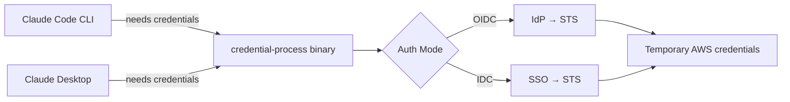
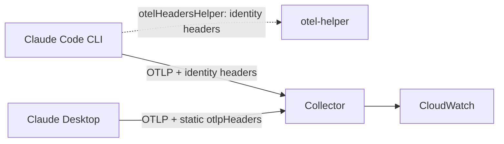
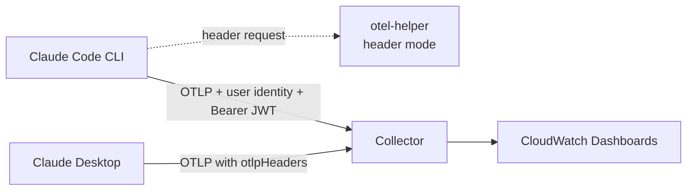
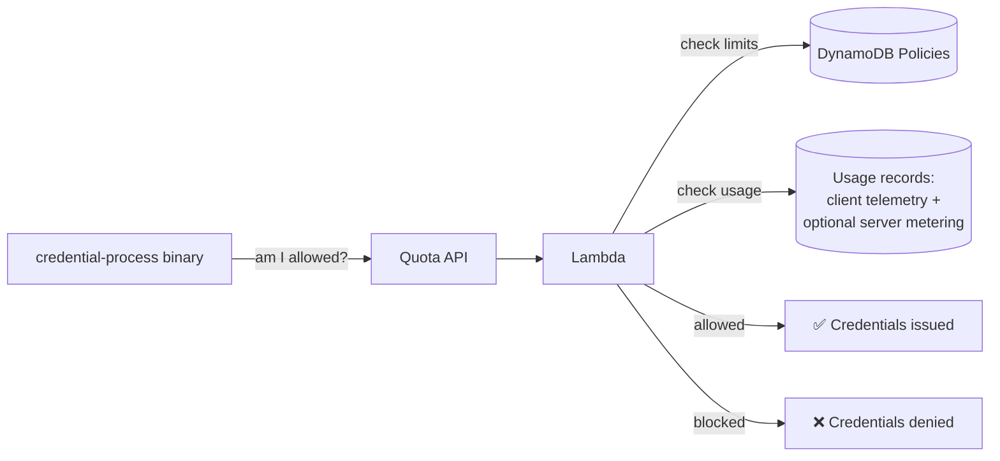

This sample is provided for illustration purposes. It represents a baseline implementation and may not address all security considerations for your specific environment. Review and adapt it before production use.

# Governed Inference Platform on Amazon Bedrock

A governed, modular pre-build that you deploy to get a **serverless LLM inference platform** on Amazon Bedrock and native AWS services. Deploy the platform once; it powers three kinds of consumers: **internal products** where LLMs are embedded (any app using the AWS SDK), **SuperApps** such as Claude Cowork and Claude Desktop (a pattern that extends to other enterprise AI apps), and the **CLI coding harnesses** your developers choose — Claude Code, Codex CLI, OpenCode, Aider, Pi.

Governance controls such as SSO identity, optional per-user budgets in dollars or tokens, cost attribution, model governance, and telemetry are enforced **below the app layer** (IAM, STS, optional quota-gated credential issuance, and optional Bedrock invocation-log metering). Consumers plug in like appliances into a wall socket and inherit the controls you enable.

## Start Here

1. **Choose an architecture and deployment path:** [Deployment Paths](assets/docs/DEPLOYMENT_PATHS.md).
2. **Understand what each module owns:** [Component Map](assets/docs/COMPONENTS.md) — and [how each control actually works](assets/docs/HOW_IT_WORKS.md).
3. **Follow one implementation path:** [Wizard Quick Start](QUICK_START.md), [Visual Console](assets/docs/CONSOLE.md), [GitOps](assets/docs/DEPLOYMENT_PATHS.md#path-2-gitops-answers-file), or [CloudFormation console](assets/docs/LAUNCH_STACKS.md).
4. **Operate it:** [Failure Posture](assets/docs/FAILURE_POSTURE.md), [Runbooks](assets/docs/RUNBOOKS.md), and [Troubleshooting](assets/docs/TROUBLESHOOTING.md).

Configuration flows from the administrator profile in `~/.gip/profiles/<name>.json` into a packaged end-user `~/gip/config.json`; harness-specific settings are generated from the same profile. See [Configuration Flow](assets/docs/ARCHITECTURE.md#configuration-architecture).

## What You Power With It

| Consumer | Examples | How it connects | Docs |
|---|---|---|---|
| **Internal products** | Any application that calls Bedrock through the AWS SDK | Standard AWS `credential_process` provider in the SDK default chain — temporary credentials, optionally quota-gated, with no app-side auth code | [Internal products](#internal-products-any-aws-sdk-app), [How It Works](#how-it-works) |
| **SuperApps** | Claude Desktop (Chat, Cowork, Code); pattern extends to other enterprise AI apps | Pinned AWS Samples [Claude apps gateway](#claude-apps-gateway-recommended-for-claude-apps) (recommended) or the credential-process architecture via static MDM | [CoWork 3P Guide](assets/docs/COWORK_3P.md) |
| **CLI coding harnesses** | Claude Code, Codex CLI, OpenCode, Aider, Pi | Gateway (Claude apps) or the `credential_process` plug — zero harness-specific auth work | [Claude Code](#claude-code-cli), [Harnesses Guide](assets/docs/HARNESSES.md) |

The platform is consumer-agnostic. Deploy it once, then connect each surface your organization uses.

### Internal products (any AWS SDK app)

The credential-process binary is a standard AWS `credential_process` provider. Any application that resolves credentials through the AWS SDK default chain receives temporary credentials with SSO identity attached. When a quota endpoint is configured, issuance is quota-gated and per-user budgets apply. Cost attribution and IAM model/region guardrails require no app-side auth work. Server-side controls (default-on model allow-list scoping, optional account-level [Guardrails](assets/docs/GUARDRAILS.md), optional [invocation-log metering](assets/docs/QUOTA_MONITORING.md#server-side-metering-tamper-proof-usage)) sit below the client entirely and cover every consumer in the account identically.

### SuperApps: Claude Desktop (Cowork)

The [Claude apps gateway](#claude-apps-gateway-recommended-for-claude-apps) serves Claude Desktop — server-side model allow-lists and spend caps, no per-user AWS credentials on the desktop.

On the credential-process architecture, the same deployment extends to the desktop with one command:

```bash
poetry run gip cowork generate
```

This generates MDM configuration files (JSON, macOS .mobileconfig, Windows .reg) using your existing credential-process deployment profile — same credentials, same quotas, same dashboards. Gateway-based Desktop deployments use the upstream gateway-native bootstrap or its official [companion add-on](assets/docs/BOOTSTRAP_SERVER.md), unchanged. See the [Cowork 3P Guide](assets/docs/COWORK_3P.md); optional [web search via AgentCore](assets/docs/WEB_SEARCH.md).

### Claude Code (CLI)

Two connection modes:

- **Claude apps gateway (recommended):** Anthropic's first-party control plane — nothing to install on developer machines beyond Claude Code itself. Details in [the gateway section](#claude-apps-gateway-recommended-for-claude-apps).
- **credential-process:** developers sign in with SSO; the binary vends temporary AWS credentials to the AWS SDK and quota-gates issuance when a quota endpoint is configured. Choose it when you need full per-user CloudTrail/CUR attribution, IAM Identity Center, or CI usage. Packaged and distributed via `gip package` / `gip distribute`.

### Other CLI harnesses: OpenCode, Codex CLI, Pi, Aider

Any harness that uses the AWS SDK default chain inherits the same SSO login, quota enforcement, per-user cost attribution, and IAM model/region guardrails with no extra auth work. Codex CLI is the exception for inference: its Amazon Bedrock path uses the Mantle endpoint, which governed credentials deny by design ([Harnesses Guide](assets/docs/HARNESSES.md#openai-codex-cli)). Generate ready-to-use, verified configs with:

```bash
poetry run gip package --harnesses all
```

See the [Harnesses Guide](assets/docs/HARNESSES.md) for per-harness setup and an honest capability matrix (telemetry dashboards and managed-settings model locks remain Claude-Code-only; per-user usage for other harnesses comes from CUR session-name attribution and optional [server-side metering](assets/docs/QUOTA_MONITORING.md#server-side-metering-tamper-proof-usage), which covers every harness identically). When [web search](assets/docs/WEB_SEARCH.md) is enabled, `gip package` also wires the gateway MCP endpoint into OpenCode and Codex CLI via a stdio proxy on the same binary (Pi and Aider have no MCP support upstream).

## Key Features

### Platform and governance

- **Secure Access**: Secure single sign-on (SSO) with enterprise identity providers such as Okta, Entra ID, Auth0, Google, Cognito, or AWS IAM Identity Center — temporary credentials, automatic refresh, no API keys to manage
- **Budgets in Dollars or Tokens**: Per-user, per-group, and default policies with monthly/daily USD budgets (recommended) or raw token limits, 80/90/100% warning alerts, and alert-or-block enforcement
- **Two Records of Truth**: Usage is measured from client telemetry and, optionally, [server-side from Bedrock model invocation logs](assets/docs/QUOTA_MONITORING.md#server-side-metering-tamper-proof-usage) — with automatic drift reconciliation so a stopped sidecar can't hide usage
- **Server-Side Model Governance**: Default-on `RestrictToAnthropicModels` IAM scoping enforces the model allow-list below the client, not just in settings files
- **Account-Level Guardrails** (optional): [Bedrock Guardrails enforcement](assets/docs/GUARDRAILS.md) applied to every model invocation in the account and region — server-side, not client-configurable
- **Usage Monitoring**: CloudWatch dashboards with per-user cost attribution and [prompt-cache savings](assets/docs/MONITORING.md#measuring-prompt-cache-savings) (tokens saved and dollars saved by caching), plus S3 + Athena for historical analytics
- **Model Lifecycle Alerts** (optional): Daily checks for legacy, provider-set premium pricing, and end-of-life model transitions (`gip deploy model-lifecycle`, `gip models check`)
- **Data Residency**: Select your cross-region inference profile (US, EU, AU, JP, APAC, Global); the wizard warns when telemetry or web-search infrastructure would leave your inference geography
- **GitOps-Ready**: `gip init --from-file answers.yaml` reproduces an entire deployment from one reviewable file; `--export-answers` round-trips existing deployments
- **Multi-Platform**: Windows, macOS, Linux — Go or Python binaries, built by `gip package`
- **AWS-Native**: Your data, your AWS account, your compliance controls — no Anthropic licensing required

### Consumer integrations

- **Any Harness, One Plug**: The same credential-process powers [OpenCode, Codex CLI, Pi, and Aider](assets/docs/HARNESSES.md) — SSO, quotas, and attribution apply below the harness layer
- **Two Architectures**: The [Claude apps gateway](assets/docs/APPS_GATEWAY.md) central control plane (recommended for Claude Code and Claude Desktop) or per-developer STS federation (for other harnesses, IAM Identity Center, CI, and per-user AWS-native audit) — deployable side by side
- **Platform Tools over MCP** (optional): [Web search](assets/docs/WEB_SEARCH.md) grounded in Amazon's web index and log-only [memory](assets/docs/MEMORY.md) behind one [AgentCore Gateway endpoint](assets/docs/MCP_GATEWAY.md) — wired into Claude Code, Claude Desktop, OpenCode, and Codex CLI; group entitlement and identity-dependent memory activation are rejected pending redesign
- **Skills Registry** (optional): Governed publish → approve → distribute lifecycle for [agent skills](assets/docs/SKILLS_REGISTRY.md) — immutable content-addressed artifacts, IAM-separated publisher/curator roles, delivered to Claude Code, OpenCode, Codex CLI, and AgentCore harnesses
- **One Deployment, Two Surfaces**: Same infrastructure powers both Claude Code CLI and Claude Desktop (which features Chat, Cowork and Code)
- **Native Desktop Experience**: Deploy and manage Claude Desktop via MDM (Jamf, Intune, Group Policy)
- **Upstream Desktop Delivery**: Use the gateway-native Desktop overlay or the pinned AWS Samples [bootstrap companion](assets/docs/BOOTSTRAP_SERVER.md); GIP does not maintain a parallel response shape

## Table of Contents

1. [What You Power With It](#what-you-power-with-it)
2. [Key Features](#key-features)
3. [Modular Architecture](#modular-architecture)
   - [Modules](#modules)
   - [Authentication Modes](#authentication-modes)
   - [Claude Apps Gateway](#claude-apps-gateway-recommended-for-claude-apps)
   - [Per-User Attribution](#per-user-attribution)
4. [How It Works](#how-it-works)
   - [Usage Monitoring](#usage-monitoring)
   - [Quota Enforcement and Cost Controls](#quota-enforcement-and-cost-controls)
5. [Deployment](#deployment) — six paths mapped in [Choosing a Deployment Path](assets/docs/DEPLOYMENT_PATHS.md)
6. [Additional Resources](#additional-resources)

## Modular Architecture

The architecture is modular: start with the authentication core, then add monitoring, quota enforcement, analytics, governance, or distribution stacks independently as requirements grow. A small team can run auth-only; a large enterprise can enable every module — same platform. This guidance supports three authentication paths (see [Authentication Modes](#authentication-modes) for details). The recommended path is Direct IAM Federation:

![Architecture diagram of the platform's deployable modules. On the left, a Developer machines box lists Claude Code, Claude Desktop and other AWS SDK clients: OpenCode, Pi, Aider, internal apps on any SDK host, and Codex CLI for MCP tools only. gip package installs credential-process and otel-helper on these machines. On the right, an AWS Cloud box holds an AWS account with a column of module cards, each saying how it is deployed. The Authentication core card, with a solid border, holds the IAM OIDC provider, the federated role and AWS STS. Optional modules follow with dashed borders: the Claude apps gateway, from the pinned upstream AWS Samples CDK; model governance with Amazon Bedrock Guardrails and a lifecycle check; quota and metering; telemetry and analytics; platform tools over MCP; the skills registry; and distribution. The platform tools card sits in its own us-east-1 Region box and holds Amazon Bedrock AgentCore Gateway and Amazon Bedrock AgentCore Memory in log-only mode, and notes that it calls the AWS-managed Web Search Tool. Dashed arrows link the developer machines with every card except model governance. A solid arrow shows every client except Codex CLI invoking Amazon Bedrock, at the top right, directly with temporary credentials. The gateway, model governance and quota cards connect to Amazon Bedrock with dashed arrows. A caption notes that other modules deploy to the Region chosen in gip init.](assets/images/platform-overview-v2.png)

### Recommended: Direct IAM Federation

![Diagram of the Direct IAM Federation credential flow with six numbered steps. On the left, a Developer machine box holds the developer, Claude Code or Claude Desktop, credential-process, and a local credential cache: a file or keyring with no long-lived AWS keys. In the middle, a box labelled "Your OIDC identity provider" holds the IdP, which can be Okta, Microsoft Entra ID, Auth0, Google, Amazon Cognito user pools or another OIDC provider. On the right, an AWS Cloud box holds an AWS account. Amazon Bedrock is at the top. An optional Quota check API (Amazon API Gateway, AWS Lambda and Amazon DynamoDB) is in the middle. AWS STS, the IAM OIDC identity provider and the federated IAM role are at the bottom. Step 1: the developer requests Bedrock access through Claude Code or Claude Desktop, which asks credential-process for credentials. Step 2: credential-process signs the user in with PKCE and receives an ID token. Step 3, dashed: only when a quota endpoint is configured, it checks the quota API, and a deny, or an error in fail-closed mode (the default), stops issuance. Step 4: it calls AWS STS AssumeRoleWithWebIdentity with the ID token. STS checks the issuer and audience against the IAM OIDC identity provider and evaluates the role's trust policy. Step 5: STS returns temporary Bedrock-scoped credentials for up to 12 hours. Step 6: the app invokes Amazon Bedrock and receives the model response. Claude Code signs with SigV4, and Claude Desktop sends a bearer token.](assets/images/credential-flow-direct-diagram.png)

1. **User initiates authentication**: User requests access to Amazon Bedrock through Claude Code or Claude Desktop
2. **OIDC authentication**: User authenticates with their OIDC provider and receives an ID token
3. **Optional quota decision before STS**: when quota enforcement is enabled, credential-process checks the quota API with the validated identity and stops on deny or fail-closed error
4. **Token exchange with AWS STS**: credential-process calls `AssumeRoleWithWebIdentity` after the optional quota gate allows issuance, or immediately when no quota endpoint is configured
5. **STS returns credentials**: AWS STS validates the token and returns temporary Bedrock-scoped credentials
6. **Access Amazon Bedrock**: the application receives standard credential-process JSON and invokes Bedrock (Claude Desktop's default credential helper receives a Bedrock bearer token derived from the same temporary credentials)

### Modules

`gip init` creates a profile that selects which stacks to enable. Deploy all at once with `gip deploy`, or individually with `gip deploy <stack>`:

| Component | What | Deployed via |
|-----------|------|-------------|
| **Authentication** (core) | IAM OIDC Provider + federated role (default-on Anthropic-only model scoping), or IDC auth stack | `gip deploy auth` |
| **User packages** | Platform-specific binaries (credential-process, otel-helper) + install scripts + optional [multi-harness configs](assets/docs/HARNESSES.md) | `gip package` |
| **Monitoring** (optional) | Central mode: ECS Fargate OTEL collector + ALB. Sidecar mode: local collector on each machine. Both export to CloudWatch dashboards (incl. prompt-cache savings). | `gip deploy monitoring` |
| **Quota enforcement** (optional) | Quota check API + DynamoDB policies + per-user/group USD budgets or token limits | `gip deploy quota` |
| **Server-side metering** (optional) | Per-region Bedrock invocation-log metering (metadata only) + client/server drift reconciliation | `gip deploy metering` |
| **Guardrails** (optional) | Account-level Bedrock Guardrails enforcement (harmful-content filters on every invocation in the region) + metadata-only dashboard | `gip deploy guardrails` |
| **Model lifecycle** (optional) | Daily legacy/premium-pricing/end-of-life checks on the deployed model catalog, SNS alerts, AWS Health passthrough | `gip deploy model-lifecycle` |
| **Analytics** (optional) | S3 data lake + Athena for historical SQL queries on usage data (incl. exact cache-savings queries) | `gip deploy analytics` |
| **Web search** (optional) | AgentCore Gateway with the managed Web Search connector (MCP) — wired into Claude Code, Claude Desktop, OpenCode, and Codex CLI | `gip deploy websearch` |
| **Memory** (optional, opt-in) | AgentCore Memory resources and MCP tools on the same gateway, currently deployable log-only; identity-dependent activation is rejected pending redesign | `gip deploy memory` |
| **Skills registry** (optional) | Agent Registry + S3 + distributor Lambda: publish → approve → distribute agent skills as immutable, digest-pinned artifacts (Claude Code, OpenCode, Codex CLI, AgentCore harness) | `gip deploy skills` |
| **Claude Desktop bootstrap** (optional) | Exact AWS Samples companion CDK for PKCE configuration/MCP delivery behind the upstream gateway | `scripts/fetch-claude-apps-gateway.sh`, then `vendor/aws-samples/anthropic-on-aws/claude-apps-gateway-bootstrap` |
| **Claude apps gateway** (recommended for Claude apps) | Exact AWS Samples CDK for the gateway built into Claude — server-side model/spend policy, no per-dev AWS credentials | `scripts/fetch-claude-apps-gateway.sh`, then `vendor/aws-samples/anthropic-on-aws/claude-apps-gateway` |
| **Distribution** (optional) | S3 presigned URLs (IAM-user or role-based presigning) or self-service landing page with IdP auth | `gip deploy distribution` |
| **Diagnostics** | Installation health checks + resolved config dump; model-catalog drift check | `gip doctor` / `gip models check` |

See [Monitoring Guide](assets/docs/MONITORING.md), [Quota Guide](assets/docs/QUOTA_MONITORING.md), [Analytics Guide](assets/docs/ANALYTICS.md), and [Distribution Comparison](assets/docs/distribution/comparison.md) for detailed setup.

### Authentication Modes

This guidance supports three identity paths. Each path provides usage monitoring and audit trails. Per-user identity resolution and quota enforcement depend on the authentication mode chosen.

| Mode | `gip init` choice | Identity Source | Session Length | Quota Enforcement | Best For |
|------|--------------------|----------------|----------------|-------------------|----------|
| **External IdP (OIDC)** | `OIDC / Direct IdP` | Okta, Entra ID, Auth0, Google, Cognito User Pools JWT claims | Refresh token lifetime | ✅ Full | Orgs with an existing enterprise IdP |
| **AWS IAM Identity Center** | `AWS IAM Identity Center` | `AWSReservedSSO_*` IAM role ARN (email in session name) | Up to 90 days (recommended: 7 days) | ✅ Via SigV4 | Orgs on native AWS identity, or where OIDC localhost callback is blocked |
| **None** | `None` | IAM user ARN or hashed role principal | AWS credential TTL | ❌ Not available | Internal tools / analytics-only deployments |

For deployment patterns and best practices, see the [Claude Code deployment patterns and best practices with Amazon Bedrock](https://aws.amazon.com/blogs/machine-learning/claude-code-deployment-patterns-and-best-practices-with-amazon-bedrock/) blog post.

### Claude Apps Gateway (recommended for Claude apps)

For new deployments of Claude apps on Amazon Bedrock, Anthropic's [Claude apps gateway](https://code.claude.com/docs/en/claude-apps-gateway) is the recommended module: a self-hosted service that sits between your Claude clients and your model provider and replaces per-developer AWS credentials entirely. It is included in the `claude` binary, so the same executable that runs Claude Code also runs the gateway. Developers sign in to the gateway with corporate OIDC; the gateway holds the only Bedrock credential, enforces model allow-lists and managed settings server-side per IdP group, and applies per-user/group/org spend caps inline. It provides:

- Corporate SSO (OIDC) with centralized policy enforcement
- Per-user cost attribution and spend caps
- Managed settings delivery
- OTLP telemetry routing
- Single stateless container deployment

**👉 [Get started with Claude Apps Gateway on AWS](https://github.com/aws-samples/anthropic-on-aws/tree/main/claude-apps-gateway)** — this repository pins that subtree to an exact upstream commit in `vendor/aws-samples/anthropic-on-aws/UPSTREAM.json`; `scripts/fetch-claude-apps-gateway.sh` materializes it unchanged under `vendor/aws-samples/anthropic-on-aws/claude-apps-gateway` and verifies the resulting Git tree id (paths, types, executable modes, symlink targets, and bytes), while pin bumps arrive through tested review PRs. [`gip deploy gateway`](assets/docs/APPS_GATEWAY.md) is retired rather than wrapping or modifying the upstream CDK.

**💻 [Need a separate Claude Desktop configuration/MCP overlay? Add the Bootstrap companion](https://github.com/aws-samples/anthropic-on-aws/tree/main/claude-apps-gateway-bootstrap)** — it attaches to the same gateway and delivers its upstream PKCE configuration contract.

Choose the credential-process architecture instead when you need per-user CloudTrail/CUR attribution, IAM Identity Center, CI usage, or non-Claude consumers (internal AWS SDK apps, OpenCode, Pi, Aider; Codex CLI for MCP tools only). The two can coexist in one account. See the [Apps Gateway guide](assets/docs/APPS_GATEWAY.md) for a full decision table and deployment steps.

<details>
<summary><strong>Areas where this platform complements Claude Apps Gateway today</strong></summary>

The following capabilities are not yet available in Claude Apps Gateway but may appear on its future roadmap. This solution provides reference patterns in the meantime:

- **AWS IAM Identity Center** — native IDC authentication without external OIDC
- **Historical usage analytics** — S3 + Athena for long-term usage queries
- **Multi-platform packaging** — automated installers for Windows, macOS, Linux (note: Claude Apps Gateway is native to Claude Code and requires no additional client-side packages)
- **Cost tracking via IAM principal-based cost allocation** — Gateway spend controls are based on cost estimates

As Claude Apps Gateway evolves, check Anthropic's documentation for the latest capabilities.

</details>

### Optional: Deploy Without SSO Authentication

You can deploy the observability/analytics stack without configuring an identity provider. Select **"None"** during `gip init`.

- No OIDC provider or IdP configuration required
- Uses AWS IAM for access control directly
- Identity detection is automatic (IDC users: email from ARN, IAM users: username, other roles: hashed identifier)
- Best for: internal tools, analytics-only deployments, or orgs where users already have IAM access to Bedrock

### Per-User Attribution

For the credential-process architecture, identity and AWS billing attribution
follow the authenticated AWS session. Claude Apps Gateway has a separate
upstream identity, telemetry, and spend-control model.

| Auth Mode | Identity Source | Telemetry Attribution | Quota Enforcement | CUR 2.0 Cost Visibility |
|-----------|----------------|----------------------|-------------------|-------------------------|
| **OIDC** | JWT email claim | Per-user (email, team, department) | ✅ | ✅ Per-user via the STS session name (`line_item_iam_principal`); session tags optional (IdP-supplied) |
| **IAM Identity Center** | IAM ARN session name | Per-user (email only) | ✅ | ✅ Per-user if [ABAC attributes](https://docs.aws.amazon.com/singlesignon/latest/userguide/abac.html) configured in IDC |
| **None** | Hashed IAM principal | Anonymous | ❌ | ✅ Per-IAM-role |

The same credential-issuance quota decision applies when Claude Code or Desktop
uses the managed AWS profile. Desktop's static GIP telemetry is aggregate-only,
so GIP does not claim that Desktop usage is merged into the user's measured
quota total. Gateway spend controls remain separate.

See [Quota Monitoring Guide](assets/docs/QUOTA_MONITORING.md) for enforcement details and [CoWork 3P Guide](assets/docs/COWORK_3P.md#quota-enforcement) for Desktop-specific behavior.

## How It Works

> For a didactic walkthrough of the runtime mechanics — which control fires when, enforced by which AWS primitive, and what is per-user vs account-wide — see [How the Controls Actually Work](assets/docs/HOW_IT_WORKS.md).

Once distributed, the **credential-process** binary runs on each user's machine:
- **Claude Code:** configured via `credential_process` in `~/.aws/config` (AWS SDK calls it automatically)
- **Claude Desktop (Cowork):** configured via the `inferenceCredentialHelper` MDM key, which runs `credential-process --desktop` directly (default); legacy `profile` mode uses `inferenceBedrockProfile` with `credential_process`



The **otel-helper** binary attaches per-user identity to telemetry:

- **Header mode** (Claude Code CLI): Called at startup and then periodically (default every 29 minutes) as Claude Code's `otelHeadersHelper`. Returns JSON headers containing user identity (email, team, department) extracted from the cached JWT.
- **Static MDM** (credential-process Desktop path): Set `otlpHeaders` in MDM config for aggregate/device-level telemetry. GIP does not claim per-user identity from client-supplied fields.
- **Claude Apps Gateway**: Follow the pinned upstream telemetry and identity contract; its spend controls and telemetry are separate from GIP quota tables.



### Usage Monitoring

Both Claude Code (CLI) and Claude Desktop emit OpenTelemetry (OTLP) telemetry. For the credential-process architecture, otel-helper provides Claude Code identity while Desktop's static MDM path is aggregate-only. Gateway deployments follow the upstream gateway's telemetry contract. See [Monitoring Guide](assets/docs/MONITORING.md) for detailed configuration.



| Surface | Per-user identity | How | Collector mode |
|---------|------------------|-----|----------------|
| **Claude Code (CLI)** | otel-helper (header mode) | Returns identity headers (refreshed every 29 minutes by default) | Central or Sidecar |
| **Claude Desktop (static GIP MDM)** | `otlpHeaders` in MDM config | Aggregate/device-level only | Central or Sidecar |
| **Claude Desktop (Apps Gateway)** | Exact upstream gateway/Desktop contract | Upstream-owned; not merged into GIP quota state | Follow upstream |

> **Recommended for Claude apps:** use the exact pinned Claude Apps Gateway and its native Desktop contract. Do not translate gateway telemetry into GIP-specific bootstrap headers.

**Cost attribution:** Amazon Bedrock supports [IAM principal cost tracking via CUR 2.0](assets/docs/COST_ATTRIBUTION.md) — per-user costs appear in CUR 2.0 (`line_item_iam_principal`, from the STS session name credential-process sets) once caller-identity data is enabled in the export; per-user Cost Explorer views also require IdP-supplied session tags. Note: real-time quota enforcement relies on telemetry emitted from the client rather than actual costs metered by AWS, so figures may differ from CUR.

**Dashboards:** Pre-built CloudWatch dashboards for [Claude Code](assets/images/ClaudeCodeDashboard.png) and [Claude Desktop (Cowork)](assets/images/ClaudeCoworkDashboard.png). See [Monitoring Guide](assets/docs/MONITORING.md) for setup.

### Quota Enforcement and Cost Controls

Quota is enforced at the **credential layer** — before any Bedrock call is made:



How it works:
- **Policies** (DynamoDB): Admins set per-user, per-group, or default policies via `gip quota` commands — monthly/daily **USD budgets** (recommended) or raw token limits, each with alert or block enforcement
- **Usage — client record** (CloudWatch): The OTEL collector aggregates token consumption per user; the quota monitor converts tokens to estimated spend using per-model-family rates (including cache read/write) and sends 80/90/100% warnings
- **Usage — server record** (optional, [metering stack](assets/docs/QUOTA_MONITORING.md#server-side-metering-tamper-proof-usage)): Bedrock model invocation logs (metadata only, never prompts) produce a second, tamper-proof usage record per user; drift between the two records is published as a metric and alerted on. In `max` mode enforcement uses whichever record is higher
- **Check** (Lambda): On each credential request (and periodic re-check), compares current usage against the effective policy
- **Enforcement**: If over limit, credentials are withheld and the user sees a quota-exceeded message with their usage

If a user exceeds their quota, new and refreshed credentials are withheld until usage resets or an admin unblocks them (`gip quota unblock`); credentials already issued stay valid until they expire. See [Quota Guide](assets/docs/QUOTA_MONITORING.md) for configuration details.

**Prompt-cache savings:** caching is one of Bedrock's biggest cost levers, so the dashboards and Athena queries report not just cache token usage but the **dollars saved by caching** per user and per model (and flag negative savings, which indicate misconfigured caching). See [Measuring prompt-cache savings](assets/docs/MONITORING.md#measuring-prompt-cache-savings).


## Deployment

**First, pick your deployment path** — there are six, from a visual console to a guided wizard to fully by-hand CloudFormation to agent-assisted. See [Choosing a Deployment Path](assets/docs/DEPLOYMENT_PATHS.md) for the persona-based decision table. The default (wizard) path is documented step by step in [QUICK_START.md](QUICK_START.md).

**Prefer a GUI?** `gip console` opens a local visual deployment console — Basics → Modules → Review + create → live deploy progress — that emits the same `answers.yaml` the GitOps path consumes. Console-first teams can instead deploy individual stacks with one-click [quick-create links](assets/docs/LAUNCH_STACKS.md).


**Deployment time:** 2-3 hours for initial setup.

### Requirements

- Python 3.10-3.13, Poetry, AWS CLI v2, Git (`unzip` is also required on Linux)
- AWS account with Bedrock activated and IAM/CloudFormation permissions
- OIDC identity provider (Okta, Entra ID, Auth0, Google, Cognito) or AWS IAM Identity Center
- Go 1.24+ for the default `gip package` build path; the deprecated `--legacy` path uses Python build tools instead

**End users need only:** Claude Code or Claude Desktop installed. No Python, AWS account, or build tools required — IT distributes pre-built packages.

### Supported Regions

Deploys to any AWS region with Bedrock support, across both AWS Commercial and AWS GovCloud (US) partitions. During `gip init`, select your region and the wizard auto-configures partition-appropriate models and endpoints.

### Cross-Region Inference

Select your preferred model (Opus, Sonnet, Haiku) and cross-region inference profile (US, EU, AU, JP, APAC, Global) for optimal routing and data residency. Modern Claude models (3.7+) require cross-region inference.

See [Model Configuration](https://code.claude.com/docs/en/model-config) for model aliases (including `opusplan` for Opus planning + Sonnet execution).

### Platform Support

| Platform | Architecture | Build Methods |
|----------|-------------|---------------|
| Windows | x64 | Go (recommended) or Nuitka via CodeBuild |
| macOS | ARM64 / Intel / Universal | Go or PyInstaller |
| Linux | x86_64 / ARM64 | Go or PyInstaller (Docker) |

**Binaries:** this sample does not publish pre-built binaries. `gip package` builds the Go binaries (Go 1.24+): Linux and Windows targets cross-compile from any host, and macOS binaries need a macOS host with Apple build tools. See [WINDOWS_BUILD_SYSTEM.md](assets/docs/WINDOWS_BUILD_SYSTEM.md).

See [QUICK_START.md](QUICK_START.md#platform-builds) for build configuration.

## Additional Resources

### Getting Started

- [Choosing a Deployment Path](assets/docs/DEPLOYMENT_PATHS.md) - Six ways to deploy, mapped to customer profiles (visual console, wizard, GitOps, by-hand console, gateway, agent-assisted)
- [Deployment Console](assets/docs/CONSOLE.md) - `gip console`: local visual wizard over the same answers.yaml engine
- [Launch Stacks](assets/docs/LAUNCH_STACKS.md) - One-click CloudFormation quick-create links for standalone stacks
- [Quick Start Guide](QUICK_START.md) - Step-by-step deployment walkthrough (wizard path)
- [Agent-Assisted Deployment](assets/docs/AGENT_DEPLOY.md) - Playbook for deploying with Claude Code or another coding agent
- [CLI Reference](assets/docs/CLI_REFERENCE.md) - Complete command reference for the `gip` tool, including non-interactive/GitOps mode
- [Troubleshooting](assets/docs/TROUBLESHOOTING.md) - Common issues, `gip doctor`, and how to file bugs
- [Workshop: Claude Code on Amazon Bedrock](https://catalog.workshops.aws/claude-code-on-amazon-bedrock/en-US) - Companion hands-on workshop
- [Claude Code deployment patterns and best practices with Amazon Bedrock](https://aws.amazon.com/blogs/machine-learning/claude-code-deployment-patterns-and-best-practices-with-amazon-bedrock/) - Blog post covering deployment patterns and best practices

### Architecture & Deployment

- [Architecture and Regional Deployability](assets/docs/ARCHITECTURE.md#regional-deployment-and-data-residency) - Account-local inference architecture, eight-region deployability, CRIS, and data-residency constraints
- [Architecture Decision Records](assets/docs/adr/README.md) - Why the platform is built this way, with alternatives considered
- [Claude Apps Gateway](assets/docs/APPS_GATEWAY.md) - Recommended server-side control plane for Claude apps, on ECS Fargate
- [Harnesses Guide](assets/docs/HARNESSES.md) - OpenCode, Codex CLI, Pi, and Aider on the same governed endpoint
- [Deployment Guide](assets/docs/DEPLOYMENT.md) - Advanced deployment options
- [Multi-Account Deployment](assets/docs/MULTI_ACCOUNT.md) - Account-local inference cells, SCPs, and what may centralize
- [Network Isolation](assets/docs/NETWORK_ISOLATION.md) - PrivateLink coverage per component and the residual public surface
- [Resource Inventory](assets/docs/RESOURCE_INVENTORY.md) - Per-stack resources and IAM actions for SCP pre-clearance
- [Distribution Comparison](assets/docs/distribution/comparison.md) - Presigned URLs vs Landing Page, IAM-user vs role presigning
- [Local Testing Guide](assets/docs/LOCAL_TESTING.md) - Testing before deployment

### Platform Tools & Governance

- [Web Search](assets/docs/WEB_SEARCH.md) - Managed AgentCore Web Search connector as a governed MCP tool
- [Memory](assets/docs/MEMORY.md) - Opt-in per-user memory and org knowledge on AgentCore Memory (the one content-bearing feature; KMS, sweeper, deploy gate)
- [MCP Gateway Extension](assets/docs/MCP_GATEWAY.md) - Attach internal tools to the same governed MCP entry point
- [Skills Registry](assets/docs/SKILLS_REGISTRY.md) - Publish, approve, and distribute agent skills to every harness
- [Bedrock Guardrails](assets/docs/GUARDRAILS.md) - Account-level enforced guardrails
- [Claude Desktop Bootstrap](assets/docs/BOOTSTRAP_SERVER.md) - Gateway-native Desktop bootstrap and the pinned AWS Samples companion add-on

### Operations

- [Runbooks](assets/docs/RUNBOOKS.md) - IdP/gateway secret rotation, collector outage, quota failure, upgrades, offboarding, model rotation
- [Failure Posture](assets/docs/FAILURE_POSTURE.md) - What fails closed, what fails visible, and the honest gaps
- [Monitoring Guide](assets/docs/MONITORING.md) - OpenTelemetry setup, dashboards, and prompt-cache savings
- [Analytics Guide](assets/docs/ANALYTICS.md) - S3 data lake and Athena SQL queries
- [SIEM Export](assets/docs/SIEM_EXPORT.md) - Splunk, Datadog, and Elastic export recipes (metadata only)

### Cost Management

- [Cost Planning Model](assets/docs/COST_ESTIMATES.md) - Scenario-based monthly estimates with topology floors, usage assumptions, and runtime exclusions
- [Cost Attribution](assets/docs/COST_ATTRIBUTION.md) - Per-user and per-team cost tracking via CUR 2.0 and Cost Explorer

### Plugins

- [Example Plugins](assets/claude-code-plugins/) - Example plugins for Claude Code and Cowork 3P ([distribution guide](assets/docs/PLUGINS.md))

### Claude Cowork (Desktop)

- [CoWork 3P Guide](assets/docs/COWORK_3P.md) - Setup and deployment for Claude Desktop with Bedrock
- [AWS Blog: Running Claude Cowork in Amazon Bedrock](https://aws.amazon.com/blogs/machine-learning/from-developer-desks-to-the-whole-organization-running-claude-cowork-in-amazon-bedrock/)

### Identity Provider Setup

- [Okta](assets/docs/providers/okta-setup.md)
- [Microsoft Entra ID](assets/docs/providers/microsoft-entra-id-setup.md)
- [Auth0](assets/docs/providers/auth0-setup.md)
- [Google](assets/docs/providers/google-oidc-setup.md)
- [AWS Cognito User Pool](assets/docs/providers/cognito-user-pool-setup.md)
- [AWS IAM Identity Center](assets/docs/providers/iam-identity-center-setup.md)
- [Generic OIDC (PingFederate, Keycloak, ForgeRock, etc.)](assets/docs/providers/generic-oidc-setup.md)
- [IdP Requirements Contract](assets/docs/providers/README.md) - Claims and endpoints any compliant IdP must provide

## Security

See [CONTRIBUTING](CONTRIBUTING.md#security-issue-notifications) for more information.

## License

This project is licensed under the MIT No Attribution (MIT-0) License - see the [LICENSE](LICENSE) file for details.
Third-party components and their licenses are listed in [THIRD-PARTY-LICENSES](THIRD-PARTY-LICENSES).
