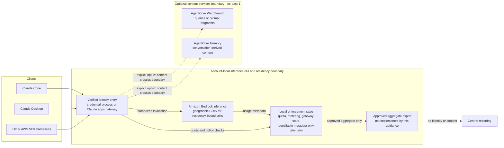

# Technical Architecture

This document provides technical details about the Governed Inference Platform credential-process architecture, design decisions, and integration patterns.

> **Note**: For deployment instructions, prerequisites, and operational guides, see the [main README](../../README.md).

## System Overview

The Governed Inference Platform credential-process architecture enables secure, scalable access to Amazon Bedrock by federating enterprise identity providers with AWS IAM — by default directly through STS (`AssumeRoleWithWebIdentity`), or optionally brokered through an Amazon Cognito Identity Pool. The architecture follows zero-trust principles with complete audit trails.

### Authentication Components

The credential process is a native Go binary (`source/go/`) implementing the full authentication lifecycle:

- **OAuth2/OIDC with PKCE** — browser-based login, no client secrets
- **Silent refresh** — stores OIDC refresh_token for automatic renewal (7-30 days without browser re-auth)
- **Token caching** — OS keyring (macOS Keychain, Windows Credential Manager, Linux Secret Service) or session files protected by restrictive filesystem permissions
- **Multi-provider registry** — Okta, Microsoft Entra ID, Auth0, Google, Cognito, generic OIDC
- **Cross-platform** — single `make all` builds credential-process and otel-helper for 5 targets (macOS ARM64/Intel, Linux x64/ARM64, Windows x64; 10 binaries) via Go cross-compilation

The Go rewrite (June 2026) replaced the Python credential-provider, eliminating PyInstaller/Nuitka build complexity, AV false positives on Windows, and the 60-80MB binary size (now ~14MB). The Python implementation (`source/credential_provider/`) is deprecated but still ships in two cases: `gip package --legacy`, and automatic fallback when Go >= 1.24 is not installed. It also anchors the Go/Python parity test suite. Deprecation status and removal conditions: [ADR-0013](adr/0013-legacy-python-credential-provider.md).

The core authentication component is the credential process, implemented as a native Go binary in `source/go/`. This implements a complete OAuth2/OIDC client with PKCE flow for secure authentication without client secrets. Go produces binaries for macOS ARM64/Intel, Linux x64/ARM64, and Windows x64. Linux and Windows targets cross-compile across supported administrator hosts; macOS targets require a macOS host because Keychain support uses CGO. The credential process supports multiple identity providers including Okta, Microsoft Entra ID, Auth0, and Cognito User Pools through a flexible provider registry system. Once authenticated, credentials are cached either in the operating system's secure keyring or in session files, depending on the organization's preference. The implementation follows the AWS CLI credential process protocol, making it transparent to any AWS SDK or tool.

The management CLI in `source/governed_inference_platform/` provides IT administrators with tools to deploy and manage the infrastructure. Built on the Cleo framework, it offers an intuitive command-line interface for initialization, deployment, and package generation. This component is used only during setup and is not distributed to end users.

### AWS Infrastructure Components

The authentication infrastructure supports two federation methods. With Direct IAM Federation, an IAM OIDC Provider creates the trust relationship between the organization's identity provider and AWS, allowing direct token exchange via STS. With Cognito Identity Pool, Amazon Cognito acts as an intermediary that federates OIDC tokens into AWS credentials. Both methods use IAM roles that grant permissions specifically for Amazon Bedrock model invocation in configured regions. Direct IAM Federation attributes calls through the STS role session name (email by default, or the bound email/sub claim); session tags are added only when the IdP embeds them in the ID token. Cognito Identity Pool mode maps email, sub, and name to session tags.

#### IAM Permissions

The IAM role assigned to authenticated users grants the following Amazon Bedrock permissions:

- `bedrock:InvokeModel` - Invoke foundation models for text generation
- `bedrock:InvokeModelWithResponseStream` - Invoke models with streaming responses
- `bedrock:ListFoundationModels` - List available foundation models
- `bedrock:GetFoundationModel` - Get details about specific models
- `bedrock:GetFoundationModelAvailability` - Check model availability in regions
- `bedrock:ListInferenceProfiles` - List available cross-region inference profiles
- `bedrock:GetInferenceProfile` - Get details about specific inference profiles

The role also grants `bedrock:CallWithBearerToken` (Claude Desktop bearer tokens) and `bedrock:ApplyGuardrail`, limits invoke to Anthropic model and inference-profile ARNs by default (`RestrictToAnthropicModels=true`), scopes its Regional statements to `AllowedBedrockRegions` (invoke on global foundation-model ARNs and read-only List/Get calls have no Region condition), explicitly denies `bedrock-mantle:*`, and, with monitoring enabled, allows `cloudwatch:PutMetricData` to the `GIP/Bedrock/Usage` and `AWS/Bedrock` namespaces.

When monitoring is enabled, the solution supports two deployment modes:

**Central Mode** (default): A shared, server-side collector ingests metrics from all clients.
- Client → ALB → ECS OTEL Collector → CloudWatch OTLP + EMF logs
- Deploys a VPC with public subnets, an ECS Fargate cluster running the OpenTelemetry collector, and an Application Load Balancer as the ingestion endpoint. When analytics is enabled, the collector additionally writes EMF logs to CloudWatch Logs for the analytics pipeline (Athena SQL over historical data).

**Sidecar Mode**: Each client runs a local OpenTelemetry collector that exports directly to CloudWatch.
- Client → localhost:4318 → Local OTEL Collector → CloudWatch OTLP (SigV4)
- No server-side networking or ECS infrastructure is required. The local collector authenticates to CloudWatch using SigV4 with the user's federated credentials. Only the CloudWatch dashboard stack is deployed on the AWS side.

For organizations requiring detailed analytics, the optional analytics stack provides comprehensive usage analysis capabilities. Kinesis Data Firehose continuously streams metrics from CloudWatch Logs to an S3 data lake, with a Lambda function transforming the data into Parquet format for efficient querying. Amazon Athena enables SQL analytics on this data, with pre-configured partition projection eliminating the need for Glue crawlers. This architecture supports queries spanning months of historical data while keeping costs minimal through columnar storage and lifecycle policies.

## Authentication Flow

The authentication flow begins when Claude Code requests AWS credentials through the AWS SDK credential chain, which runs our credential process executable (Claude Desktop's default MDM configuration runs it directly as its credential helper). The executable initiates an OAuth2 flow with PKCE (Proof Key for Code Exchange) to ensure security without requiring client secrets. A browser window opens automatically, directing the user to their organization's identity provider for authentication.

After successful authentication, the identity provider redirects back to the local callback server with an authorization code. The credential process exchanges this code for OIDC tokens. The system then uses one of two authentication methods to obtain AWS credentials:

### Authentication Methods

The system supports two authentication methods:

**Direct IAM Federation**
- Uses IAM OIDC Provider with STS AssumeRoleWithWebIdentity
- Direct federation from OIDC tokens to AWS credentials
- Configurable session duration up to 12 hours

**Cognito Identity Pool**
- Uses Amazon Cognito Identity Pool as federation broker
- Cognito manages the OIDC to AWS credential exchange
- Requires an authenticated OIDC or Cognito User Pool login; anonymous AWS credentials are disabled
- Credential lifetime is set by Cognito (enhanced-flow credentials last one hour); the helper does not request a duration

The authentication method is selected during initial configuration. Direct IAM Federation attributes calls through the STS role session name (email by default, or the bound email/sub claim); session tags are added only when the IdP embeds them in the ID token. Cognito Identity Pool mode maps email, sub, and name to session tags.

The temporary credentials are returned to Claude Code through the standard AWS CLI credential process protocol. The entire flow operates without any long-lived AWS credentials. Credentials are cached using either the operating system's encrypted keyring service or session files (AWS credentials in `~/.aws/credentials`, tokens in `~/.gip-session/`, both 0600 and unencrypted; session mode is the default), preventing repeated authentication requests during the session lifetime.

## AWS CLI Credential Process Protocol

The solution leverages the [AWS CLI external credential process](https://docs.aws.amazon.com/cli/latest/userguide/cli-configure-sourcing-external.html), a feature that allows custom credential providers to integrate with AWS CLI. When the AWS CLI needs credentials for a profile configured with `credential_process`, it executes the specified program and expects JSON-formatted temporary credentials on stdout.

Our implementation returns credentials in the exact format required by the AWS CLI:

```json
{
  "Version": 1,
  "AccessKeyId": "ASIA...",
  "SecretAccessKey": "...",
  "SessionToken": "...",
  "Expiration": "2025-01-01T12:00:00Z"
}
```

## Package Distribution Architecture

The packaging and distribution system bridges the gap between IT administrators who deploy infrastructure and end users who need simple, foolproof installation. The `gip package` command creates a self-contained distribution that includes everything users need without requiring technical expertise.

The packaging system uses Go (`gip package`) to produce native binaries for five targets, replacing the previous PyInstaller (macOS/Linux) and Nuitka/CodeBuild (Windows) build pipeline. A macOS administrator host can build all targets; Linux and Windows hosts can build the non-macOS targets. The binaries are generic — they contain zero customer-specific data and work for all deployments.

The `gip package` command cross-compiles the requested binaries and generates customer-specific `config.json` (with federation config, quota settings) and `settings.json` (with Bedrock model, OTel endpoint) from the admin's profile. Linux and Windows targets need only Go 1.24+; macOS targets additionally require a macOS host with Apple build tools for CGO Keychain support.

The package embeds the configuration created during deployment, including the federation identifier (role ARN or identity pool ID) read from the profile. Generic install scripts (`install.sh`, `install.bat`, `gip-install.ps1`) read profile names and regions from `config.json` at install time, so they work for any customer without regeneration.

For organizations with monitoring enabled, the package also includes the OTEL helper executable and Claude Code settings. This provides a complete solution from authentication through telemetry without requiring users to understand the underlying complexity.

## Configuration Architecture

### Configuration Hierarchy

1. **Administrator Configuration** (`~/.gip/profiles/<name>.json`)

   - Created by `gip init` in the administrator's home directory
   - Contains deployment parameters and provider settings
   - Not distributed to end users

2. **End User Configuration** (`~/gip/config.json`)

   - Embedded during package build
   - Contains runtime authentication parameters
   - Includes the federated role ARN (Direct IAM Federation, default) or the identity pool ID (Cognito mode)

3. **Claude Code Settings** (`~/.claude/settings.json`)
   - Generated during package build
   - Contains OTEL endpoint and environment variables
   - Includes path to OTEL helper executable

## Security Architecture

The security architecture addresses several threat vectors inherent in enterprise authentication systems. Each design decision directly mitigates specific risks while maintaining usability.

Credential theft represents the most common attack vector in authentication systems. Traditional long-lived API keys create persistent risk - once stolen, they remain valid until manually revoked. Our architecture eliminates this risk by using only temporary credentials that expire automatically. Direct STS credentials last `max_session_duration` (default and maximum 12 hours); Cognito Identity Pool credentials last one hour. Even if credentials are somehow compromised, the attacker's window of opportunity is limited and closes automatically.

The OAuth2 authorization flow itself presents opportunities for interception attacks. An attacker who intercepts an authorization code could potentially exchange it for tokens. We implement PKCE (Proof Key for Code Exchange, RFC 7636) which generates a dynamic code verifier for each authentication request. This makes intercepted codes useless without the corresponding verifier. Additionally, a cryptographically random state parameter prevents cross-site request forgery attacks.

Token storage on end-user machines requires careful consideration. We provide two storage options: integration with the operating system's keyring service, which provides encrypted storage with OS-level access controls, or session files (AWS credentials in `~/.aws/credentials`, tokens in `~/.gip-session/`, both 0600 and unencrypted; session mode is the default). The session-file option does not encrypt token contents, so organizations that require encrypted local storage should use the keyring mode. The system automatically cleans up expired credentials to minimize the attack surface.

Privilege escalation attempts are contained through IAM policy design. The federated role grants only the minimum permissions required to invoke Bedrock models in specified regions. The role's identity policy limits what the credentials can do (Bedrock invoke on the allowed models and Regions). CloudTrail records the role session name for attribution.

Every API call carries the role session name (email by default; the raw email or sub claim when SessionNameBinding is set), which CloudTrail records. Authentication events through Cognito are similarly logged, creating a comprehensive security audit trail from login through API usage.

## Regional Deployment and Data Residency

Treat each AWS account and residency boundary as an independently operable inference cell. Quota, metering, gateway state, and identifiable telemetry remain in that cell. Telemetry is metadata-only: token counts, model IDs, cost, and verified identity where available, never prompts or completions. Only a separately approved aggregate without user, principal, session, prompt, response, or unapproved resource identifiers may leave the cell. This guidance does not implement a central aggregate exporter or a new control plane.



Caller-supplied headers do not establish or override identity. Per-user attribution requires a verified OIDC/JWT or IAM identity; other paths use aggregate dimensions. Optional Web Search and Memory process conversation-derived content, so enabling either feature requires a separate data-classification, retention, encryption, regional-placement, and erasure review. Enabling them does not change the metadata-only telemetry boundary.

### Eight-region deployability

The following conclusions are based on service-region listings, CloudFormation registry checks, and read-only API probes performed on **2026-07-16**.

!!! warning "Availability is not deployment validation"
    "Availability verified" means the required service and control-plane surfaces responded to the documented read-only checks. No stack was created. These results do not establish runtime behavior, account-level model access, quotas, marketplace subscriptions, or successful resource creation.

| Infrastructure region | Verdict | Geographic CRIS and model constraint | Full-stack degradation |
|---|---|---|---|
| `us-east-1` | **Availability verified (reference)** | `us.` profiles and the observed Anthropic catalog are available. | No availability blocker observed; the repository places optional Web Search and Memory here. |
| `us-west-2` | **Availability verified** | `us.` profiles and the observed Anthropic catalog are available. | The repository places optional Web Search and Memory in `us-east-1`; this crosses regions but remains in the US geography. |
| `eu-west-1` | **Core-service availability verified; residency degraded when content services are enabled** | Modern `eu.` Haiku, Sonnet, and Opus profiles were observed; `fable-5` had no `eu.` profile. | Repository-pinned Web Search queries and Memory content go to `us-east-1`, outside the EU. |
| `eu-central-1` | **Core-service availability verified; residency degraded when content services are enabled** | 11 Anthropic foundation-model entries and the modern `eu.` Haiku, Sonnet, and Opus profile set were observed; `fable-5` had no `eu.` profile. | Repository-pinned Web Search queries and Memory content go to `us-east-1`, outside the EU. |
| `eu-west-2` | **Core-service availability verified; residency degraded when content services are enabled** | Modern `eu.` Haiku, Sonnet, and Opus profiles were observed; some legacy profiles and `fable-5` were absent. | Repository-pinned Web Search queries and Memory content go to `us-east-1`, outside the EU. |
| `ap-southeast-2` | **Core-service availability verified; residency degraded when content services are enabled** | `au.` profiles were present, but `opus-4-5` and `fable-5` were absent. `apac.` profiles covered legacy model subsets only. | Repository-pinned Web Search queries and Memory content go to `us-east-1`, outside Australia. |
| `ap-northeast-1` | **Core-service availability verified; model and residency degradation** | `jp.` profiles lacked `sonnet-5`, `opus-4-5`, `opus-4-6`, and `fable-5`. `apac.` profiles covered legacy model subsets only. | Repository-pinned Web Search queries and Memory content go to `us-east-1`, outside Japan. Do not use `global.` to fill the model gaps for a residency-bound cell. |
| `ca-central-1` | **Infrastructure-service availability verified; Canadian inference residency blocked** | **No `ca.` CRIS exists.** Only `us.` and `global.` profiles were observed; either allows inference processing outside Canada. | Infrastructure-service availability was observed in Canada, but no stack or infrastructure-residency behavior was deployment-validated. A "Canadian data stays in Canada" inference posture is not available. |

No AWS-side service-availability blocker was observed for the infrastructure stack in these eight regions. The practical blockers and degradations are model-catalog asymmetry, the absence of Canadian geographic CRIS, and the repository's regional placement of optional content services. Model access grants, quotas, and marketplace subscriptions remain account- and region-specific prerequisites.

The checks did not create stacks. They also did not runtime-test the new enforced-guardrail CloudFormation resource, CloudWatch PromQL dashboard rendering, or the managed Web Search connector outside `us-east-1`. Validate those features in each target account and region before production approval.

### CRIS and residency

Cross-Region Inference (CRIS) profiles and the infrastructure region control different boundaries:

- A geographic profile such as `us.`, `eu.`, `au.`, or `jp.` may route inference among supported Regions inside that geography. Pair it with an infrastructure Region in the same geography so quota records, identifiable telemetry, analytics, and gateway state remain inside the intended boundary.
- `global.` is a capacity-routing profile, not a residency control. It can route outside a customer's geography and is rejected for residency-bound cells by this guidance.
- `apac.` is not interchangeable with country-level residency. The observed APAC profiles covered legacy model subsets, while the current AU and JP subsets differ as shown above.
- `ca-central-1` has no Canadian geographic CRIS. Calling `us.` from Canada processes inference in US Regions; using `global.` also does not provide Canadian residency.
- Tier fallback for strict `eu`/`au`/`jp` configurations stays in-geography and does not silently substitute `global.` or `us.`. A missing tier therefore resolves to another approved in-geography model or fails to resolve.

The infrastructure stacks store user-identifying state in their deployment Region:

| Stack | Data held | Contains |
|---|---|---|
| Monitoring (OTEL collector + dashboard) | CloudWatch logs and metrics | Verified identity attributes and per-user usage; no prompt or completion content |
| Quota monitoring (`quota-monitoring.yaml`) | DynamoDB tables | User identity keys and token/cost usage records |
| Historical Usage Analytics | S3, Glue, and Athena | Historical per-user usage records; no prompt or completion content |

`gip init` prints a non-blocking `[Data residency]` warning when the infrastructure and strict CRIS geographies diverge. The warning is a review gate, not proof that the selected combination meets a regulatory requirement.

### AgentCore content-service location

AWS documents AgentCore Gateway, Memory, Policy, and Built-in Tools availability in all eight regions above. Read-only control-plane probes for Gateway, Memory, and Policy succeeded in all eight. The **repository**, however, currently restricts its Web Search gateway to `us-east-1`, and the Memory stack follows that gateway Region. This is a repository implementation constraint, not evidence that the AgentCore services are unavailable elsewhere.

When enabled, Web Search queries or prompt fragments are processed in `us-east-1`, and conversation-derived AgentCore Memory content is stored there. For EU, AU, and JP cells, this moves content outside the selected inference geography. Both features are disabled by default; keep them disabled unless that data location is approved. The specific managed Web Search connector was not create-tested outside `us-east-1`, so do not remove the repository pin based only on the broader AgentCore region table.

### Sources

Accessed **2026-07-16**:

- [Amazon Bedrock cross-Region inference](https://docs.aws.amazon.com/bedrock/latest/userguide/cross-region-inference.html)
- [Amazon Bedrock AgentCore supported Regions and features](https://docs.aws.amazon.com/bedrock-agentcore/latest/devguide/agentcore-regions.html)
- [Amazon CloudWatch OTLP endpoints](https://docs.aws.amazon.com/AmazonCloudWatch/latest/monitoring/CloudWatch-OTLPEndpoint.html)
