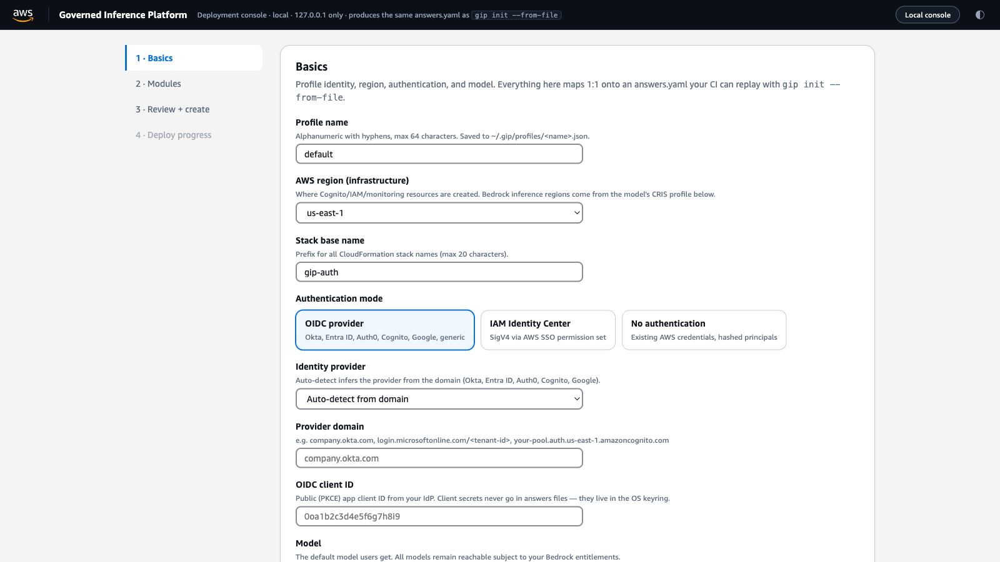
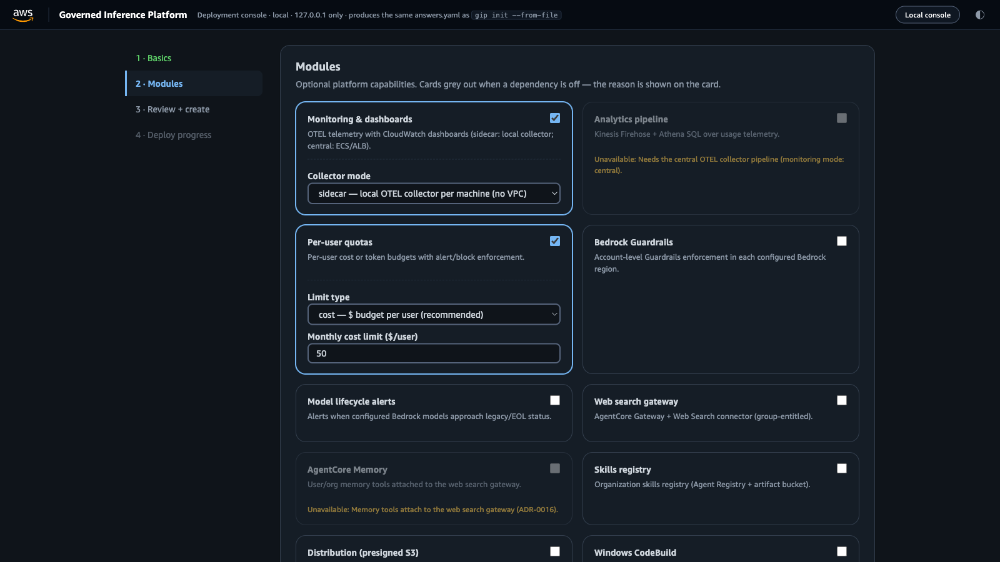

# Visual Deployment Console (`gip console`)

A localhost, single-page deployment console for the Governed Inference Platform — the
Azure-portal "create experience" (guided wizard → review generated template → deploy →
watch progress) implemented as a pure front-end over the platform's existing GitOps
machinery. Nothing in the console is a second implementation: the wizard produces the
same answers structure `gip init --from-file` consumes, persists profiles through the
same code path, and deploys through the same engine as `gip deploy`.

```bash
poetry run gip console                 # serve on http://127.0.0.1:8321/ and open a browser
poetry run gip console --port 9000     # alternate port
poetry run gip console --no-browser    # print the URL only (headless / remote-forwarded)
```





The console follows the AWS console's visual language, with **light and dark themes** — it defaults to your OS preference and the toggle in the top navigation persists your choice in the browser.

## What it is (and is not)

| | |
|---|---|
| **Is** | A visual way to author `answers.yaml`, create a profile, and run `gip deploy` — for people evaluating the platform or preferring a guided UI. |
| **Is not** | A hosted service, a new deployment engine, or a replacement for GitOps. It binds to 127.0.0.1 only and holds no state beyond the running process. |

## The four steps

1. **Basics** — profile name, AWS region, authentication mode (OIDC / IAM Identity
   Center / none) with provider-specific fields shown conditionally, default model +
   cross-region (CRIS) inference profile. All option catalogs (providers, regions,
   models, CRIS profiles) come from the same constants the `gip init` wizard uses.
2. **Modules** — card grid of the optional stacks (monitoring, analytics, quotas,
   guardrails, model lifecycle, web search, memory, skills, distribution, CodeBuild).
   Cards grey out when a dependency is unmet and say why (e.g. *memory requires the
   web search gateway*; *quota requires per-user identity*).
3. **Review + create** — live `answers.yaml` preview, **Validate** (server-side, the
   exact `--from-file` validators), **Export answers.yaml** for GitOps handoff, and
   **Create profile** (writes `~/.gip/profiles/<name>.json`, sets it active). Then a
   per-stack deploy checklist with dry-run support.
4. **Progress** — per-stack state chips (pending / running / succeeded / failed /
   skipped) polling the deploy job, a live event log, and next steps on success
   (`gip package`, `gip status`, dashboard stack names).

## Mapping to answers.yaml / GitOps

The console is an answers-file authoring UI. The **Export answers.yaml** button at
Review downloads exactly what the server validated — commit it and replay in CI:

```bash
gip init --from-file answers.yaml --profile-name prod --force
gip deploy
```

Round-trip guarantee: `POST /api/profile` runs `build_config_from_answers()` +
`InitCommand._save_configuration()` — the same two calls `gip init --from-file`
makes — so a profile created in the console is byte-identical to one created from the
exported file (covered by `tests/cli/commands/test_console.py`).

## HTTP API (used by the page; token required)

| Endpoint | Purpose |
|---|---|
| `GET /api/bootstrap` | Option catalogs: auth modes, provider types, regions, models + CRIS profiles, module cards, valid stacks. |
| `POST /api/validate` | `{answers}` → field-level errors from the `--from-file` validators + rendered YAML. |
| `POST /api/profile` | `{answers, profile_name, force}` → persist the profile (same path as `--from-file`). |
| `POST /api/deploy` | `{stacks: ["all"] or names, dry_run, profile}` → background deploy job (409 if one is running). |
| `GET /api/deploy/status` | Per-stack status, recent engine/CloudFormation output, errors. |
| `GET /api/answers.yaml` | Download the last validated answers file. |

## Security notes

- **Localhost only.** The server binds `127.0.0.1` exclusively — it is never reachable
  from the network. A `Host` header check rejects DNS-rebinding attempts.
- **Per-session token.** A random token is generated at startup, embedded in the served
  page, and required (header `X-Gip-Token`) on every `/api/*` call. No CORS headers are
  ever emitted, so a malicious website cannot read the token or call the API from your
  browser (drive-by localhost CSRF protection).
- **No secrets in answers.** Same rule as the answers file: raw client secrets are
  rejected; they belong in the OS keyring or Secrets Manager (see
  `gip init --from-file` docs).
- **Request bodies capped** at 1 MB; no shell execution — deployment runs in-process
  through the same boto3/CloudFormation code as `gip deploy`.
- AWS credentials are whatever the terminal running `gip console` has; the browser
  never sees them.

## Troubleshooting

| Symptom | Fix |
|---|---|
| `Could not bind 127.0.0.1:8321` | Port in use — `gip console --port 8322`. |
| Browser shows *missing or invalid X-Gip-Token* | You reloaded a stale tab after restarting the console (new token per session). Re-open the printed URL. |
| Deploy chip stuck on *running*, no events | Check the terminal running `gip console`: interactive prompts (e.g. orphaned-stack cleanup during a full deploy) appear there, not in the browser. Answer in the terminal or deploy the specific stacks instead of "all". |
| Deploy fails immediately with *Profile … not found* | Create the profile in Step 3 first (or pass an existing profile). |
| Validation passes but deploy fails on AWS errors | Same failure you would get from `gip deploy` — see [TROUBLESHOOTING.md](TROUBLESHOOTING.md); retry a single stack with `gip deploy <stack>`. |
| No browser opened | Use the printed URL manually; `--no-browser` disables auto-open (e.g. over SSH, forward the port: `ssh -L 8321:127.0.0.1:8321 host`). |

## Relationship to other deployment paths

- `gip init` (interactive TUI) — same questions, terminal-native.
- `gip init --from-file` — headless/CI; the console's export feeds this.
- `gip console` — visual; produces/consumes the same artifacts as both.
