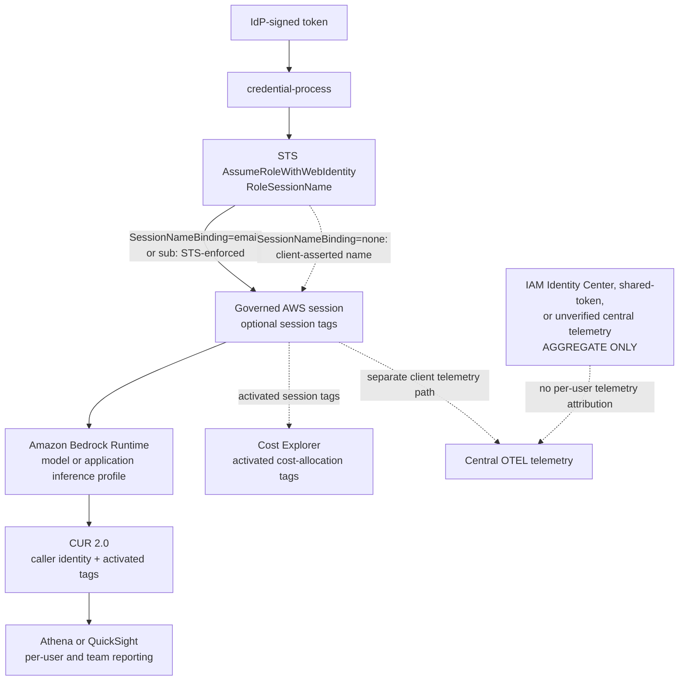
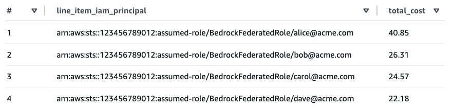
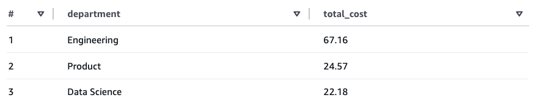

# Cost Attribution for Amazon Bedrock

This applies to the **direct IAM path** (`FederationType=direct`) only. The Cognito path handles cost attribution automatically.

## Attribution flow and trust boundary



Billing data, not caller-supplied OTEL organization fields, is the attribution record in this guide. Bedrock model invocation logs are a separate quota-metering source and are not CUR or client telemetry. A stack-created logging configuration disables body delivery; a pre-existing configuration is adopted unchanged only after every content-delivery flag is verified disabled. Its service-generated counts are tamper-resistant, but Direct STS per-user attribution still requires `SessionNameBinding=email|sub`; without binding, the session name is client-asserted. Claude Apps Gateway and the direct IAM path maintain separate budget controls; this solution does not reconcile them into one hard cap.

---

## 1. Built-in per-user tracking (no IdP changes required)

The credential provider embeds the user's email in the STS session name, so the resulting principal ARN looks like:

```
arn:aws:sts::123456789012:assumed-role/app-role/alice@acme.com
```

This ARN automatically appears in the `line_item_iam_principal` column of CUR 2.0 when IAM principal data is enabled. **This is the default behavior — no IdP changes or tag configuration required.**

### Enable IAM principal data in CUR 2.0

1. Open the Billing and Cost Management console → **Data Exports**
2. Create or edit a Standard data export (CUR 2.0)
3. Under **Additional export content**, enable **"Include caller identity (IAM principal) allocation data"**

The following example shows per-user Bedrock costs queried from CUR 2.0 data using Athena:



Each user's email is visible in the `line_item_iam_principal` column, enabling per-user cost visibility without any IdP changes or tag configuration.

> **Note:** `line_item_iam_principal` is available in CUR 2.0 data and can be queried using tools like Athena or QuickSight. Cost Explorer does not expose this column as a filter or grouping dimension. To see per-user costs in Cost Explorer, configure session tags as described in [section 3](#3-optional-session-tags-for-richer-per-user-attribution).

---

## 2. IAM principal tags for team/department-level attribution

Tags applied to IAM principals (users or roles) in the IAM console appear in CUR 2.0 with the `iamPrincipal/` prefix (e.g., `iamPrincipal/department`, `iamPrincipal/cost-center`). In this solution all federated users share the same role, so role-level tags are useful for team or department attribution but cannot distinguish between individual users.

To set this up:

1. In the IAM console, tag the federation role with organizational tags (e.g., `department`, `cost-center`)
2. In the Billing and Cost Management console → **Cost Allocation Tags**, filter for **IAM principal type** tags, select the desired tags, and click **Activate**
3. Tags only appear after the role has made at least one Bedrock API call, and take up to **24 hours to appear** and a further **24 hours to activate**

---

## 3. Optional: session tags for richer per-user attribution

If you need per-user **tag-based** cost allocation (beyond the session name in the ARN), you can embed session tags in the ID token.

When `AssumeRoleWithWebIdentity` is called, STS reads the `https://aws.amazon.com/tags` claim from the ID token and attaches those tags to the resulting session. Once activated as **user-defined cost allocation tags** (not the "IAM principal type" filter), they appear in CUR 2.0 and Cost Explorer.

### Trust policy requirement

The IAM role's trust policy must include `sts:TagSession` in addition to `sts:AssumeRoleWithWebIdentity`. Without it, the `AssumeRoleWithWebIdentity` call fails entirely with an `AccessDenied` error — STS does not silently ignore the tags.

### Claim format

Your IdP must add the `https://aws.amazon.com/tags` claim to the ID token. Two formats are accepted by STS:

- **Nested object** (Auth0): tag values are single-element arrays inside a `principal_tags` object.
- **Flattened per-key claims** (Okta, Entra ID): one claim per tag, with plain string values and JSON Pointer-encoded paths.

Nested object format (Auth0):

```json
{
  "principal_tags": {
    "UserEmail": ["alice@acme.com"],
    "UserId":    ["user-internal-id"]
  },
  "transitive_tag_keys": ["UserEmail", "UserId"]
}
```

### Auth0

Add a post-login Action that sets the claim:

```javascript
exports.onExecutePostLogin = async (event, api) => {
  api.idToken.setCustomClaim('https://aws.amazon.com/tags', {
    principal_tags: {
      UserEmail: [event.user.email],
      UserId:    [event.user.user_id],
    },
    transitive_tag_keys: ['UserEmail', 'UserId'],
  });
};
```

### Okta

Okta's Expression Language cannot produce a JSON object value directly. Use an [Okta inline token hook](https://developer.okta.com/docs/guides/token-inline-hook/) with `com.okta.identity.patch` operations to inject the flattened per-key claim format. URI-style claim names must be JSON Pointer-encoded: `/` becomes `~1`, so `https://aws.amazon.com/tags` as a patch path becomes `https:~1~1aws.amazon.com~1tags`.

Your token hook endpoint must return:

```json
{
  "commands": [{
    "type": "com.okta.identity.patch",
    "value": [
      {
        "op": "add",
        "path": "/claims/https:~1~1aws.amazon.com~1tags~1principal_tags~1UserEmail",
        "value": "alice@acme.com"
      },
      {
        "op": "add",
        "path": "/claims/https:~1~1aws.amazon.com~1tags~1principal_tags~1UserId",
        "value": "user-internal-id"
      },
      {
        "op": "add",
        "path": "/claims/https:~1~1aws.amazon.com~1tags~1transitive_tag_keys",
        "value": ["UserEmail", "UserId"]
      }
    ]
  }]
}
```

> **Note:** AWS requires `transitive_tag_keys` to be an array of strings. Okta's hook schema formally types `value` as a scalar string, so array support depends on runtime behavior — test this against your Okta org. If Okta rejects the array, mark only the tag key you need in Cost Explorer (e.g., `"UserEmail"`) and accept that the other key will not propagate to child sessions.

Refer to the [token inline hook reference](https://developer.okta.com/docs/reference/token-hook/) for the full request/response schema.

### Microsoft Entra ID

Entra ID's custom claims provider does not support JSON object values (only `String` and `String array`), so use the [flattened STS claim format](https://docs.aws.amazon.com/IAM/latest/UserGuide/id_session-tags.html) via a [custom claims provider](https://learn.microsoft.com/en-us/entra/identity-platform/custom-claims-provider-overview) backed by an Azure Function. The function must return:

```json
{
  "data": {
    "@odata.type": "microsoft.graph.onTokenIssuanceStartResponseData",
    "actions": [
      {
        "@odata.type": "microsoft.graph.tokenIssuanceStart.provideClaimsForToken",
        "claims": {
          "https://aws.amazon.com/tags/principal_tags/UserEmail": "alice@acme.com",
          "https://aws.amazon.com/tags/principal_tags/UserId":    "object-id-from-entra",
          "https://aws.amazon.com/tags/transitive_tag_keys":      ["UserEmail", "UserId"]
        }
      }
    ]
  }
}
```

### Activate session tags as cost allocation tags

After at least one Bedrock API call has been made with session tags:

1. Open **Billing and Cost Management console → Cost Allocation Tags**
2. Filter for **user-defined** cost allocation tags (not "IAM principal type" — that is for section 2 role-level tags)
3. Locate `UserEmail` and `UserId` and click **Activate** — tags take up to **24 hours to appear** after the first tagged API call, and a further **24 hours to activate**
4. In Cost Explorer, group or filter by **Tag → `UserEmail`** to see per-user Bedrock spend

Once activated, session tags are available in both **Cost Explorer** and **CUR 2.0**. This means you can group or filter costs by tag in the Cost Explorer console without needing Athena, unlike the `line_item_iam_principal` column in section 1 which is only available in CUR 2.0.

With session tags configured, you can also group costs by department or any other tag dimension. The following example shows department-level Bedrock costs queried from CUR 2.0 data using Athena:



---

## 4. Organizational attribution uses billing data

The central OTEL collector does not accept caller-supplied project, department,
team, cost-center, or organization dimensions. This prevents an unverified
client from assigning telemetry to another organizational unit.

Use the session tags described in sections 2 and 3 with Cost Explorer or CUR
2.0 for organizational reporting. Those tags are applied to the governed AWS
session and appear in billing data rather than client telemetry.

### Supported session-tag claim names

The otel-helper checks these specific claim names (first non-empty wins):

| Claim path | Used by |
|------------|---------|
| `https://aws.amazon.com/tags` → `principal_tags.Project` | Okta, Auth0, Entra ID session tags |
| `https://aws.amazon.com/tags` → `principal_tags.CostCenter` | Cost-center allocation |
| `https://aws.amazon.com/tags` → `principal_tags.BillingCode` | Billing-code allocation |

Map IdP-specific attributes to the approved session-tag keys in your identity provider configuration.

### What you get

Once activated as cost-allocation tags, Cost Explorer and CUR can group Bedrock spend by these dimensions. They are intentionally absent from the real-time CloudWatch telemetry dashboard.

For quantifying how much prompt caching reduces these costs (dashboard widgets, Athena queries, and the savings formula), see [Measuring prompt-cache savings](MONITORING.md#measuring-prompt-cache-savings).

### IDC limitation

IAM Identity Center central telemetry is aggregate-only. For per-user and organizational cost visibility in CUR 2.0, configure [ABAC attributes](https://docs.aws.amazon.com/singlesignon/latest/userguide/abac.html) in IAM Identity Center so session tags flow automatically.

---

## 5. Optional: Application Inference Profiles for team/cost-center attribution

[Application Inference Profiles](https://docs.aws.amazon.com/bedrock/latest/userguide/cost-mgmt-application-inference-profiles.html) (AIPs) are admin-created Bedrock resources that carry cost-allocation tags. Clients invoke the profile ARN in place of the model ID, and the profile's tags attach to every resulting billing record. This is an **additive team/cost-center layer on top of** the per-user session-name attribution in section 1 — not a replacement (see ADR-0021).

### How this solution wires them

`gip init` optionally collects one AIP ARN per model tier (Opus / Sonnet / Haiku). `gip package` then writes them into the distributed Claude Code settings, overriding the cross-region (CRIS) tier defaults:

| Profile field | Claude Code env vars |
|---|---|
| `inference_profile_haiku_arn` | `ANTHROPIC_SMALL_FAST_MODEL`, `ANTHROPIC_DEFAULT_HAIKU_MODEL` |
| `inference_profile_sonnet_arn` | `ANTHROPIC_DEFAULT_SONNET_MODEL` |
| `inference_profile_opus_arn` | `ANTHROPIC_DEFAULT_OPUS_MODEL` |

`ANTHROPIC_MODEL` keeps its alias value (e.g. `sonnet`) — Claude Code resolves aliases through the `ANTHROPIC_DEFAULT_*_MODEL` chain, so the AIP ARN is what gets invoked. Tiers without an ARN keep their CRIS defaults. Claude Code documents AIP ARNs as model identifiers and treats such pins as admin-managed ([docs](https://claude-code.mintlify.app/en/amazon-bedrock)). LV-3 live-verified the packaged pin on 2026-08-14: Claude Code returned `pong`, and the invocation log carried the full AIP ARN. Because AIP IDs are opaque, this required the documented explicit `restrict_to_anthropic_models: false` decision for the approved AIP; the default restriction was restored after the test. One profile set per team means packaging is per-team: run `gip package` once per team profile.

Generated configs for other harnesses (OpenCode, Codex, Pi, Aider) do **not** inherit AIP ARNs — AIP-ARN-as-model-ID is verified for Claude Code only, and those harnesses' model-ID handling of opaque profile ARNs is untested. Their usage still carries per-user attribution via the shared credential process (section 1).

### Caveats (source-backed)

- **Granularity is per usage type per day, aggregated dollars** — AIPs do not produce per-request or per-user cost. Keep session-name attribution for per-user visibility; AWS documents both working alongside each other ([AIP cost management](https://docs.aws.amazon.com/bedrock/latest/userguide/cost-mgmt-application-inference-profiles.html), retrieved 2026-07-08).
- **Tag at team/cost-center level, not per user.** The account quota is 1,000 inference profiles (adjustable, quota code `L-40EC9882`); profile count = teams × models, so per-user profiles are structurally infeasible and AWS explicitly recommends IAM principal attribution for per-user tracking instead (same source; quota verified live 2026-07-08).
- **Tag activation is not retroactive.** Tags take up to 24 hours to appear in billing after the first tagged usage, and activation applies only forward. Once active, AIP tags appear in **both Cost Explorer and CUR** (classic and 2.0) — unlike `line_item_iam_principal`, which is CUR 2.0-only.
- **Linked-account validation is blocked without payer access.** In the
  2026-08-14 linked child-account run, cost-allocation-tag activation was
  payer-only. LV-1 billing-tag readback therefore remains blocked; LV-3's
  independent packaged-AIP harness path was verified.
- **Both signals land on the same line item.** An invocation through an AIP still carries the user's session name in `line_item_iam_principal` — team tags and per-user attribution coexist ([granular cost attribution launch](https://aws.amazon.com/blogs/machine-learning/introducing-granular-cost-attribution-for-amazon-bedrock/), 2026-04-16).
- **Bedrock invocation logs carry the full AIP ARN** in the `modelId` field (verified live 2026-07-08). Because that ARN is opaque, the server-side metering processor does not guess the underlying model family for `server_estimated_cost`; it treats AIP ARN usage as unpriced and logs a warning. Cost Explorer remains billing truth for AIP-tagged team spend.
- **Which profile a client uses is client configuration.** Without IAM enforcement, AIP attribution is as client-asserted as session names. To force invocation through a team's profile, use the `bedrock:InferenceProfileArn` condition key with ABAC tag matching ([prerequisites](https://docs.aws.amazon.com/bedrock/latest/userguide/inference-profiles-prereq.html)) — ship enforcement opt-in only after all model paths are overridden, or non-AIP paths (e.g. `/model` picks) break.
- **Keep AIP sources geographic.** An AIP copied from a `global.*` CRIS profile evaluates `aws:RequestedRegion` as `unspecified` and may not clear a strict `AllowedBedrockRegions` `StringEquals` condition; use `us.`/`eu.`/`jp.`/`apac.` sources.

---

## Attribution trust levels

Not all attribution signals carry the same integrity guarantees:

1. **Direct STS session names are client-asserted by default — and can be
   cryptographically bound.** In Direct STS mode the client builds
   `RoleSessionName` from the JWT email, and with the default
   `SessionNameBinding=none` nothing binds it server-side: a modified client
   can attribute its usage to any string. Deploying the auth stack with
   `SessionNameBinding=email` (or `sub`) adds an `sts:RoleSessionName`
   trust-policy condition whose value is an IAM policy variable resolved from
   the IdP-signed, STS-validated token (for example
   `${company.okta.com:email}`), so STS rejects any
   `AssumeRoleWithWebIdentity` call whose session name is not exactly that
   claim. The IAM default OIDC claim mapping exposes `email` and `sub` as
   trust-policy condition keys for *any* OIDC provider (an earlier revision
   of this document claimed binding was impossible for generic OIDC — that
   was wrong; `email` is trust-policy-only, which is exactly where the
   binding lives). Quota enforcement is NOT affected either way — the quota
   API identifies users from the validated JWT, not the session name.
2. **Cognito-mode principal tags are server-derived and tamper-proof.** In
   Cognito Identity Pool mode, session tags come from
   `IdentityPoolPrincipalTag` mappings that Cognito applies server-side from
   the validated token; clients cannot alter them.
3. **Recommendation:** where attribution integrity matters (chargeback,
   compliance, audit), enable `SessionNameBinding` in Direct STS mode, or use
   Cognito Identity Pool mode or the [Claude apps gateway](APPS_GATEWAY.md).

| Signal | Mode | Integrity |
|---|---|---|
| `RoleSessionName` in CUR (`line_item_iam_principal`) | Direct STS, `SessionNameBinding=none` | Client-asserted (spoofable) |
| `RoleSessionName` in CUR (`line_item_iam_principal`) | Direct STS, `SessionNameBinding=email\|sub` | IdP-signed, STS-enforced (tamper-proof) |
| Principal tags (`UserEmail`/`UserId`) | Cognito Identity Pool | Server-derived (tamper-proof) |
| OTEL headers (email/sub dimensions) | All modes | Client-emitted (telemetry, not enforcement) |

### Binding session names to the token claim (`SessionNameBinding`)

Every OIDC auth template (`bedrock-auth-{okta,azure,auth0,google,generic,cognito-pool}.yaml`)
accepts an opt-in `SessionNameBinding` parameter:

| Value | Trust-policy effect | Client requirement |
|---|---|---|
| `none` (default) | No condition — trust policy unchanged | Any client version |
| `email` | `sts:RoleSessionName` must equal the token's `email` claim | Existing clients keep working for typical enterprise emails (the legacy sanitizer is a no-op when the email is already a valid session name); the updated client validates and fails closed with a clear error otherwise |
| `sub` | `sts:RoleSessionName` must equal the token's `sub` claim | **Requires the updated client** (legacy naming adds a `claude-code-` prefix and truncates, which the bound trust policy rejects) |

Per-provider notes:

- **Okta / Google / generic OIDC / Cognito user pool:** `email` and `sub` both
  supported. For generic OIDC, verify your id_token actually carries the
  claim before opting in — binding fails closed for users whose token lacks it.
- **Azure (Entra ID):** `email` can be absent for some tenant configurations
  and guest accounts; those users would be denied in `email` mode. Prefer
  `sub` if any of your users lack the claim.
- **Auth0:** `email` only. Auth0 `sub` claims are pipe-delimited
  (`auth0|…`), and `|` is not a legal STS session-name character, so the
  template does not offer `sub`.
- `sub` mode produces stable pseudonymous CUR rows
  (`assumed-role/Role/<sub>`); the analytics pipeline already receives
  `email` + `sub` per session via OTEL headers, so a `sub -> email` join
  recovers readable attribution — and survives email changes.

Migration (update-safe):

1. Updating the stack without setting the parameter changes nothing
   (`Default: none`; the trust-policy update is in-place, no role replacement).
2. For `email` mode: update the stack with `SessionNameBinding=none`,
   distribute the new client bundle, flip the parameter to `email`, verify a
   canary user, and watch CloudTrail for STS `AccessDenied` stragglers.
3. For `sub` mode: **all clients must be upgraded first** — flipping the
   parameter locks out old clients (fail-closed by design).
4. Live sessions (up to 12 h) are unaffected until their next credential
   refresh; the binding applies at assumption time. Reversible at every step
   by flipping the parameter back to `none`.

The deployed value flows into the packaged `config.json` as
`session_name_binding`, and `credential-process --explain` reports it under
`session.session_name_binding`. See ADR-0015 for the decision record
(including why `sts:SourceIdentity` was rejected: it never reaches CUR, and
`AssumeRoleWithWebIdentity` has no `SourceIdentity` request parameter).
