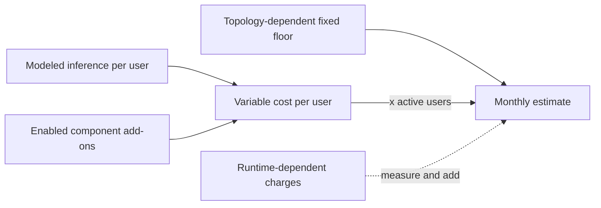

# Monthly Cost Planning Model

This guide gives operations and finance teams a planning model for three deployment scenarios in US East (N. Virginia). It separates fixed infrastructure, per-user usage, and charges that can only be established from a running deployment.

> **Disclaimer:** The examples are planning inputs, not quotes. Prices vary by AWS Region, inference profile, model, usage, and date. Confirm every rate against the live pages in [Pricing references](#pricing-references) or build the deployment in [AWS Pricing Calculator](https://calculator.aws/) before approving a budget. The token tables use global-routing model anchors accessed July 17, 2026; residency-bound geographic CRIS can cost more.

## Read the estimate correctly

The tables distinguish three evidence levels:

- **Verified rate inputs:** Infrastructure and service rates were retrieved from AWS pricing pages or the AWS Price List API. The `$3/$15` Sonnet 4.6, `$1/$5` Haiku 4.5, and `$5/$25` Opus 4.8 token anchors were cross-checked against Anthropic's current model-pricing table on July 17, 2026 and represent global-routing planning rates, not a verified geographic-CRIS quote or observed customer spend.
- **Modeled usage:** Explicit workload assumptions applied to those rates. The cached case, model mix, invocation count, memory use, and other usage volumes are forecasts, not measurements.
- **Runtime-dependent or unverified charges:** The tables include the stated low-volume ALB LCU and ingestion assumptions. Additional LCU usage, application/runtime logs, Container Insights, cross-AZ and other transfer, backups, DynamoDB point-in-time recovery storage, artifact storage, support plans, discounts, and taxes are not included. Measure them after deployment.

No stack was deployed and no Cost and Usage Report (CUR) was measured for this model.



## Scenarios

!!! warning "Gateway totals require regeneration"
    Scenario A and the gateway portion of Scenario C preserve the retired local
    CloudFormation model and are not authoritative for new deployments. Price
    the synthesized template from the pinned AWS Samples CDK under `vendor/`
    before making a budget commitment. The sync workflow deliberately does not
    copy old local cost assumptions onto new upstream revisions.

| Scenario | Included deployment |
|---|---|
| **A - Claude applications** | Historical estimate for the retired local gateway topology; regenerate from the pinned upstream CDK before use. |
| **B - Multi-harness** | IAM OIDC authentication, quota monitoring, central monitoring with one 0.5-vCPU/1-GB collector and ALB, and presigned-S3 packaging for OpenCode, Codex CLI, Pi, and Aider. |
| **C - Full stack** | A and B plus Historical Usage Analytics, server-side metering, Web Search, AgentCore Memory, skills registry, Guardrails, model lifecycle alerts, and landing-page distribution. |

## Assumptions

All totals use the following modeled inputs. Change them to match measured usage before making a budget commitment.

- Region: `us-east-1`; 730 hours/month; 22 working days/month.
- Active user: 500,000 input and 100,000 output tokens per working day, or 11 million input and 2.2 million output tokens/month.
- Model mix by token volume: A is 80% Sonnet 4.6 and 20% Opus 4.8; B is 70% Sonnet 4.6 and 30% Haiku 4.5; C is 60% A mix and 40% B mix. These mixes use the global-routing anchors above.
- Cached variant: 30% of input at the normal rate, 70% at the cache-read rate, plus an additional 10% input volume at the five-minute cache-write rate. Cache reads are 10% and writes are 125% of the input rate. This is a modeling assumption, not a measured cache-hit rate.
- Web Search: 20 searches/user/working day. Telemetry: 2 MB/user/working day. Credential refresh and quota checks: 3/user/working day.
- Average inference turn: 10,000 input and 2,000 output tokens, or 50 invocations/user/working day. This affects metering and memory event counts, not token cost.
- Guardrails: four characters/token, with all input and output evaluated by one content policy.
- Memory: one short-term event/inference turn, 10% extracted to long-term memory, and one retrieval/user/working day. The template has no long-term-memory TTL.
- Distribution in B and C: one decimal 100-MB package download/user/month (`0.1 GB`). The illustrative 5,000-user rows assume the account-wide first 100 GB internet-transfer allowance is otherwise unused; actual package egress can be higher when other workloads consume that shared allowance.

## Formulas

```text
monthly total = fixed topology floor
              + active users * variable cost per user
              + measured runtime-dependent charges

uncached inference/user = 11 * blended input $/MTok
                        + 2.2 * blended output $/MTok

cached input multiplier = 0.30 + (0.70 * 0.10) + (0.10 * 1.25)
                        = 0.495

cached inference/user = 11 * blended input $/MTok * 0.495
                      + 2.2 * blended output $/MTok
```

| Scenario mix | Blended input/output rate per MTok | Uncached inference/user | Cached inference/user |
|---|---:|---:|---:|
| A: 80% Sonnet / 20% Opus | `$3.40 / $17.00` | `$74.80` | `$55.91` |
| B: 70% Sonnet / 30% Haiku | `$2.40 / $12.00` | `$52.80` | `$39.47` |
| C: 60% A mix / 40% B mix | weighted from A and B | `$66.00` | `$49.34` |

## Topology-dependent fixed floors

The historical gateway model used private subnets without creating egress. The
current upstream CDK is authoritative; the values below are retained only to
show the old calculation and must be regenerated after each reviewed sync.

| Scenario | Shared customer egress | One dedicated NAT | One NAT per AZ (two AZs) | Runtime charges to add |
|---|---:|---:|---:|---|
| A | `$81.63` | `$114.48` | `$147.33` | ALB LCUs, logs, Container Insights, transfer, backups |
| B | `$45.95` | `$45.95` | `$45.95` | ALB LCUs, logs, Container Insights, transfer |
| C | `$156.11` | `$188.96` | `$221.81` | A and B runtime charges plus optional-component runtime usage |

Each NAT changes the fixed floor by `$32.85/month` before `$0.045/GB` data processing. Scenario B uses public subnets and three public IPv4 addresses, so its floor does not require a NAT Gateway. The scenario tables below use **one dedicated NAT** for A and C.

## Scenario estimates

`Variable/user` includes modeled inference and scenario-specific operational usage. Scenario C uses AgentCore Memory at month 12; memory cost continues to grow without a long-term-memory TTL. Displayed variable rates are rounded, while totals use the underlying calculation.

### Uncached

| Scenario | Users | Fixed/month | Variable/user/month | Total/month | Total/user/month |
|---|---:|---:|---:|---:|---:|
| A | 50 | `$114.48` | `$74.8029` | `$3,854.63` | `$77.09` |
| A | 500 | `$114.48` | `$74.8029` | `$37,515.93` | `$75.03` |
| A | 5,000 | `$114.48` | `$74.8029` | `$374,128.98` | `$74.83` |
| B | 50 | `$45.95` | `$52.8222` | `$2,687.06` | `$53.74` |
| B | 500 | `$45.95` | `$52.8222` | `$26,457.05` | `$52.91` |
| B | 5,000 | `$45.95` | `$52.8294` | `$264,192.95` | `$52.84` |
| C | 50 | `$188.96` | `$78.9532` | `$4,136.62` | `$82.73` |
| C | 500 | `$188.96` | `$78.9532` | `$39,665.56` | `$79.33` |
| C | 5,000 | `$188.96` | `$78.9604` | `$394,990.96` | `$79.00` |

### Cached modeling assumption

| Scenario | Users | Fixed/month | Variable/user/month | Total/month | Total/user/month |
|---|---:|---:|---:|---:|---:|
| A | 50 | `$114.48` | `$55.9159` | `$2,910.28` | `$58.21` |
| A | 500 | `$114.48` | `$55.9159` | `$28,072.43` | `$56.14` |
| A | 5,000 | `$114.48` | `$55.9159` | `$279,693.98` | `$55.94` |
| B | 50 | `$45.95` | `$39.4902` | `$2,020.46` | `$40.41` |
| B | 500 | `$45.95` | `$39.4902` | `$19,791.05` | `$39.58` |
| B | 5,000 | `$45.95` | `$39.4974` | `$197,532.95` | `$39.51` |
| C | 50 | `$188.96` | `$62.2882` | `$3,303.37` | `$66.07` |
| C | 500 | `$188.96` | `$62.2882` | `$31,333.06` | `$62.67` |
| C | 5,000 | `$188.96` | `$62.2954` | `$311,665.96` | `$62.33` |

The 5,000-user B and C rows include `$36.00/month`: `(500 GB - 100 GB) * $0.09/GB`. The 100-GB allowance is shared across the AWS account, so this is illustrative rather than guaranteed. Smaller package fleets can still incur egress when other workloads consume the allowance.

## Component add-ons

Use these lines to adapt the scenarios. They are not all additive to every scenario: C already includes all rows, while A and B include only the components named in their scenario definitions.

| Component | Fixed floor/month | Variable/user/month | Modeled basis or uncertainty |
|---|---:|---:|---|
| AgentCore Memory | `$1.31` | month 1 average `~$0.373`; month 12 `~$1.280` | 50 events/day, 10% extracted, one logical retrieval/day; each retrieval queries both facts and preferences and incurs two retrieval charges; includes Cedar authorization per tool call; month-one storage uses the average 55 records rather than the 110-record exit run rate; no long-term-memory TTL, so cost keeps growing |
| Skills registry | `~$1.01` | negligible | Agent Registry preview price is `$0`; artifact bytes excluded; includes the `$1.00` KMS key that encrypts the pending-approval SNS topic |
| Web Search | `$0` | `$3.0932` | 20 searches/day for 22 days, including one Gateway call and one Cedar authorization/search |
| Guardrails | `$3.00` | `$7.92` | One content policy; four characters/token; all modeled input/output evaluated |
| Historical Usage Analytics | runtime-dependent | `~$0.632` lower bound | Includes two explicit classic per-user metric series (`~$0.60/user`); exporter rollups may create more billable series |
| Server-side metering | `$0.40/region` | `~$0.0031` | 50 invocations/day and 2-KB log record; Metrics Insights query cost is unverified and excluded |
| Model lifecycle | `$0.10` (`$1.10` standalone) | negligible | One standard alarm and daily Lambda; `+$1.00` for the alert-topic KMS key only when the stack creates its own topic (`gip deploy` reuses the quota stack's topic when quota monitoring is enabled, so no second key) |
| Quota monitoring | `~$1.00` | `~$0.000107` | 66 checks/user/month; includes the `$1.00` KMS key that encrypts the `gip-quota-alerts` SNS topic |
| Landing page | `$23.73` | package egress | ALB plus two public IPv4 addresses |

The analytics metric amount is a **lower-bound risk**, not a proven savings opportunity. The actual exporter output and CloudWatch metric count must be measured in the deployed configuration before changing the estimate.

### SNS alert-topic encryption keys

Each stack that creates its alert topic (quota monitoring, skills registry, and model lifecycle when it does not reuse the quota topic) also creates one customer-managed KMS key for that topic. Per [AWS KMS pricing](https://aws.amazon.com/kms/pricing/) (accessed September 2, 2026):

- Key storage: `$1.00/month` per key, prorated hourly. The keys rotate automatically once a year; the first and second rotation each add `$1.00/month`, capped there, so a key costs at most `$3.00/month` from its third year.
- Key usage: `$0.03` per 10,000 symmetric requests after the account-wide free tier of 20,000 requests/month. Amazon SNS reuses a data key for up to five minutes per publishing principal, so even a principal publishing continuously generates about 17,900 requests/month (`~$0.05` at the list rate, and inside the free tier if nothing else in the account consumes it) per the [SNS cost formula](https://docs.aws.amazon.com/sns/latest/dg/sns-key-management.html); alert traffic in these stacks is far lower.
- A topic supplied through `AlertTopicArn` creates no key (its encryption, if any, is the supplied topic's).

The scenario tables above predate these keys: add `$1.00/month` to the Scenario B fixed floor (quota key) and `$2.00/month` to Scenario C (quota and skills keys; model lifecycle reuses the quota topic there).

## CRIS pricing ambiguity

AWS documents global cross-Region inference (CRIS) as approximately 10% less expensive than geographic CRIS. Anthropic's current pricing guidance identifies the model-rate anchors used here as standard global rates and states that Bedrock geographic endpoints for Claude 4.5 and later carry a premium. The exact current Bedrock geographic profile prices were not independently retrieved.

- The tables use the global `$3/$15` Sonnet, `$1/$5` Haiku, and `$5/$25` Opus input/output anchors and apply no further discount.
- A geographic or residency-bound deployment may be about 10% higher on inference. Inference dominates these estimates.
- Use geographic CRIS for residency-bound deployment cells; do not apply a global-CRIS saving where residency requirements prohibit it.

See [Global cross-Region inference](https://docs.aws.amazon.com/bedrock/latest/userguide/global-cross-region-inference.html) and [Anthropic model pricing](https://docs.anthropic.com/en/docs/about-claude/pricing), accessed July 17, 2026. Exact current geographic Bedrock profile rates remain **unverified**; treat the published totals as global-routing planning estimates, not residency-bound quotes.

## Pricing references

All sources were accessed July 16, 2026. Recheck them for the deployment Region and purchase date.

- [Amazon Bedrock pricing](https://aws.amazon.com/bedrock/pricing/) - model, prompt-cache, and Guardrails rates
- [Anthropic model pricing](https://docs.anthropic.com/en/docs/about-claude/pricing) - model anchors, prompt-cache multipliers, and the global-versus-geographic endpoint distinction
- [AWS Fargate pricing](https://aws.amazon.com/fargate/pricing/) - Fargate compute rates
- [Elastic Load Balancing pricing](https://aws.amazon.com/elasticloadbalancing/pricing/) - ALB and LCU rates
- [Amazon RDS pricing](https://aws.amazon.com/rds/postgresql/pricing/) - PostgreSQL compute and storage rates
- [Amazon VPC pricing](https://aws.amazon.com/vpc/pricing/) - NAT Gateway and public IPv4 rates
- [Amazon CloudWatch pricing](https://aws.amazon.com/cloudwatch/pricing/) - logs, metrics, alarms, and dashboards
- [Amazon Bedrock AgentCore pricing](https://aws.amazon.com/bedrock/agentcore/pricing/) - Gateway, Web Search, Memory, and Agent Registry rates
- [AWS Secrets Manager pricing](https://aws.amazon.com/secrets-manager/pricing/), [AWS Systems Manager pricing](https://aws.amazon.com/systems-manager/pricing/), and [AWS KMS pricing](https://aws.amazon.com/kms/pricing/) - fixed supporting resources
- [AWS Lambda pricing](https://aws.amazon.com/lambda/pricing/), [Amazon API Gateway pricing](https://aws.amazon.com/api-gateway/pricing/), and [Amazon DynamoDB on-demand pricing](https://aws.amazon.com/dynamodb/pricing/on-demand/) - request-driven services
- [Amazon Data Firehose pricing](https://aws.amazon.com/firehose/pricing/), [Amazon S3 pricing](https://aws.amazon.com/s3/pricing/), and [Amazon Athena pricing](https://aws.amazon.com/athena/pricing/) - analytics and distribution
- [AWS Pricing Calculator assumptions](https://aws.amazon.com/calculator/calculator-assumptions/) - estimate boundaries and the 730-hour convention

For actual per-user and per-team spend after deployment, see [Cost Attribution](./COST_ATTRIBUTION.md).
