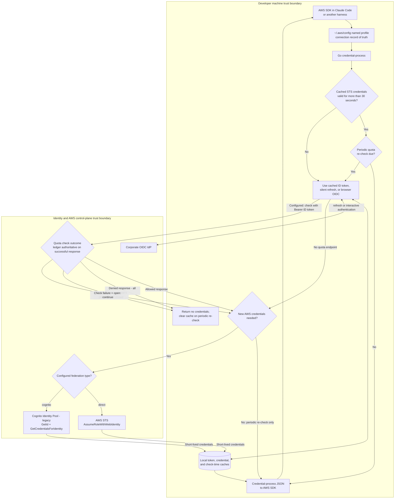

# Enterprise Deployment Guide

This guide walks IT administrators through deploying Claude Code authentication across your organization, transforming your existing identity provider into a gateway for secure Amazon Bedrock access.

> **Prerequisites**: See the [Quick Start prerequisites](../../QUICK_START.md#prerequisites) for detailed requirements. You'll need AWS administrative access, an OIDC identity provider, and Python with Poetry installed.

## The Deployment Process

Deploying Claude Code authentication involves four key phases: configuring your identity provider, deploying AWS infrastructure, creating distribution packages, and supporting your users. Each phase builds on the previous one, creating a complete authentication solution that's transparent to end users.

## Credential-process authentication and issuance flow

At runtime, the AWS SDK follows the installed named profile into the Go
credential-process. Local files are caches, not authorization records. With a
quota endpoint configured, a successful quota response makes its usage ledger
the enforcement record of truth: an explicit denial blocks in every mode.
Missing tokens and API, network, or parse failures block in the default
`closed` mode but continue in `open` mode. The check precedes
both direct STS and legacy Cognito Identity Pool credential issuance.



## Phase 1: Configuring Your Identity Provider

The journey begins in your organization's identity provider console. Whether you're using Okta, Azure AD, or Auth0, you'll create a new application that serves as the authentication gateway for Claude Code.

Log into your provider's admin console and navigate to the application creation section. You're creating what's known as a "Native Application" in OIDC terms - this tells the provider that users will authenticate from their local machines rather than a web server. Name it something clear like "Claude Code Authentication" or "Amazon Bedrock CLI Access" so users recognize it during login.

The critical configuration involves setting up the OAuth2 flow with specific parameters. Enable "Authorization Code" and "Refresh Token" grant types, which allow secure authentication and token renewal. The redirect URI must be exactly `http://localhost:8400/callback` - this is where the authentication process returns after users log in. Request the standard OIDC scopes: `openid`, `profile`, and `email`. Most importantly, enable PKCE (Proof Key for Code Exchange), which provides security without requiring client secrets.

> **Provider-Specific Guides**: For detailed instructions specific to your identity provider, see our guides for [Okta](providers/okta-setup.md), [Azure AD](providers/microsoft-entra-id-setup.md), or [Auth0](providers/auth0-setup.md).

Next, determine who should have access. The cleanest approach is creating a dedicated group like "Claude Code Users" and assigning it to the application. This gives you centralized control over access - simply add users to the group to grant access, or remove them to revoke it. Apply any additional policies your organization requires, such as MFA or device trust requirements.

Before moving on, note two critical values from your application configuration: the provider domain (like `company.okta.com` or `login.microsoftonline.com/{tenant-id}/v2.0`) and the Client ID. You'll need these for the AWS infrastructure deployment.

## Phase 2: Deploying AWS Infrastructure

With your identity provider configured, it's time to deploy the AWS infrastructure that bridges your organization's authentication to Amazon Bedrock. Start by cloning the repository and installing the deployment tools:

```bash
git clone https://github.com/aws-samples/sample-guidance-for-governed-inference-platform-on-amazon-bedrock
cd sample-guidance-for-governed-inference-platform-on-amazon-bedrock/source
poetry install
```

The `gip` (Governed Inference Platform) CLI tool guides you through deployment with an interactive wizard. Run `poetry run gip init` to begin. The wizard walks you through each configuration decision, starting with your OIDC provider details - enter the domain and Client ID you noted earlier.

The wizard asks you to choose an authentication method. You can select either Direct IAM federation or Cognito Identity Pool based on your organization's requirements. Both methods provide secure OIDC federation to AWS credentials.

Next, you'll select your Claude model and configure regional access. Choose from available Claude models (Opus, Sonnet, Haiku) and select a cross-region inference profile (US, Europe, or APAC) for optimal performance. The wizard will then prompt you to select a source region within your chosen profile for model inference. Finally, choose where to deploy the authentication infrastructure (typically your primary AWS region) and configure optional monitoring setup, which provides usage analytics and cost tracking through OpenTelemetry.

Once configuration is complete, deploy the infrastructure with:

```bash
poetry run gip deploy
```

This single command orchestrates the creation of multiple AWS resources. Depending on your chosen authentication method, it creates either an IAM OIDC Provider or a Cognito Identity Pool to establish the trust relationship with your identity provider. IAM roles and policies grant precisely scoped Bedrock access.

The stacks deployed by `gip deploy` depend on the monitoring mode selected during `gip init`:

- **Central mode**: Deploys networking, s3bucket, monitoring, dashboard, and analytics stacks (ECS Fargate collector shared by all users).
- **Sidecar mode**: Deploys only the dashboard stack. The OpenTelemetry collector runs locally on each developer's machine, so no server-side networking or monitoring infrastructure is needed.

> **Deployment Options**: For more control, see the [CLI Reference](CLI_REFERENCE.md) for deploying specific stacks or using dry-run mode.

## Phase 3: Creating Distribution Packages

With infrastructure deployed, you're ready to create the package that end users will install.

### Multi-Platform Build Support

The packaging system uses Go cross-compilation for all supported platforms:

```bash
# On a macOS admin host, cross-compile binaries for all platforms
poetry run gip package --target-platform all
```

This single command:
- Cross-compiles Go binaries for all 5 platforms (macOS ARM64/Intel, Linux x64/ARM64, Windows x64)
- Generates customer-specific `config.json` and `settings.json` from your deployment profile
- Includes `otel-helper` binary if monitoring is enabled
- Produces ready-to-distribute install packages with platform-specific installers

**Requirements:** Go 1.24+ installed. Linux and Windows targets cross-compile from macOS, Linux, or Windows without Docker or CodeBuild. macOS targets require a macOS host with Apple build tools because the credential process uses CGO for Keychain access. Run `--target-platform all` on macOS; on other hosts request only Linux and Windows targets.

> **Legacy mode:** `gip package --legacy` explicitly selects the deprecated PyInstaller/Nuitka/Docker/CodeBuild pipeline retained for temporary backward compatibility.

<details>
<summary>Legacy build mode details</summary>

PyInstaller emits binaries in the host OS's native format, so the build host must match the target OS. Only Windows (via CodeBuild) escapes this constraint.

| Target binary | Build host required | Tooling |
|---|---|---|
| `macos-arm64`, `macos-intel` | **macOS** | PyInstaller (native) |
| `linux-x64`, `linux-arm64` | Linux, **or** macOS with Docker Desktop | PyInstaller (Docker container when building from macOS) |
| `windows` | any host | AWS CodeBuild (remote) |

- **Windows**: Uses Nuitka via AWS CodeBuild
- **macOS**: Uses PyInstaller with architecture-specific builds (ARM64 or Intel)
- **Linux x64/ARM64**: Uses PyInstaller in Docker containers (cross-compiled from macOS)

**Linux admins cannot produce macOS binaries** — the package command refuses this combination with a clear error.

</details>

**Which macOS binary should you ship?**

| Your developer fleet | Recommended binary | Notes |
|---|---|---|
| Apple Silicon only | `macos-arm64` | Native, no extra setup |
| Intel only | `macos-intel` | Native, no extra setup |
| Mixed (or unknown) | `macos-intel` | Covers everyone — runs natively on Intel, via Rosetta on Apple Silicon |
| Performance-conscious mixed fleet | Both `macos-arm64` + `macos-intel` | Installer picks the right one per device |

> **Rosetta translation:** Intel (`x86_64`) binaries run on Apple Silicon via Apple's Rosetta 2 translation layer — users don't need to do anything. ARM64 binaries cannot run on Intel Macs at all.

**Optional: Cross-arch macOS Builds (legacy mode only)**

By default, legacy-mode `gip package` builds only for your Mac's own architecture (arm64 on Apple Silicon, x86_64 on Intel). To build for the other architecture — for example, an Apple Silicon admin building the Intel binary to cover Intel Mac users — install a universal2 Python:

1. Download the **macOS 64-bit universal2 installer** for Python 3.12 from [python.org/downloads/macos](https://www.python.org/downloads/macos/)
2. Run the installer — it places Python at `/Library/Frameworks/Python.framework/`
3. Re-run `gip package` — it detects the universal2 Python automatically and builds both architectures

On first cross-arch build, `gip` creates an isolated build environment at `~/.gip/build-venvs/` (~30s). Subsequent runs reuse it.

Without universal2 Python: `--target-platform=all` skips the cross-arch target with a note and continues normally. Explicitly requesting the cross-arch target (e.g. `--target-platform=macos-intel` on Apple Silicon) fails with a clear error pointing to the python.org installer.

(Cross-arch setup is not needed with the default Go path.)

The resulting `dist/` folder contains everything users need:

- Platform-specific executables (`credential-process-<platform>`) handle the OAuth2 authentication flow
- The configuration file includes all necessary settings
- Intelligent installer scripts (`install.sh` for Unix, `install.bat` + `gip-install.ps1` for Windows) detect the user's architecture and set up their AWS profile automatically
- If you enabled monitoring, OTEL helper executables and Claude Code telemetry settings that point to your OpenTelemetry collector

### Legacy Windows Build System (Optional)

The default Go path builds Windows binaries locally and does not require CodeBuild. The deprecated `--legacy` path can use AWS CodeBuild with Nuitka and is configured during `init`:

1. **Enable during init**: When running `poetry run gip init`, you'll be prompted:

   ```
   Enable Windows build support via AWS CodeBuild? (y/N)
   ```

   If you answer "yes", the CodeBuild stack will be deployed automatically when you run `deploy`.

2. **If enabled**, legacy Windows builds trigger when you run:

   ```bash
   poetry run gip package --legacy --target-platform=all
   # or specifically for Windows:
   poetry run gip package --legacy --target-platform=windows
   ```

3. **Monitor build progress**:
   ```bash
   poetry run gip builds
   ```

**Important Notes:**

- CodeBuild is unnecessary for the default Go path
- In legacy mode, Windows is skipped if CodeBuild is not enabled
- Legacy Windows builds take 20+ minutes
- To enable Windows builds after initial setup, re-run `poetry run gip init`

### Organization-Wide Enforcement (Optional)

For large deployments (50+ users) where settings must be non-overridable, use managed settings:

```bash
poetry run gip init --managed
poetry run gip package
```

This writes settings to the OS-level `managed-settings.json` path instead of user-scope `~/.claude/settings.json`. Managed settings have the **highest precedence** in Claude Code's settings hierarchy and cannot be edited or overridden by end users.

| OS | Managed path | Requires |
|---|---|---|
| macOS | `/Library/Application Support/ClaudeCode/managed-settings.json` | `sudo` |
| Linux/WSL | `/etc/claude-code/managed-settings.json` | `sudo` |
| Windows | `C:\Program Files\ClaudeCode\managed-settings.json` | Administrator |

The installer will detect managed settings in the package and prompt for elevated privileges. For MDM-managed fleets (Jamf, Intune, Group Policy), see Anthropic's [MDM templates](https://github.com/anthropics/claude-code/tree/main/examples/mdm) for alternative delivery.

## Phase 4: Testing Your Deployment

Before distributing to users, thoroughly test the package to ensure everything works as expected. The CLI provides a comprehensive test command that simulates exactly what end users will experience:

```bash
poetry run gip test
```

This test runs through the complete user journey. It executes the installer in a temporary directory, configures the AWS profile, triggers the authentication flow, and verifies access to Amazon Bedrock. Watch as it opens a browser window for authentication - this is exactly what your users will see.

For more thorough validation, add the `--api` flag to make actual Bedrock API calls:

```bash
poetry run gip test
```

## Phase 5: Distributing to Your Users

With a tested package in hand, you're ready for the final phase: getting the authentication system to your users. Claude Code offers two distribution methods:

### Option 1: Secure URL Distribution

Generate a presigned URL for easy, secure distribution without requiring AWS credentials:

```bash
# Create distribution with 48-hour expiration
poetry run gip distribute

# Or specify custom expiration (up to 7 days)
poetry run gip distribute --expires-hours=72
```

The command uploads your package to S3 and generates a secure, time-limited URL. Share this URL with developers via email, Slack, or your internal wiki. Users download and run the installer - no AWS credentials required.

### Option 2: Manual Distribution

Share the `dist/` folder through your normal software distribution channels - perhaps a shared drive, internal website, or artifact repository.

**Installation by Platform:**

- **Windows**: Users run `install.bat`
- **macOS/Linux**: Users run `chmod +x install.sh && ./install.sh`

Regardless of distribution method, the user experience remains simple. They receive the package, run the installer for their platform, and they're done. The installer:

- Detects their operating system and architecture
- Installs the appropriate binary
- Configures their AWS profile
- Sets up the credential process
- Handles all the complex authentication machinery invisibly

When they run Claude Code with `AWS_PROFILE=gip`, authentication happens automatically in the background. On first use, users will see a browser window open for authentication with your organization's identity provider.
