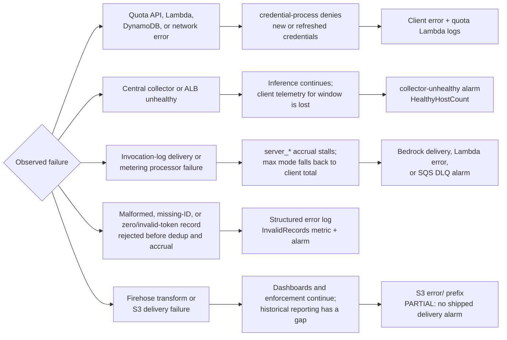

# Failure Posture

How each component of this platform behaves when it fails or when a dependency
degrades — what developers experience, what enforcement does, and what the
operator response is. The design rule throughout: **enforcement paths default
to fail-closed; telemetry paths may degrade but must degrade visibly, never
silently.** Metering record validation follows this rule with structured logs,
an explicit metric, and an alarm on every rejected record.

Recovery procedures live in [RUNBOOKS.md](RUNBOOKS.md). This page is the map:
which failures matter, what the default posture is, and where the honest gaps
are.

## Reading the matrix

- **Fail-closed** — the failure denies access rather than allowing ungoverned
  use (enforcement paths).
- **Fail-open** — the failure allows continued use without the control
  (availability preserved, control suspended).
- **Fail-visible** — the failure degrades a telemetry/reporting path, and an
  alarm or metric surfaces it.

A single outage can span more than one row: the quota *API* being unreachable
(row 1, fail-closed) is a different failure from the *collector* being down
while the quota API is healthy (row 3, silent under-count — see the honest
note below the matrix).

## Failure visibility flow

The visibility signals above are scoped to the resources this repository deploys. Client OTEL collector failures and Bedrock invocation-log delivery failures are separate failure domains. Aggregate-only telemetry follows the same health paths but cannot identify an affected user.

## Failure matrix

Quota checks are deliberately single-attempt and fail-closed (ADR-0034). A
transient dependency failure can deny a refresh; the quota stack alarms on
Lambda errors and API 5XX responses, and `quota_fail_mode: open` is the explicit
operator break-glass choice.

| Component | Failure symptom | Default behavior | Customer impact | Operator action | Posture |
|---|---|---|---|---|---|
| **credential-process quota check (client)** | Quota API unreachable / non-200 at credential issuance or 30-min re-check | Deny credentials (`quota_fail_mode` defaults to `"closed"`, `source/go/internal/config/config.go:216-217`; applies even when no usable ID token exists — the check is never silently skipped, `cmd/credential-process/main.go:709-725`) | Quota-enabled developers cannot get new/refreshed AWS credentials; cached STS credentials keep working until expiry | Fix the quota stack ([RUNBOOKS.md §3](RUNBOOKS.md#3-quota-subsystem-failure)); break-glass: set `quota_fail_mode: "open"` in the client profile | **Fail-closed** (enforcement) |
| **Quota API / DynamoDB (server)** | `gip-quota-check` Lambda errors, DynamoDB throttling/outage | Lambda returns deny on internal error (`ERROR_HANDLING_MODE` defaults to `fail_closed`; the template does not override it) | Same as above — credential issuance blocked for quota-enabled clients | [RUNBOOKS.md §3](RUNBOOKS.md#3-quota-subsystem-failure): check Lambda logs + DynamoDB throttles; emergency levers: flip `ERROR_HANDLING_MODE`, switch policies to alert-only, or `gip quota unblock` | **Fail-closed** (enforcement) |
| **OTEL collector — central mode** | ECS collector/ALB down; dashboards flat | Inference unaffected (credentials and Bedrock access do not pass through the collector). Client OTLP exports fail; metrics for the window are dropped, not backfilled | Usage during the outage is invisible to quota — silent under-enforcement (see note below), permanent dashboard gap | `<stack>-collector-unhealthy` alarm fires (ALB `HealthyHostCount < 1` for 3 min); restart tasks / redeploy per [RUNBOOKS.md §2](RUNBOOKS.md#2-otel-collector-outage-central-mode) | **Fail-visible** (telemetry); enforcement silently under-counts unless metering `max` mode is on |
| **OTEL sidecar — sidecar mode** | Developer's local sidecar stopped (crash or tampering) | That user's usage stops being counted; inference unaffected | Same under-count, but per-user and deliberate tampering is possible | Opt-in [sidecar bypass detection](QUOTA_MONITORING.md#sidecar-bypass-detection) (CloudTrail-vs-DynamoDB join, SNS alert) or metering drift alerts | Telemetry fail-open by construction; **fail-visible** only with bypass detection or metering enabled |
| **Server-side metering** | Invocation-log delivery or processor Lambda failure | `server_*` accrual stalls; enforcement falls back to client-reported figures (`max(client, server)` in `max` mode); dedup markers guarantee retries never double-count | No developer-facing impact; tamper-resistance temporarily reduced | Alarms on processor errors, SQS DLQ depth, and Bedrock `ModelInvocationLogsCloudWatchDeliveryFailure` ([QUOTA_MONITORING.md](QUOTA_MONITORING.md#server-side-metering-tamper-proof-usage)); redrive the DLQ | **Fail-visible** for raised errors and delivery failures |
| **Metering record validation** | Malformed record, missing `requestId`, invalid token count, or zero total tokens | Reject before dedup/accrual; emit a structured content-free error log plus the `GIP/Metering` `InvalidRecords` metric | `max` enforcement and reconciliation may temporarily use an incomplete server total; no invalid record is marked as processed | `${stack}-invalid-records` alarms on any rejection; inspect `invalid_metering_record` logs, correct the source/processor, then replay because no `DEDUP#` marker was committed | **Fail-visible** (telemetry) |
| **Analytics pipeline (Firehose -> S3 -> Athena)** | Transform/delivery failures | Failed records land under the bucket's `error/` prefix (`analytics-pipeline.yaml` `ErrorOutputPrefix`); enforcement and dashboards are unaffected (quota reads CloudWatch, not S3) | Gap in historical/cost reporting only | Inspect the `error/` prefix; no built-in CloudWatch alarm on delivery failure — monitor `AWS/Firehose` `DeliveryToS3.Success` yourself if analytics gaps matter | Fail-open for reporting; visibility is **partial** (error records retained, but not alarmed) |
| **Apps gateway — Postgres outage** | Gateway RDS instance down | Owned by the pinned AWS Samples gateway implementation; GIP does not add a health-check or spend-enforcement mode | Deployment-specific impact remains **unverified in this repo**; do not infer the retired GIP `/readyz` behavior or call spend limits hard caps during a database outage | Follow the pinned upstream operations guide and test the selected commit's database-outage behavior before production | **Upstream-owned; live behavior unverified here** |
| **Apps gateway — service outage** | ECS service/ALB down | Gateway *is* the data plane for Claude apps: no inference for gateway-connected clients until it recovers | Full outage for Claude Code/Desktop users on the gateway; credential-process users unaffected | Follow the pinned upstream operations guide; [RUNBOOKS.md §7](RUNBOOKS.md#7-legacy-gip-apps-gateway-secret-rotation-retired) applies only to legacy GIP stacks | Fail-closed by construction (no gateway -> no inference) |
| **Web search gateway (AgentCore MCP)** | Gateway or managed connector unavailable | Search tool calls fail; the MCP path is independent of the inference path — Bedrock inference and credentials unaffected | Developers lose web search until recovery | No built-in alarm in `bedrock-agentcore-gateway.yaml` (managed service); missing/invalid caller identity is refused. Group entitlement is unavailable and unsafe settings are rejected ([WEB_SEARCH.md](WEB_SEARCH.md#entitlement)) | **Fail-closed** for invalid identity; tool availability degrades without a built-in alarm |
| **Memory stack** | Identity-dependent tools are requested, or a deployed Lambda/sweeper fails | Active identity-dependent tools are rejected pending redesign; log-only calls perform no reads or writes. Inference is unaffected. Sweeper failure can widen the raw-event retention window up to the 3-day service floor | Developers cannot use identity-dependent memory tools; resource/sweeper failures do not affect inference | Keep `DeployGate=log-only`; CloudWatch alarms cover both Lambdas plus a sweeper-not-running watchdog ([MEMORY.md](MEMORY.md)) | **Fail-closed** (feature disabled); **fail-visible** (sweeper) |
| **Skills registry** | Distributor Lambda failure, or registry/S3 unreachable during `gip skills sync` | An explicit curator approval fails before the distributor can verify, promote, and mark the revision `APPROVED`; scheduled rendering failures leave the prior distribution outputs unchanged ([SKILLS_REGISTRY.md](SKILLS_REGISTRY.md)). Previously synced skill directories on developer machines remain as-is [unverified: sync failure cleanup behavior is not pinned by a test] | Developers keep working with the skills they already have; the failed approval or later output refresh does not propagate | Re-run `gip skills approve` for a failed curator request; for an already-approved record, wait for or invoke the 15-minute renderer after fixing the dependency; check distributor Lambda logs | **Fail-closed** for a requested approval; **fail-open** with stale content for rendering/sync availability |
| **Model lifecycle poller** | Daily check Lambda errors | Alerts stop — which is exactly what must not look like "no news": a CloudWatch alarm fires if the check Lambda itself errors ([RUNBOOKS.md §9](RUNBOOKS.md#9-model-rotation-legacy-premium-pricing-end-of-life)) | None immediate; risk is missing a Legacy/EOL window | Fix the Lambda; `gip models check` gives the same answer interactively | **Fail-visible** (a broken poller alarms) |

## Known silent enforcement gaps

The collector-outage row deserves emphasis because it is the one place the
default posture is neither closed nor visible **for enforcement**: during a
central-collector outage the quota-check Lambda keeps returning `allowed`
based on the last usage the monitor recorded — neither fail-mode ever
triggers, because nothing *errors* ([RUNBOOKS.md §2](RUNBOOKS.md#2-otel-collector-outage-central-mode),
"honest impact"). The collector alarm makes the telemetry failure visible,
but usage during the window is under-counted with no reconciliation step.

**Closing it:** deploy [server-side metering](QUOTA_MONITORING.md#server-side-metering-tamper-proof-usage)
with `MeteringMode=max`. Server figures accrue from Bedrock invocation logs,
independent of the collector, so collector outages stop creating a silent
enforcement gap in metered regions. Invalid invocation records can still delay
accrual, but they now produce an alarm and remain replayable because validation
runs before dedup marker construction.

## Design boundaries this posture rests on

- **Enforcement lives at credential issuance, not inline per-request**
  ([ADR-0009](adr/0009-enforcement-at-credential-issuance.md)). This is why a
  collector or quota outage never breaks inference for holders of live STS
  sessions, and why the enforcement gap is bounded by `max_session_duration`.
  Customers who want inline enforcement can use Claude Apps Gateway. Its
  health, database, and spend-failure behavior is owned by the exact AWS
  Samples source pinned under `vendor/`; GIP does not add or reinterpret a
  separate posture.
- **Optional GIP stacks fail independently.** Web search, memory, skills,
  metering, and analytics are separate stacks with independent lifecycles; an
  outage in any of them never takes down the credential/inference path. The
  upstream apps gateway is a separate architecture and has its own failure
  posture.
- **Guardrails caveat:** account-level Guardrails enforcement fails closed by
  design — an invalid enforced configuration can block inference in that
  region ([GUARDRAILS.md](GUARDRAILS.md)). Sandbox-test enforced configs first.
- **VPC-endpoint deployments:** because the quota path is fail-closed, a
  misconfigured endpoint policy (403 on `execute-api`) blocks credential
  issuance — see [NETWORK_ISOLATION.md](NETWORK_ISOLATION.md).

## Unverified failure modes

Marked `[unverified]` where repo evidence is absent; treat these as questions
for your own game-day, not guarantees:

- Skills `gip skills sync` partial-failure cleanup (matrix row above).
- Analytics Firehose delivery-failure alerting — no alarm ships; the `error/`
  prefix is the only built-in signal.
- Web search / memory gateway availability alarms — none ship in the
  templates; AgentCore Gateway is a managed service and its availability
  monitoring is [unverified] beyond tool-call errors surfacing to clients.
- Collector and quota failure behavior was live-verified with Cognito OIDC in
  `us-east-1` on 2026-08-14. Scaling the collector from 1 to 0 left Claude Code
  inference and quota checks working from stale counts, moved the health alarm
  to `ALARM`, left permanent missing datapoints, and recovered metrics and an
  `OK` alarm after scaling back to 1. Closing the quota Lambda produced a 503
  and denied issuance in closed mode; open mode allowed with the documented
  warning, and normal closed-mode issuance recovered after concurrency was
  restored.
- Apps gateway live Postgres-outage behavior is not validated by GIP. The
  selected upstream commit's health and store behavior must be tested in the
  customer deployment; retired local-template postures are not evidence.
