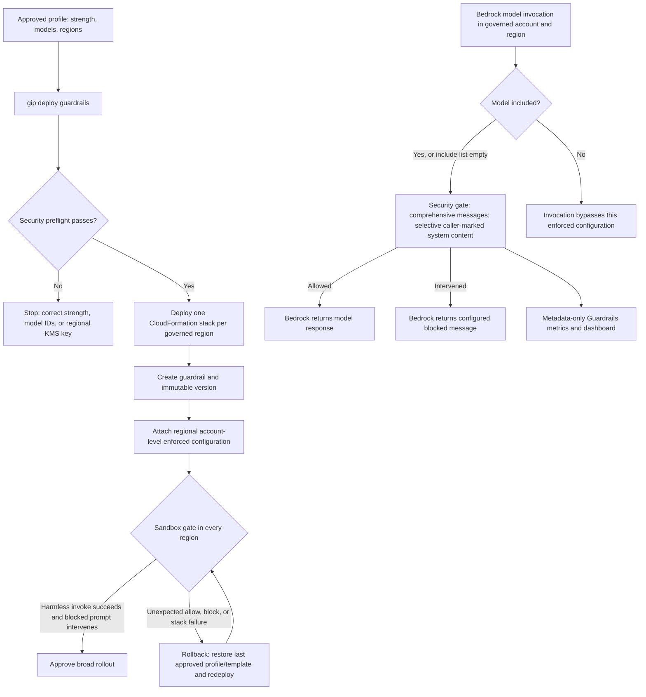

# Bedrock Guardrails Enforcement

This optional stack applies Amazon Bedrock Guardrails at the account-and-region level for the inference account.

> **How does this relate to per-user controls?** The Bedrock service enforces the guardrail on every **in-scope model invocation** in the account and region; an empty `model_include_list` means all models. Messages are guarded comprehensively while system prompts use selective guarding. This policy is not per-user, and an in-scope client cannot opt out. For the didactic end-to-end explanation, see [How the Controls Actually Work](HOW_IT_WORKS.md#door-3-what-the-model-will-say-bedrock-guardrails).

## What It Deploys

- `deployment/infrastructure/guardrails-enforcement.yaml`
- One regional CloudFormation stack per configured Bedrock region.
- An `AWS::Bedrock::Guardrail` with harmful-content filters enabled for input and output. The default does not add a `PROMPT_ATTACK` filter.
- An immutable `AWS::Bedrock::GuardrailVersion`.
- An `AWS::Bedrock::EnforcedGuardrailConfiguration` using `Messages: COMPREHENSIVE` and `System: SELECTIVE` for Claude Code compatibility.
- A CloudWatch dashboard using metadata-only `AWS/Bedrock/Guardrails` metrics.

## Enable

Interactive:

```bash
gip init
gip deploy guardrails
```

Answers-file fields:

```yaml
guardrails:
  enabled: true
  content_filter_strength: MEDIUM  # LOW | MEDIUM | HIGH
  name: gip-guardrail             # optional
  model_include_list: []           # empty = all models in the account+region
  kms_key_arn: null                # optional CMK for guardrail configuration
```

Profile JSON fields:

```json
{
  "guardrails_enabled": true,
  "guardrails_content_filter_strength": "MEDIUM",
  "guardrails_name": "gip-guardrail",
  "guardrails_model_include_list": [],
  "guardrails_kms_key_arn": null
}
```

## Operating Model



- Enforcement is regional. The CLI deploys the stack to every `allowed_bedrock_regions` entry in the same AWS partition as the profile region.
- If `allowed_bedrock_regions` is empty, guardrails uses the same all-known-Bedrock-region fallback as the auth stack to avoid leaving an IAM-allowed region unenforced.
- `guardrails_kms_key_arn` is only supported for a single-region guardrails deployment, and the key ARN must be in that region.
- Empty `model_include_list` means every Bedrock model invocation in that account and region is enforced. Use a dedicated inference account when possible.
- If you co-host unrelated Bedrock workloads, set `model_include_list` to the model IDs this deployment should govern.
- Guardrail trace is not enabled by this stack. Do not enable trace for production traffic unless the response and logs are treated as sensitive data.
- `PolicyRevision` forces CloudFormation to roll out a new immutable guardrail version when policy behavior changes.
- Governed roles include `bedrock:ApplyGuardrail`, required to apply the enforced guardrail during inference.
- Mantle/OpenAI-compatible endpoint coverage remains unverified and is blocked separately by the `DenyBedrockMantleEndpoint` IAM policy until metering/governance parity exists. Any Mantle use outside governed paths is surfaced by the metering stack's `MantleEndpointUsageAlarm` tripwire — see [ADR-0022](adr/0022-mantle-metering-deferred-tripwire.md) and [QUOTA_MONITORING.md](QUOTA_MONITORING.md#endpoint-scope-bedrock-runtime-only-mantle-tripwire).

## Why Not IAM Header Enforcement

R1 rejected IAM `bedrock:GuardrailIdentifier` as the primary path because unsupported harnesses cannot reliably attach Bedrock guardrail headers. That policy denies requests with no guardrail context key, which would brick Claude Code/OpenCode/Codex and the Claude apps gateway. See [ADR-0020](adr/0020-bedrock-guardrails-account-enforcement.md).

## Live Checks

- Run `gip deploy guardrails --show-commands` and confirm the region list matches the intended Bedrock regions.
- Deploy to a sandbox account first; an invalid enforced configuration fails closed and can block inference in that region.
- Validate one harmless invoke and one known-blocked prompt in each region.
- Watch the generated dashboard for `Invocations`, `InvocationsIntervened`, `TextUnitCount`, and `InvocationLatency`.
- Confirm guardrail throughput headroom before broad rollout; guardrails are billed and throttled by text units, not tokens.
