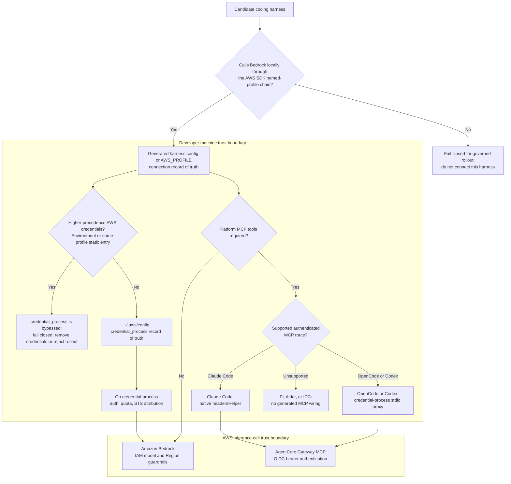

# Any Coding Harness on Bedrock: The Universal Credential-Process Plug

This guidance is packaged for Claude Code, but its authentication core is
harness-agnostic. The credential-process binary emits standard
[AWS `credential_process` JSON](https://docs.aws.amazon.com/cli/latest/userguide/cli-configure-sourcing-external.html),
and the installer registers it as an AWS profile in `~/.aws/config`:

```ini
[profile gip]
credential_process = /home/user/gip/credential-process --profile gip
region = us-east-1
```

Any coding harness that resolves credentials through the **AWS SDK default
chain** — OpenCode, OpenAI Codex CLI, Pi, Aider, or anything else that speaks
Bedrock — inherits the full enterprise control plane with **zero
harness-specific auth work**. Generate ready-to-use configs with:

```bash
poetry run gip package --harnesses all        # or: opencode,codex,pi,aider
```

This writes `harnesses/<name>/` config files plus a `harnesses/README.md` into
the package output. The default (`--harnesses claude-code`, or omitting the
flag) produces exactly the same output as before.

## Architecture: one plug, N harnesses

Use this decision flow before adding a harness. A harness is governed only when
its Bedrock client resolves the installed AWS named profile; a vendor-hosted
inference path or private key store never reaches credential-process. AWS
provider precedence also matters: environment credentials or a static entry for
the same profile in `~/.aws/credentials` can be selected before the
`credential_process` entry in `~/.aws/config`.



## The universal-plug guarantees

These controls are enforced **below the harness layer** — in the
credential-process binary and in IAM — so no harness can opt out of them:

| Guarantee | Enforced where | Applies to |
|---|---|---|
| **OIDC SSO login** (browser flow, token cache, silent refresh) | credential-process binary | Every harness identically |
| **Quota enforcement** | credential-process checks quota **before vending credentials**; blocked users get no credentials at all | Every harness identically |
| **Per-user cost attribution** | STS session name embeds the user identity → `line_item_iam_principal` in CUR 2.0 (see [COST_ATTRIBUTION.md](COST_ATTRIBUTION.md)) | Every harness identically |
| **Model / region guardrails** | IAM policy on the assumed role (Anthropic-model allow-list via the `RestrictToAnthropicModels` parameter, region conditions) | Every harness identically |

## Per-harness setup

Model IDs in every generated config are the **same resolved cross-region
inference (CRIS) profile IDs** the packaged Claude Code settings receive
(resolved per tier for your deployment's CRIS geography, e.g.
`us.anthropic.claude-sonnet-4-5-20250929-v1:0`).

### OpenCode

Live-verified with OpenCode 1.18.18 on 2026-08-14: the generated config returned
`4`, and the web-search MCP proxy connected. Reference:
<https://opencode.ai/docs/providers/#amazon-bedrock>

Config file: `opencode.json` (project root, or `~/.config/opencode/opencode.json`).
The `amazon-bedrock` provider takes `options.region` and `options.profile`
(a named AWS profile — our managed profile); models are declared under
`provider.amazon-bedrock.models` keyed by model ID, and CRIS
inference-profile IDs are used directly as keys:

```json
{
  "$schema": "https://opencode.ai/config.json",
  "model": "amazon-bedrock/us.anthropic.claude-sonnet-4-5-20250929-v1:0",
  "provider": {
    "amazon-bedrock": {
      "options": { "region": "us-east-1", "profile": "gip" },
      "models": { "us.anthropic.claude-sonnet-4-5-20250929-v1:0": {} }
    }
  }
}
```

### OpenAI Codex CLI

Live-verified with Codex 0.147.0 on 2026-08-14: it used the governed identity and
received the expected explicit Mantle deny. This proves the governed deny path,
not a successful Codex model invocation. Reference:
<https://developers.openai.com/codex/amazon-bedrock>

Config file: `~/.codex/config.toml` with `model_provider = "amazon-bedrock"`.
AWS auth uses the SDK credential chain — the Codex docs explicitly support
"Federated identity configured with `credential_process`", which is exactly
this solution's profile. Set `AWS_PROFILE`/`AWS_REGION` in the shell (or in
`~/.codex/.env` for the desktop app / IDE extension).

> **Honest limitation:** Codex's Bedrock integration runs **OpenAI models
> only**, through the Amazon Bedrock Mantle endpoint (Bedrock's
> OpenAI-compatible Responses API); it does not run Claude models, so the
> Claude CRIS IDs do not apply. Every governed credential policy carries an
> explicit `DenyBedrockMantleEndpoint` (`bedrock-mantle:*`) statement, because
> Mantle traffic is invisible to this platform's metering
> ([ADR-0022](adr/0022-mantle-metering-deferred-tripwire.md)). Codex model calls
> with governed credentials are therefore denied in every configuration;
> setting `RestrictToAnthropicModels=false` does not change this. The generated
> Codex config proves the governed deny path only. GovCloud Bedrock endpoints
> are unsupported by Codex.

### Pi

Live-verified with Pi 0.73.1 and Claude Sonnet 4.5 on 2026-08-14. Sonnet 5 had
payload incompatibilities in this client; generated config now uses the
selected model rather than assuming Sonnet 5. Reference:
<https://pi.dev/docs/latest/providers#amazon-bedrock>

Pi has **no dedicated Bedrock config file**. Credentials come from the AWS SDK
chain ("Option 1: AWS Profile" — `export AWS_PROFILE=...`, optional
`AWS_REGION`, default `us-east-1`), and the provider/model are CLI flags:

```bash
export AWS_PROFILE=gip
export AWS_REGION=us-east-1
pi --provider amazon-bedrock --model us.anthropic.claude-sonnet-4-5-20250929-v1:0
```

CRIS inference-profile IDs are passed directly as `--model`; Pi auto-enables
prompt caching for Claude model IDs it recognizes. The package ships a
sourceable `pi-bedrock.env`.

### Aider

Live-verified with Aider 0.86.2 and Claude Sonnet 4.5 on 2026-08-14. Sonnet 5
had payload incompatibilities in this client; generated config now uses the
selected model. Reference: <https://aider.chat/docs/llms/bedrock.html>

Config file: `.aider.conf.yml` (project root or home directory), models named
via LiteLLM's `bedrock/<model-id>` scheme. Inference-profile-only models
**require** the CRIS Inference Profile ID (not the base model ID). AWS auth
via `AWS_PROFILE` + `AWS_REGION` environment variables or an `.env` file:

```bash
export AWS_PROFILE=gip
export AWS_REGION=us-east-1
aider --model bedrock/us.anthropic.claude-sonnet-4-5-20250929-v1:0
```

Aider may need `boto3` installed into its environment (`pipx inject aider-chat boto3`).

### Cline

Verified against: <https://docs.cline.bot/provider-config/aws-bedrock/cli-profile>
(retrieved 2026-07-08)

Cline's "AWS Bedrock" provider reads a named AWS profile (or the default
credential chain) from `~/.aws` — Cline's enterprise docs describe it as the
"standard AWS credential provider chain". Point it at the managed profile and it
inherits SSO, quota, attribution, and IAM guardrails with zero extra work:

1. In Cline settings, choose provider **AWS Bedrock**.
2. Select authentication **AWS Profile** and enter `gip`.
3. Set the region to your deployment's region and the model to a permitted CRIS
   profile ID (e.g. `us.anthropic.claude-sonnet-4-5-20250929-v1:0`).

No generated config ships for Cline (`--harnesses` does not include it); the
manual steps above are the integration.

### Continue

Verified against: <https://www.continue.dev/docs/customize/model-providers/top-level/bedrock>
(retrieved 2026-07-08)

Continue's `bedrock` provider authenticates via a named profile from `~/.aws`:

```yaml
models:
  - name: Claude via governed Bedrock
    provider: bedrock
    model: us.anthropic.claude-sonnet-4-5-20250929-v1:0
    env:
      region: us-east-1
      profile: gip
```

> **Caveat:** Continue's docs show profile-based auth; they do not explicitly
> mention `credential_process`-backed profiles. Profile resolution goes through
> the AWS SDK, which handles `credential_process` transparently, but run a
> one-user smoke test before fleet rollout. As with Cline, no generated config
> ships — the snippet above is the integration.

### Not governable today: Cursor, Windsurf, Gemini CLI

Documented so security teams can block these knowingly (all sources retrieved
2026-07-08):

| Harness | Why it cannot be governed by this platform |
|---|---|
| **Cursor** | The CLI rejects Bedrock models ("Bedrock models are disabled" — [Cursor forum, 2026-02-25](https://forum.cursor.com/t/cli-support-for-aws-bedrock-integration/152865)). The IDE's BYOK-Bedrock option exists but uses static keys or an IAM role (with external ID) **assumed by Cursor's backend**, not the local credential chain ([Cursor API-keys docs](https://docs.cursor.com/advanced/api-keys)) — it would bypass credential-process entirely, so quota, session-name attribution, and the fail-closed vend gate never run. **Enabling Cursor BYOK-Bedrock against your account breaks the governance model**; block it via IdP/network policy if that matters |
| **Windsurf** | Inference routes through Windsurf's service; no Bedrock / bring-your-own-credential-chain option in the official docs index ([docs.windsurf.com](https://docs.windsurf.com)) |
| **Gemini CLI** | No Bedrock support; the feature request went stale ([google-gemini/gemini-cli#3454](https://github.com/google-gemini/gemini-cli/issues/3454), opened 2025-07-07) |

For the requirements a harness must meet to inherit governance for free, the
test is simple: **does it resolve Bedrock credentials through the AWS SDK
default chain / `~/.aws` profiles?** If yes (Cline, Continue, and the four
harnesses above), it is governed. If it ships its own key store or routes
inference through vendor servers, it is not.

## Honest capability matrix

Authentication, quota, and IAM guardrails are universal. Everything built on
Claude Code's own client hooks is not. (The non-Claude-Code column applies
equally to Cline and Continue — they ride the same profile.)

| Capability | Claude Code | OpenCode / Codex / Pi / Aider |
|---|---|---|
| SSO login (OIDC browser flow) | ✅ credential-process | ✅ identical — same binary |
| Quota blocking at credential issuance | ✅ | ✅ identical — checked before creds are vended |
| Per-user CUR cost attribution (session name) | ✅ | ✅ identical |
| IAM model/region guardrails | ✅ | ✅ identical |
| Model inference with governed credentials | ✅ | ✅ OpenCode / Pi / Aider; ❌ Codex (Mantle endpoint denied, see [Codex](#openai-codex-cli)) |
| **Per-user OTEL telemetry → solution dashboards** | ✅ emits OTEL metrics | ❌ do **not** feed the solution's dashboards |
| **Per-user usage visibility** | OTEL dashboards + CUR | Session-name CUR attribution; plus, when deployed, server-side metering from Bedrock invocation logs covers **all harnesses identically** ([design](designs/server-side-metering-design.md)) |
| **Default-model lock** | ✅ `managed-settings.json` (OS-managed, non-overridable) | ❌ managed-settings is Claude-Code-only; these harnesses rely on the IAM `RestrictToAnthropicModels` allow-list (any permitted Anthropic model is selectable) |
| **Web search (AgentCore gateway MCP)** | ✅ native `headersHelper` (see [Platform tools](#platform-tools-mcp)) | ✅ OpenCode / Codex via the `--mcp-proxy` stdio shim; ❌ Pi / Aider (no MCP support upstream) |
| **Claude apps gateway** | ✅ optional gateway integration | ❌ Claude-Code-only; other harnesses keep direct Bedrock access |

Two practical consequences:

1. **Usage dashboards under-count if users adopt other harnesses** while only
   client OTEL is deployed. Session-name CUR attribution still captures their
   spend per user, and the
   [server-side metering design](designs/server-side-metering-design.md)
   closes the gap authoritatively for every harness (it meters Bedrock
   invocation logs, which no client can suppress).
2. **Model governance shifts from settings to IAM.** Claude Code can be locked
   to a specific default model via managed settings; the other harnesses can
   pick any model the IAM policy allows. If a hard model allow-list matters,
   enforce it in IAM (it already applies to every harness).

## Platform tools (MCP)

When the optional [web search stack](WEB_SEARCH.md) is deployed
(`web_search_enabled`, OIDC auth), `gip package` wires the AgentCore Gateway
MCP endpoint (`GatewayMcpEndpoint`, streamable HTTP, `Authorization: Bearer
<id_token>`) into every harness whose MCP client can carry it. The auth
primitive is the same everywhere: `credential-process --profile <name>
--get-mcp-auth-header` prints `{"Authorization":"Bearer <id_token>"}` without
ever opening a browser (cached token first, silent refresh_token exchange on a
miss).

| Harness | Mechanism | Generated artifact |
|---|---|---|
| **Claude Code CLI** | Native streamable HTTP + `headersHelper` (the installer-dropped `websearch-headers` wrapper) | Installer runs `claude mcp add-json agentcore-websearch -s user`; `gip-settings/mcp.json` is the distributable fallback |
| **Claude Desktop / CoWork** | `managedMcpServers` + `headersHelper` + `headersHelperTtlSec=900` | MDM `.mobileconfig` / `.reg` (see [COWORK_3P.md](COWORK_3P.md)) |
| **OpenCode** | stdio shim: `credential-process --mcp-proxy <url>` (`type:"local"` entry) | `harnesses/opencode/opencode.json` → `mcp.agentcore-websearch` |
| **Codex CLI** | stdio shim (`[mcp_servers.agentcore-websearch]` `command`/`args`) | `harnesses/codex/config.toml` |
| **Pi** | ❌ not supported — no MCP by design (extensions are Pi's escape hatch; the community `pi-mcp-adapter` can reuse the stdio shim entry) | docs pointer only |
| **Aider** | ❌ not supported — no MCP client upstream (Aider-AI/aider#2525 open) | docs pointer only |

### Setup per harness

- **Claude Code CLI:** run the installer. If the `claude` CLI is on PATH (and
  the installer is not running under `sudo`), the server is registered
  automatically at user scope; otherwise the installer prints the exact
  `claude mcp add-json` command to run once. Admins can instead distribute
  `gip-settings/mcp.json` as a project `.mcp.json` (users get a one-time
  approval prompt).
- **OpenCode / Codex:** run the installer **first** — it resolves the
  `__CREDENTIAL_PROCESS_PATH__` placeholder in the generated configs to the
  installed binary path — then copy the config per `harnesses/README.md`. Do
  not convert the OpenCode entry to `type:"remote"`: remote headers are static
  and OpenCode's automatic OAuth-on-401 opens a browser against a gateway that
  is not an OAuth authorization server.
- **Pi / Aider:** no wiring is generated; the per-harness sections in
  `harnesses/README.md` state the limitation honestly.

### Token TTL

The gateway validates the OIDC `id_token`, which typically expires after ~1
hour. No harness needs a long-lived token:

- **Claude Code** re-runs the `headersHelper` fresh on every connection and,
  as of v2.1.193, re-runs it and retries once on a 401/403 mid-session.
- **CoWork** re-invokes the helper every `headersHelperTtlSec` (900 s).
- **The `--mcp-proxy` shim** fetches the header per request and force-refreshes
  + retries once on a 401/403 from the gateway. If the browserless refresh is
  exhausted (no refresh_token), it fails closed with a JSON-RPC error and a
  non-zero exit — run any `credential-process` auth flow once to recover.

**IDC deployments get no MCP wiring** in any harness: the gateway's
`CUSTOM_JWT` authorizer validates OIDC id_tokens, and no harness MCP client
supports SigV4. The packaging output prints this skip explicitly.

## Relationship to `gip package`

- `--harnesses` accepts a comma-separated list (`opencode,codex,pi,aider`),
  `all`, or `claude-code` (default). It can also be persisted in the profile's
  `harnesses` field.
- Output lands in `harnesses/<name>/` inside the package directory, next to
  the installer. Users run the normal installer **first** (it creates the AWS
  profile and installs the binary), then apply their harness's config file per
  `harnesses/README.md`.
