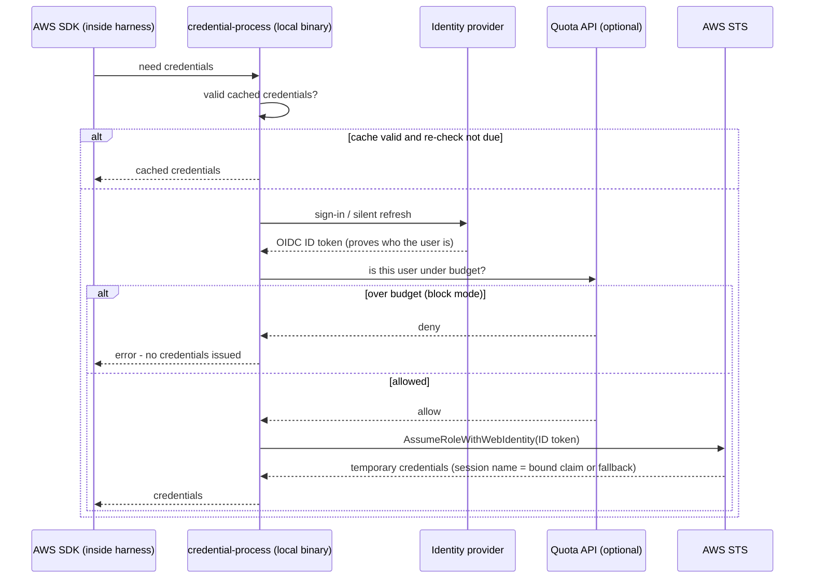

# How the Controls Actually Work

This page explains the runtime mechanics of each governance control: what
happens, in what order, and which AWS primitive enforces it when a user sends
a prompt. It is written for readers who are not AWS identity experts. Each
section answers four questions:

1. What does the user experience?
2. What actually happens, step by step?
3. Which AWS primitive enforces it?
4. Is it per-user or account-wide?

For deployment instructions, see each component's own guide (linked per
section). For the honest limits of every control, see
[Failure Posture](FAILURE_POSTURE.md).

The three-door walkthrough below describes GIP's credential-process
architecture. Claude Apps Gateway is a separate data-plane architecture owned
by the exact AWS Samples source pinned under `vendor/` (materialized by
`scripts/fetch-claude-apps-gateway.sh`); where relevant, this
page links to that upstream-owned alternative without reinterpreting its
runtime behavior.

## The mental model: three doors

Every control in this platform sits behind one of three doors. Knowing which
door a control belongs to answers most "but how does it actually work?"
questions:

| Door | Question it answers | Controls behind it | Scope |
|---|---|---|---|
| **1. Will the standard helper vend credentials?** | Can this person authenticate, and will the unmodified credential helper return credentials now? | Federated identity; cooperative quota gate | **Per-user** |
| **2. What does the key open?** | With credentials in hand, which APIs and models can be called? | IAM model/region scoping | Per-role (every user of the deployment gets the same scoped key) |
| **3. What will the model say?** | Given an allowed call, is the content acceptable? | Bedrock Guardrails | **Account + region** (everyone, identically) |

Two more mechanisms watch the doors without guarding them: **attribution**
(who did what, for CloudTrail and cost reporting) and **metering** (how much
they used, feeding back into door 1).

The single most common misunderstanding: people assume all controls are
per-user because the platform reports per-user dashboards and budgets.
They are not. *Identity and quota decisions* are per-user. The IdP/STS identity
check is server-enforced; the quota gate is enforced by the standard local
helper and can be bypassed by a modified client that exchanges a valid token
directly. *Model scoping* is per-role. *Guardrails* apply to every in-scope
invocation in the account and region, no matter who makes it. Per-user data +
account-level content policy is a deliberate design, explained below.

## Door 1: What the standard helper will vend — identity and quota

### What the user experiences

For OIDC profiles, first use opens the company IdP browser flow. IDC profiles
use the IAM Identity Center device-authorization flow. Passthrough (`none`)
profiles perform no GIP sign-in and return ambient AWS credentials. If quota is
configured on an OIDC/IDC profile, a deny makes the standard helper withhold
credential JSON.

### What actually happens

The harness never talks to the IdP or to quota itself. The AWS SDK inside the
harness calls a small local binary, `credential-process`, whenever it needs
credentials. (Claude Desktop's default MDM configuration runs the same binary
directly as its `inferenceCredentialHelper` and receives a Bedrock bearer
token.) That binary runs this sequence:

For OIDC profiles, the standard helper checks quota before exchanging the token
for Direct STS or Cognito credentials, so it does not mint or cache fresh
credentials after a deny. This ordering is a hard contract in the helper
(`source/go/cmd/credential-process/main.go`, "quota before STS") and is
covered by regression tests
(`source/go/cmd/credential-process/quota_enforcement_order_test.go`).

The diagram shows OIDC mode. [IAM Identity Center](providers/iam-identity-center-setup.md)
has a different order: the helper retrieves IDC role credentials, uses them to
SigV4-sign the quota request, and withholds credential JSON when quota denies.
The IDC credentials already exist inside the helper at check time; they are not
returned to the calling SDK after a deny. In `none` mode (existing AWS
credentials, no user identity) there is no quota gate — usage is tracked
anonymously only.

Three details worth understanding:

- **Credential source and expiry depend on mode.** Direct STS requests
  `max_session_duration` (default 12 hours). Cognito's
  `GetCredentialsForIdentity` response determines expiration; the helper does
  not pass `max_session_duration` to that API. IDC follows its SSO role/session
  configuration. Passthrough mode can return ambient static or otherwise
  long-lived credentials and receives none of GIP's federation guarantees.
- **Quota re-checks are helper-invocation driven.** After
  `quota_check_interval` minutes (default 30), the *next invocation* of
  credential-process is eligible to re-check. An SDK may keep valid
  credentials in memory and not invoke the helper immediately, so enforcement
  latency is client-specific and bounded by credential/session expiry.
- **Errors fail closed by default.** If the quota API is unreachable, or no
  ID token is available for the check, the default `quota_fail_mode=closed`
  denies issuance rather than guessing (`source/go/internal/quota/quota.go`).
  Operators can explicitly choose `open` as a break-glass availability
  trade-off ([ADR-0034](adr/0034-single-attempt-quota-fail-closed.md)).

### Which primitive enforces it

- Identity: the IdP plus STS/Cognito/IDC service validates authentication and
  issues scoped temporary credentials.
- Quota: an API Gateway + Lambda + DynamoDB stack
  (`gip deploy quota`) returns the decision; the local credential helper
  enforces it by withholding output. STS and Cognito do not consult the quota
  API. See [Quota Monitoring](QUOTA_MONITORING.md).

### Per-user or account-wide?

**Per-user decision.** The quota API keys its decision to validated OIDC or IDC
identity, and policies can differ per user or IdP group. Enforcement remains
cooperative because it is the standard helper that acts on the decision.

### What it does not do

It does not cut off a session that is already running. A blocked user's
existing credentials keep working until their issued expiration: Direct STS is
bounded by `max_session_duration`, Cognito by the expiration returned from
`GetCredentialsForIdentity`, and IDC by its permission-set role credentials.
See [ADR-0009](adr/0009-enforcement-at-credential-issuance.md). It also does not
prevent a modified OIDC client holding a valid token from bypassing
credential-process and calling STS/Cognito directly. An IDC user can likewise
use role credentials obtained outside this helper without its quota check.
IAM model/region policy and account guardrails still apply when those
credentials use the GIP-created role. Hard-blocking every request requires
putting a proxy in the inference path; teams that want that trade-off should use the
[Claude apps gateway](APPS_GATEWAY.md), whose pinned upstream implementation
provides per-request spend controls.

## Door 2: What the key opens — IAM model and region scoping

### What the user experiences

With a GIP-created OIDC/Cognito role, nothing happens until the user calls a
model outside the allow-list — then IAM returns `AccessDenied` before any model
runs. IDC behavior depends on the configured Identity Center permission-set
policy; passthrough behavior depends on the ambient principal's external policy.

### What actually happens

For OIDC and Cognito deployments, the credentials use a GIP-created IAM role.
That role's policy grants `bedrock:InvokeModel*` only on Anthropic model and
inference-profile ARNs (default-on `RestrictToAnthropicModels`,
[ADR-0006](adr/0006-default-on-iam-model-scoping.md)), and only in the regions
listed in `allowed_bedrock_regions`. IAM evaluates that policy on every API
call. IDC returns credentials for the configured AWSReservedSSO permission-set
role directly; its model/region policy must be configured on that permission
set and is not inherited from `bedrock-auth-idc.yaml`. Passthrough mode returns
ambient credentials whose policy is also external to GIP.

This is the strongest control in the platform precisely because it is not
client-side: no harness setting, environment variable, or modified binary can
widen what the credentials are allowed to do.

### Which primitive enforces it

IAM policy evaluation on the GIP OIDC/Cognito role, the external IDC
permission-set role, or the ambient passthrough principal, respectively.

### Per-user or account-wide?

**Per role.** Users federating through the same GIP OIDC/Cognito deployment get
the same scope. IDC users get their permission-set role's scope. Passthrough
credentials get their ambient principal's scope. Differentiated model access
requires separate roles/deployments or the pinned gateway's upstream
per-group model policies.

## Door 3: What the model will say — Bedrock Guardrails

This is the control people most often assume is per-user, so it deserves the
most careful explanation.

### What the user experiences

For an included model, a prompt (or model response) that trips a configured
filter comes back as the blocked message instead of a normal answer. Excluded
models do not use this enforced configuration.

### What actually happens

When the guardrails stack is deployed (`gip deploy guardrails`), it registers
an `AWS::Bedrock::EnforcedGuardrailConfiguration` in each governed region
(`deployment/infrastructure/guardrails-enforcement.yaml`). From that moment,
**the Amazon Bedrock service itself** evaluates the pinned guardrail version
against every in-scope model invocation in that account and region. An empty
`model_include_list` covers all models; a non-empty list limits enforcement to
those model IDs:

1. The harness signs an `InvokeModel`/`Converse` call with the user's
   temporary credentials and sends it to Bedrock — no proxy in between.
2. IAM authorizes the call (door 2).
3. Bedrock, server-side, applies `Messages: COMPREHENSIVE` and
   `System: SELECTIVE` before the model, then evaluates the model response.
   Selective system coverage applies only to system content the caller marks
   for guarding.
4. If a filter intervenes, Bedrock returns the blocked message; otherwise
   the response passes through unchanged.

For in-scope models, message and response enforcement occurs inside Bedrock.
System-prompt coverage is intentionally selective and therefore depends on the
client marking system content for guarding. Models excluded by
`model_include_list` are outside this configuration by design.

### "So how do we enforce guardrails per user?"

The honest, precise answer: **we don't — the guardrail content policy is
account-and-region wide for its in-scope models, and that is deliberate.**

What *is* per-user is everything around the guardrail:

- **Who authenticates** is user-specific; the standard helper also applies its
  cooperative quota decision before returning credentials.
- **Who made a blocked or allowed call** depends on the auth mode and session
  naming described below.
- **Usage and spend attribution** depends on the same identity mapping and is
  not universally an email.

Why not per-user guardrail policies? Two evaluated alternatives were
rejected ([ADR-0020](adr/0020-bedrock-guardrails-account-enforcement.md)):

- **IAM `bedrock:GuardrailIdentifier` conditions** require every client to
  attach a guardrail header to every call. Claude Code, Claude Desktop,
  OpenCode, and Codex CLI cannot reliably do that, and the IAM condition
  denies any call without the header — which would break every supported
  harness.
- **An inline proxy calling `ApplyGuardrail`** would put a platform-owned
  service in the data path of every inference call, sacrificing the
  zero-proxy availability property (a platform outage would become an
  inference outage).

Account-level enforced configuration makes message and response enforcement
server-side for in-scope models; clients cannot opt out of that portion.
Selective system-prompt coverage still requires callers to mark the relevant
system content. If a team genuinely needs
different content policies for different user groups, the supported paths
are separate inference accounts per policy (the recommended isolation
boundary). The gateway server-enforces upstream-defined model/spend controls
and delivers tool settings client-side, where a modified client can bypass
them. It does not turn this account-level Bedrock guardrail into a per-user
content policy.

### Which primitive enforces it

`AWS::Bedrock::EnforcedGuardrailConfiguration` referencing an immutable
`AWS::Bedrock::GuardrailVersion` — evaluated by the Bedrock service on every
in-scope invocation. See [Guardrails](GUARDRAILS.md).

### Per-user or account-wide?

**Account + region for the configured model scope.** The same policy applies to
everyone invoking an included model; any user visibility comes from the
separate attribution path, not from the guardrail.

## The watchers: attribution, metering, telemetry

These three do not block model requests. They make the doors auditable;
metering and telemetry can feed quota decisions made at door 1.

### Attribution — "who did what" (auth-mode dependent)

AWS records the role/session principal on subsequent API calls, but that value
is not universally an email:

- **Direct STS:** credential-process prefers email and otherwise falls back to
  a sanitized `sub`. `SessionNameBinding=email` is both tamper-resistant and
  maps to a named email in the current metering processor. Binding to `sub` is
  tamper-resistant at STS, but a typical non-email subject is currently stored
  under `UNATTRIBUTED#<role>`. With binding `none`, the session name is
  client-asserted and spoofable.
- **IDC:** CloudTrail carries the AWSReservedSSO role/session identity; the
  session component may be a username rather than an email.
- **Cognito identity federation:** Bedrock invocation-log role sessions are not
  reliably mappable to the user, so server metering assigns an
  `UNATTRIBUTED#<role>` bucket.

CloudTrail therefore provides principal/session attribution at the quality of
the selected auth mode. CUR 2.0 exposes `line_item_iam_principal` only when
caller-identity data is enabled. Cost Explorer cannot group on that column;
per-user Cost Explorer views require separately configured and activated
session tags. See [Cost Attribution](COST_ATTRIBUTION.md) and
[ADR-0015](adr/0015-session-name-binding.md).

### Server-side metering — "how much, provably"

Client telemetry can be turned off by a hostile client; invocation logs
cannot. The optional metering stack (`gip deploy metering`) enables Bedrock
**model invocation logging** (metadata only — token counts, model, identity;
never prompt content). A processor Lambda
(`deployment/infrastructure/lambda-functions/metering_processor/index.py`)
reads those service-generated records, deduplicates by request ID, and
accrues `server_*` totals in the quota table. Token counts and request IDs are
service-generated, but the user label still depends on the role-session mapping
above: email-bound Direct STS maps to a named user, sub-bound Direct STS is
usually unattributed, unbound Direct STS is client-asserted, IDC may use a
username, and Cognito can be unattributed. In `max` mode, the
quota decision uses the higher client/server total for the mapped identity, so
stopping the telemetry sidecar no longer hides usage where identity mapping is
available. See
[Quota Monitoring](QUOTA_MONITORING.md#server-side-metering-tamper-proof-usage).

### Telemetry — "dashboards"

In the credential-process architecture, per-user Claude Code telemetry is
available for sidecar OIDC, quota-enabled sidecar IDC with the identity helper,
and verified central OIDC. Zero-binary sidecar IDC, central IDC,
passthrough/no-auth, HTTP-only, shared-token, and unmatched central ingress are
aggregate-only. Claude Desktop's static GIP MDM path is also aggregate-only;
GIP does not claim that client-supplied Desktop fields establish user identity
or feed a named user's quota. Gateway deployments use their own upstream-owned
telemetry and spend model. See [Monitoring](MONITORING.md).

## Putting it together: one prompt, end to end

A Direct-STS user with email binding types a prompt in Claude Code with every
module enabled:

1. The AWS SDK asks `credential-process` for credentials. Cache is warm and
   the quota re-check is not due, so cached temporary credentials are
   returned instantly. *(Door 1 — already passed.)*
2. The SDK signs `InvokeModel` and sends it straight to Bedrock. IAM checks
   the federated role's policy: Anthropic model, allowed region — permitted.
   *(Door 2.)*
3. Bedrock's enforced guardrail scans the request content, lets it through,
   the model generates, the guardrail scans the response, and the answer
   returns. *(Door 3.)*
4. CloudTrail logs the call under `.../assumed-role/<role>/user@company.com`;
   the invocation log emits a metadata record that the metering processor
   accrues to that user; the harness emits OTEL metrics for the dashboards.
   *(Watchers.)*
5. After the default 30-minute interval has elapsed, the next SDK invocation of
   credential-process makes the quota re-check eligible. At 92% a warning is
   printed; past 100% in block mode, that helper call returns no credentials.
   *(Back to door 1.)*

No platform-owned service sat between the harness and Bedrock at any point —
which is why a platform component outage degrades dashboards or credential
*renewal*, never in-flight inference. The one exception, chosen knowingly,
is the [Claude apps gateway](APPS_GATEWAY.md) path, where inline per-request
spend enforcement is worth owning the data path; its behavior remains defined
by the pinned upstream source.

## Quick reference

| Control | Enforced by | Enforced when | Scope | Can a client bypass it? |
|---|---|---|---|---|
| Federated identity (not passthrough) | IdP + STS/Cognito/IDC service | Credential issuance | User/session | Invalid identity cannot bypass service validation |
| Quota / budgets | Quota API decision enforced by credential-process | OIDC issuance; IDC after role retrieval; eligible cache re-check on later helper invocation | Per-user / group / default | **Yes** — OIDC can exchange a valid token directly and IDC can use role credentials outside the helper; existing credentials also survive until expiry |
| Model / region scope | IAM policy on the active principal | Every API call | GIP role for OIDC/Cognito; permission-set role for IDC; ambient principal for passthrough | No beyond what that principal's IAM policy allows; GIP guarantees the policy only for its OIDC/Cognito roles |
| Guardrails | Bedrock enforced guardrail configuration | Every in-scope invocation; messages comprehensive, system selective | Account + region + selected models | No for in-scope models — enforced inside Bedrock |
| Attribution | AWS role/session principal → CloudTrail / CUR | Every API call | Auth-mode dependent | Email/sub bindings are tamper-resistant; only email-shaped Direct STS sessions map to named-user metering today |
| Server metering | Bedrock invocation logs → processor Lambda | Every invocation (async) | Mapped identity or `UNATTRIBUTED#<role>` | Counts are service-generated; named identity depends on auth mode and session shape |
| Telemetry | OTEL → collector → CloudWatch | Continuous | Per-user only for sidecar OIDC, quota-enabled sidecar IDC with helper, or verified central OIDC; otherwise aggregate | Yes (client-side) — which is exactly what metering `max` mode compensates for where identity maps |
