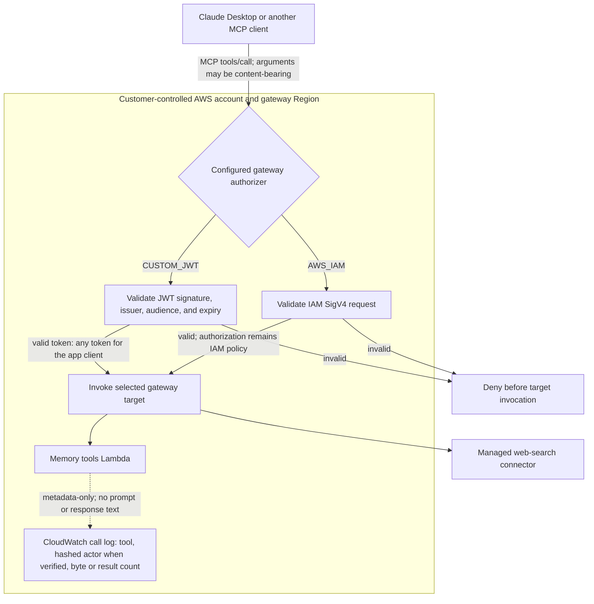

# MCP Gateway Extension Guide

This repo ships two supported AgentCore Gateway patterns:

- **Managed connector target** — `gip deploy websearch` creates the web-search MCP target.
- **Lambda target** — `gip deploy memory` attaches `memory_store`, `memory_retrieve`, `org_knowledge_search`, and `org_knowledge_add` tools to the same gateway.

Use those as structural starting points for internal APIs, not as proof of
identity propagation. Live validation on 2026-08-14 found that group claims are
strings in the Cedar surface and that AgentCore rejects `Authorization` as an
allowed Lambda-target request header. Group entitlement and identity-dependent
Lambda tools are therefore unavailable pending redesign.

## Current authenticated tool-call flow

The JWT or IAM identity is cryptographically validated at gateway ingress, but
the current target path cannot safely use it for group entitlement or per-user
Lambda attribution. A caller-supplied tool argument never establishes
identity. IDC uses IAM authorization. Tool arguments are
content-bearing when they contain a web query, memory text, or internal API
payload. The shown Lambda log path is metadata-only. Target-specific content
and residency boundaries are documented in [Web Search](WEB_SEARCH.md) and
[Memory](MEMORY.md).

## Recommended Pattern For Internal Tools

1. **Start from the existing gateway**
   Deploy `websearch` first. Memory and future internal tools attach additional `AWS::BedrockAgentCore::GatewayTarget` resources to that gateway instead of creating separate MCP endpoints per tool.

2. **Use Lambda targets for internal APIs first**
   Lambda targets are the easiest safe bridge for internal systems because the Lambda can call your private API with IAM, VPC networking, Secrets Manager, or a service-specific SDK. Keep external credentials out of the client.

3. **Do not activate identity-dependent tools yet**
   Never accept `user`, `email`, `actorId`, `group`, or `tenant` as tool arguments. The attempted gateway-forwarded Authorization design is rejected by AgentCore, so a new server-derived identity path must be proven before activation.

4. **Redesign group authorization before write tools**
   The current Cedar set policy cannot consume the string representation observed for Cognito groups. Do not expose write/admin tools until the replacement policy is live-validated for the deployed IdP.

5. **Keep schemas narrow**
   Tool schemas should expose business inputs only: `query`, `ticket_id`, `account_id`, `content`. Do not expose transport details, credentials, ARNs, or user identity fields.

6. **Add tests before rollout**
   Copy the invariant tests in `source/tests/test_memory_tools_lambda.py`: forged identity arguments must be ignored, missing forwarded identity must fail closed, and write tools must reject non-entitled groups.

## Where To Copy From

| Need | Existing example |
|---|---|
| Managed connector target | `deployment/infrastructure/bedrock-agentcore-gateway.yaml` |
| Lambda target with multiple tools | `deployment/infrastructure/memory-stack.yaml` |
| Server-derived actor identity | `deployment/infrastructure/lambda-functions/memory_tools/index.py` |
| Invariant tests | `source/tests/test_memory_tools_lambda.py` |
| Client delivery via Claude Desktop | Pinned AWS Samples gateway `desktop` policy or `claude-apps-gateway-bootstrap` companion CDK |

## Safety Checklist

- The target is reachable only through the AgentCore Gateway or a private network path.
- Identity-dependent authorization is disabled until the replacement design is proven; client-supplied parameters never establish identity.
- The Lambda role has least-privilege access to the downstream API or secret.
- Tool input schemas do not include identity or credential fields.
- Errors fail closed for authorization and fail visibly for downstream API outages.
- CloudWatch logs do not include tokens, secrets, full prompts, or raw API payloads that may contain sensitive data.

## Current Limitations

This repo does not yet provide a `gip gateway add-target` command or a generic internal-API CloudFormation generator. Internal targets are added by authoring a small CloudFormation stack that follows `memory-stack.yaml`. Keep that work reviewable: one target, one Lambda role, one set of invariant tests.
