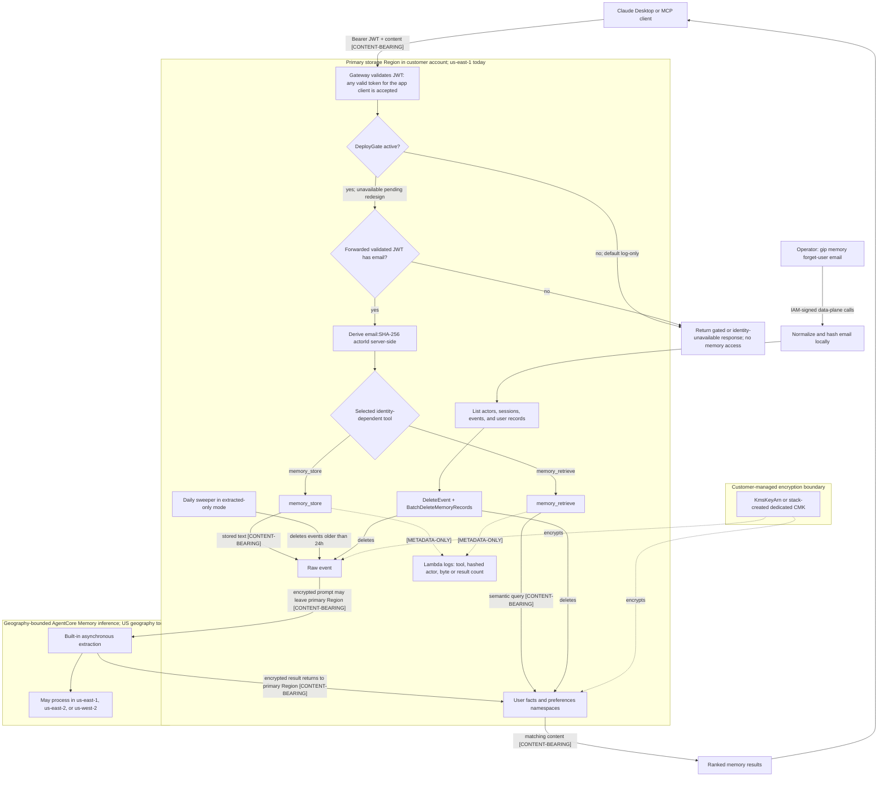

# Memory for Claude Code and Claude Desktop (Amazon Bedrock AgentCore Memory)

This guide covers the **optional, opt-in** memory capability: durable per-user
memory and shared organizational knowledge backed by
[Amazon Bedrock AgentCore Memory](https://docs.aws.amazon.com/bedrock-agentcore/latest/devguide/memory.html),
exposed as MCP tools behind the same AgentCore gateway that serves
[web search](WEB_SEARCH.md).

> **Status:** Disabled by default (see the data classification below — this is
> the one feature in this solution that stores conversation-derived content).
> Opt in during `gip init` (requires web search), deploy with
> `gip deploy memory`. Identity-dependent tools ship behind a verification
> gate (`DeployGate=log-only`). Live validation on 2026-08-14 showed that
> AgentCore rejects `Authorization` in `AllowedRequestHeaders`, so active mode
> is unavailable pending an identity-propagation redesign.

## What it does

The memory stack (`deployment/infrastructure/memory-stack.yaml`) provisions:

- An **`AWS::BedrockAgentCore::Memory`** store, encrypted with a
  customer-managed KMS key (yours via `KmsKeyArn`, or a dedicated CMK the
  stack creates).
- A **second gateway target** on your existing web search gateway exposing up
  to four MCP tools:

| Tool | Scope | Enabled by |
|---|---|---|
| `memory_store` | Save a fact/preference for the current user | `EnableUserMemory` |
| `memory_retrieve` | Semantic search over the current user's memories | `EnableUserMemory` |
| `org_knowledge_search` | Search shared org knowledge | `EnableOrgMemory` |
| `org_knowledge_add` | Publish to shared org knowledge (entitled groups only) | `EnableOrgMemory` |

- A **sweeper Lambda** (extracted-only mode) that deletes raw events daily at
  T+24h, and CloudWatch alarms on both Lambdas plus a sweeper-not-running
  watchdog.

No tool takes a user identifier as an argument. The design derives the
caller's identity server-side from the gateway-validated JWT, but that path is
inactive in this release (`DeployGate=log-only`) — see
[Security model](#security-model-actorid-and-the-deploy-gate).

![Memory architecture, drawn left to right. MCP clients on developer machines (Claude Code, Claude Desktop, OpenCode and Codex CLI) call tools over MCP with a Bearer token. An AWS Cloud box holds an AWS account with a us-east-1 Region box. In the Region box, the Amazon Bedrock AgentCore Gateway, shared with web search, routes calls to the memory tools gateway target, which has up to four MCP tools. The target invokes the memory-tools Lambda function. The function is log-only: only org_knowledge_search runs, and it reads org/knowledge records from Amazon Bedrock AgentCore Memory. A customer managed AWS KMS key encrypts the store. Below, a dashed box labelled "Extracted-only mode (default)" holds a daily Amazon EventBridge rule. The rule runs a sweeper Lambda function that deletes raw events older than 24 hours. Amazon CloudWatch alarms take metrics from both Lambda functions. To the right, a dashed box labelled AWS-managed, outside your account holds built-in extraction. Its async inference may process in the US geography (us-east-1, us-east-2 or us-west-2), and a two-way dashed async extraction arrow links it to the memory store. At the bottom left, an operator on an operator workstation erases a user's data with gip memory forget-user, an IAM-signed call to the store. A caption explains the log-only gate and the 24-hour sweep with a 3-day expiry. It also notes that data is stored only in us-east-1.](../images/memory-architecture.png)

## Current write, retrieve, and erase flows



All memory text, semantic queries, extracted records, and returned matches are
content-bearing. Raw events and long-term records are stored only in the
primary memory Region (`us-east-1` today). With the built-in strategies this
template deploys, extraction prompts and results may be processed outside that
primary Region but stay within its AgentCore Memory geography: for a
`us-east-1` store, AWS currently lists `us-east-1`, `us-east-2`, and
`us-west-2`. This is geography-bounded cross-Region processing, not global
residency. Logs shown above are metadata-only and use the hashed actor only
after the gateway-validated token can be bound to an email. The erasure path
is an operator's IAM-authenticated data-plane operation; it does not rely on a
client-supplied actor ID. Because extraction is asynchronous, repeat the erase
operation as described in [Erasure](#erasure-per-user-right-to-be-forgotten).

## Data classification (read before enabling)

Identity elsewhere in this solution is metadata-only (token counts, model IDs,
cost, email — never content). **Memory is different: it stores
conversation-derived content.** Axiom: content-bearing features are opt-in,
isolated, and erasable.

### What is stored, where, and for how long

| Data | Contents | Where | Retention |
|---|---|---|---|
| **Raw events** (short-term) | Verbatim text passed to `memory_store` (fragments of conversations) | AgentCore Memory store, gateway region (`us-east-1` today) | `extracted-only` mode: deleted by the sweeper at T+24h, **3-day service floor as backstop**. `full` mode: `RawEventRetentionDays` (3–365, default 30) |
| **Extracted records** (long-term) | LLM-extracted facts and preferences per user (`users/email:<sha256(email)>/facts`, `users/email:<sha256(email)>/preferences`) | Same store | Until deleted (`gip memory forget-user`) |
| **Org knowledge records** | Curated text published via `org_knowledge_add` or the data plane | Same store, `org/knowledge` namespace | Until deleted |
| Tool-call logs | hashed actorId (`email:<sha256(email)>`), byte counts, tool names — no content | CloudWatch Logs | Lambda log-group retention |

### Honesty notes

- **The 3-day floor.** `EventExpiryDuration` has a service minimum of 3 days —
  raw conversational text *cannot* be configured to live shorter at the
  service level. "Extracted-only" is therefore an approximation: the sweeper
  deletes raw events daily once they are older than 24 hours (the assumed
  extraction horizon), and the 3-day expiry is the backstop if the sweeper
  fails (a CloudWatch alarm fires if it stops running). There is a window of
  up to ~48 hours in which raw text exists.
- **Extraction is not sanitization.** The extracted "facts" and "preferences"
  are themselves derived from conversation content and may reproduce
  sensitive fragments verbatim. Deleting raw events does not make the
  extracted records content-free — treat the whole store as content-bearing.
- **Primary-Region storage, geography-bounded extraction.** AgentCore Memory
  stores data only in the primary memory Region, but built-in long-term memory
  extraction uses cross-Region inference: input prompts and output results may
  move among the [supported inference Regions in the source geography](https://docs.aws.amazon.com/bedrock-agentcore/latest/devguide/cross-region-inference.html).
  For this solution's `us-east-1` memory store, that is the US geography, not
  necessarily `us-east-1` alone. If policy requires single-Region inference,
  AWS documents selecting a specific model with a
  [built-in-with-overrides strategy](https://docs.aws.amazon.com/bedrock-agentcore/latest/devguide/memory-custom-strategy.html).
  The current `memory-stack.yaml` configures built-in strategies and does not
  expose built-in-with-overrides or `memoryExecutionRoleArn`; treat
  single-Region extraction as unsupported by this solution today.
- **Cost attribution gap.** Memory is usage-billed (short-term events
  $0.25/1k; long-term storage $0.75/1k records/month built-in strategies;
  retrievals $0.50/1k — see
  [AgentCore pricing](https://aws.amazon.com/bedrock/agentcore/pricing/)),
  but the quota system meters Bedrock token/cost usage only: **nothing
  attributes memory charges back to individual users**, the same gap web
  search has. The tools Lambda logs actorId per call, which gives
  who-uses-it-how-often visibility, not budget enforcement.
- Enabling memory changes nothing about what telemetry collects — OTEL,
  quota, and analytics stay metadata-only.

## Modes

| | `extracted-only` (default) | `full` |
|---|---|---|
| Raw events | `EventExpiryDuration` pinned to 3 days; sweeper purges at T+24h | Kept `RawEventRetentionDays` days (3–365, default 30); no sweeper |
| What persists | Extracted facts/preferences + org records only | Raw events too |
| Use when | You want memory with minimal content-at-rest | You need raw-event audit/replay |

Configure via `gip init` (or the answers file: `memory.mode`,
`memory.raw_event_retention_days`). User and org scopes are independently
enableable; at least one must be on.

## Security model (actorId and the deploy gate)

A Lambda gateway target receives **no JWT claims** in its event. The attempted
design used a forwarded `Authorization` header, but AgentCore rejects that
header in `AllowedRequestHeaders`. The tool schemas still never declare a
user-identity argument because a client-supplied identity could impersonate
another user. The inactive implementation is designed to:

1. derive the actorId exclusively from a future server-provided validated
   identity context. The stored actorId is
   `email:<sha256(lowercase-email)>` because AgentCore Memory actor IDs do not
   allow raw email punctuation;
2. ignore any identity-looking tool argument;
3. fail closed: no derivable identity means the call is refused.

Live deployment proved that AgentCore rejects `Authorization` in
`MetadataConfiguration.AllowedRequestHeaders`. The stack therefore supports
**`DeployGate=log-only`** only:
`memory_store`, `memory_retrieve`, and `org_knowledge_add` return a gated
response and perform no reads or writes. The product rejects
`memory_deploy_gate: "active"` until identity propagation is redesigned (see
[ADR-0016](adr/0016-agentcore-memory-stack.md)). `org_knowledge_search` is
identity-independent (shared and read-only; any valid token for the gateway's
app client can call it) and works immediately.

Defense-in-depth: the Lambda role carries
`bedrock-agentcore:namespacePath` IAM conditions restricting reads to
`users/*` and `org/*`; org writes additionally require membership in
`OrgMemoryWriteGroups` (empty = administrators only, i.e. the tool denies all
writers and org knowledge is curated out-of-band via
`BatchCreateMemoryRecords`).

## Deployment

```bash
poetry run gip init          # enable web search, then memory
poetry run gip deploy websearch
poetry run gip deploy memory
poetry run gip memory status
```

The memory stack deploys into the web search gateway's region and reads the
`GatewayId` / `GatewayExecutionRoleArn` outputs of the websearch stack. The
`Memory` resource's `Name` and `EncryptionKeyArn` are **replacement-on-update**:
the name derives from your `identity_pool_name` (do not rename), and if you
want your own CMK, set `memory_kms_key_arn` in the profile **before the first
deploy** — changing either later destroys and recreates the store, losing all
records.

Destroy with `gip destroy memory` (the target detaches without touching the
web search gateway).

## Erasure (per-user right to be forgotten)

```bash
poetry run gip memory forget-user <email> --dry-run   # enumerate first
poetry run gip memory forget-user <email>
```

There is no single purge API: the command enumerates and deletes the user's
raw events (`ListActors` → `ListSessions` → `ListEvents` → `DeleteEvent`) and
extracted records (`ListMemoryRecords` under `users/email:<sha256(lowercase-email)>` and any
service-valid pre-hash raw-email migration path → `BatchDeleteMemoryRecords`, 100 per batch),
then prints a summary.

**Extraction race:** extraction is asynchronous — a job in flight during the
erasure can materialize a new record afterwards. For a departing user, re-run
the command once, about an hour later. The offboarding runbook
([RUNBOOKS.md](RUNBOOKS.md)) includes this step.

## References

- [AgentCore Memory documentation](https://docs.aws.amazon.com/bedrock-agentcore/latest/devguide/memory.html)
- [ADR-0016 — AgentCore Memory stack](adr/0016-agentcore-memory-stack.md)
- [Web Search guide](WEB_SEARCH.md) (the gateway this feature rides on)
- [RUNBOOKS.md](RUNBOOKS.md) — offboarding with memory enabled
