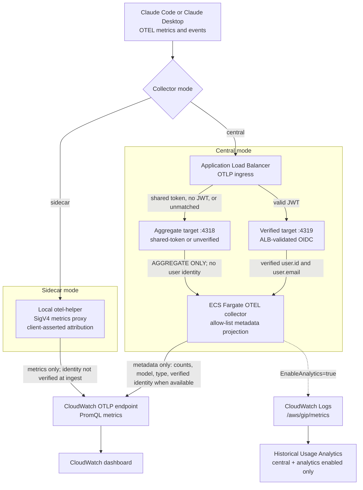

# Claude Code Monitoring Implementation

This guide explains how to deploy and use the optional monitoring system for tracking Claude Code usage through Amazon Bedrock.

When you enable monitoring during deployment, the system collects and visualizes usage metrics from Claude Code using an OpenTelemetry (OTEL) Collector that forwards metrics to CloudWatch. You can choose between two monitoring modes depending on your infrastructure needs and budget.

## Monitoring Modes

| | Central | Sidecar |
|---|---|---|
| **Cloud infrastructure** | VPC + ECS Fargate + ALB | None |
| **AWS cost** | ~$30-50/month | $0 |
| **Athena SQL queries** | Yes | No |
| **PromQL dashboards** | Yes | Yes |
| **Client reports to** | ALB endpoint | CloudWatch OTLP directly |

**Sidecar mode** requires no cloud collector infrastructure — each client sends metrics directly to the CloudWatch OTLP endpoint (`monitoring.<region>.amazonaws.com`) using SigV4 auth. Only the CloudWatch dashboard stack is deployed on the AWS side.

**Central mode** deploys a shared ECS Fargate collector behind an ALB. Required if you need the Athena SQL analytics pipeline (EMF logs → Firehose → S3 → Athena).

## Metadata-only telemetry flow

The central collector projects client telemetry onto an allow-list before export. Sidecar mode forwards Claude Code's metrics-only OTLP payload through the local SigV4 proxy; packaged settings disable OTEL log export. Neither mode exports prompt or completion content. Central verified ingress derives identity from an ALB-validated OIDC token. Sidecar attribution comes from local client state and is client-asserted at telemetry ingestion, not cryptographically verified by CloudWatch. Shared-token, unauthenticated, HTTP-only, IAM Identity Center central ingress, and unmatched central traffic use aggregate-only dimensions.

The shared CoWork token is supported only on internal ALBs and internal
networks. It remains readable through `elasticloadbalancing:DescribeRules` to
authorized principals, has no automatic template rotation, and provides only
aggregate telemetry. CloudFormation rejects it for internet-facing ALBs;
internet-facing attributed CoWork telemetry must use verified OIDC, which is
the recommended mode for all deployments.



This is **client telemetry**. Optional **Bedrock model invocation logs** are a separate, service-generated source used by server-side quota metering; they do not pass through either OTEL collector mode. The metering stack disables body delivery when it creates the logging configuration and only adopts a pre-existing configuration after verifying every content-delivery flag is disabled. See [Server-Side Metering](QUOTA_MONITORING.md#server-side-metering-tamper-proof-usage).

## Central Collector (ECS Fargate)

- Server-side OpenTelemetry collector running on ECS Fargate behind an ALB
- Supports optional Athena SQL pipeline (EMF logs → Kinesis Firehose → S3 → Athena) for ad-hoc SQL queries
- Requires VPC and networking infrastructure
- Requires the `AWSServiceRoleForECS` service-linked role (created automatically by `gip deploy`; if deploying templates manually, create it first: `aws iam create-service-linked-role --aws-service-name ecs.amazonaws.com`)

### Central mode deployment

```bash
# During gip init, select "Central" when prompted for monitoring mode
poetry run gip init

# Deploy (creates VPC, ECS, ALB, dashboard)
poetry run gip deploy
```

## Sidecar Collector (Local)

- Lightweight (~15-20MB) Go binary (`otel-helper`) runs on each developer's machine
- Sends metrics directly to CloudWatch OTLP endpoint using SigV4 auth from federated credentials
- No server-side infrastructure required — only the CloudWatch dashboard stack is deployed

### Sidecar mode deployment

```bash
# During gip init, select "Sidecar" when prompted for monitoring mode
poetry run gip init

# Deploy (creates only the dashboard stack — no VPC, no ECS)
poetry run gip deploy

# Package includes otel-helper binary automatically
poetry run gip package
```

The default target set is host-aware. Run on macOS with `--target-platform all` when the package must include macOS binaries; Linux and Windows hosts build Linux x64/ARM64 plus Windows by default.

End users receive the `otel-helper` binary in their install package. It starts automatically when Claude Code launches and sends metrics to CloudWatch using the same federated credentials.

## Architecture (Central Collector)

The following describes the Central Collector (ECS Fargate) architecture. The Sidecar Collector uses the same metric format but sends directly from the developer's machine to the CloudWatch OTLP endpoint — no ALB, ECS, or VPC required.

The collector's export behavior depends on whether analytics is enabled:

- **Analytics disabled** (default): The collector exports metrics only to the CloudWatch OTLP endpoint (`monitoring.<region>.amazonaws.com`) using SigV4 authentication. These metrics are queryable via PromQL in CloudWatch dashboards and alarms. No EMF logs or classic CloudWatch metrics are published.

- **Analytics enabled**: The collector dual-exports — OTLP for real-time PromQL dashboards, plus EMF (Embedded Metric Format) logs to a CloudWatch Log Group (`/aws/gip/metrics`). The EMF stream feeds the optional analytics pipeline (Kinesis Firehose → S3 → Athena) for long-term historical SQL analysis.

This is controlled by the `EnableAnalytics` parameter on the `otel-collector.yaml` CloudFormation stack, which `gip deploy` sets automatically based on your `analytics_enabled` profile setting.

The CloudWatch Dashboard uses native PromQL chart widgets — no Lambda functions or DynamoDB tables required. All dashboard queries run directly against OTLP-ingested metrics.

## Implementation Details

The core component runs as an ECS Fargate service using the upstream OpenTelemetry Collector Contrib image pinned by the template. The default task has 0.5 vCPU and 1 GB memory. An Application Load Balancer sits in front of the ECS service, receiving OTLP metrics on port 4318.

### Configuration

The OTEL Collector configuration defines how metrics flow through the system:

- **Receivers**: Aggregate OTLP on ports 4317/4318 and verified OIDC OTLP on port 4319
- **Processors**: Fail-closed metadata projection removes caller identity and nested content. Verified ingress derives `user.id` and `user.email` from the ALB-validated JWT; aggregate ingress exports no identity.
- **Exporters**:
  - `otlphttp` — sends to CloudWatch OTLP endpoint with SigV4 auth (for PromQL dashboards)
  - `awsemf` — writes EMF logs to `/aws/gip/metrics` (for analytics pipeline)

### Metrics

Claude Code sends several metric types:

- `claude_code.token.usage` — Input/output/cache token consumption (dimensions: type, model, user.email)
- `claude_code.session.count` — Active sessions
- `claude_code.active_time.total` — Time spent actively using Claude Code
- `claude_code.cost.usage` — Estimated costs based on token usage
- `claude_code.code_edit_tool.decision` — Code editing decisions (dimensions: language, tool_name, decision)
- `claude_code.lines_of_code.count` — Lines added/removed
- `claude_code.commit.count` — Commits
- `claude_code.pull_request.count` — Pull requests

### Dashboard

The CloudWatch Dashboard uses PromQL queries over OTLP-ingested metrics. Sections include:

- **Overview** — Total tokens, active users, sessions, cache hit rate
- **Token Usage** — Usage over time, by type, by model, top users, cost by user
- **Developer Productivity** — Lines of code, commits, active hours, pull requests, code generation by language
- **Bedrock API Health** — Throttles, client errors, server errors by model

### Per-user attribution (`user.email`)

The central collector sets `user.email` only from the bearer forwarded through
the HTTPS `VerifiedCollectorEndpoint` after ALB JWT validation:

- **OIDC with matching verified endpoint** — `user.id` is a hash of the signed subject and `user.email` comes from signed email claims.
- **IDC, no-auth, internal shared-token, HTTP-only, or unmatched endpoint** — aggregate-only; no identity helper is configured.

Use [Cost Attribution](COST_ATTRIBUTION.md#idc-limitation) for CUR/ABAC-based
organizational reporting. The central collector intentionally does not trust
caller-supplied department, team, project, cost-center, or organization fields.

### Tracking deployed package versions (`settings_version`)

`gip package` still stamps `settings_version` into client resource attributes
for local diagnostics. The central collector discards this caller-supplied field
because it is not cryptographically verified; do not use central telemetry to
claim package-version adoption.

## Usage Quota Monitoring

Quota monitoring uses the CloudWatch Prometheus-compatible API (`monitoring.<region>.amazonaws.com/api/v1/query`) to query per-user token usage via PromQL. The quota monitor Lambda runs every 15 minutes, fetches usage data via PromQL, writes results to a DynamoDB table (`UserQuotaMetrics`), and checks against quota policies.

The quota check Lambda provides real-time allow/block decisions by reading the DynamoDB table (fast reads, at most 15 minutes stale).

Claude Code and CoWork 3P usage are combined for a per-user quota only when CoWork uses verified OIDC ingress. Shared-token CoWork telemetry is aggregate-only and cannot contribute to an individual quota. See [CoWork 3P Quota Enforcement](COWORK_3P.md#quota-enforcement) for details.

> **Detailed Information**: See the [Quota Monitoring Guide](QUOTA_MONITORING.md).

## Analytics Pipeline (Optional)

The analytics pipeline streams EMF logs from CloudWatch Logs to S3 using Kinesis Data Firehose, converting metrics to Parquet format. AWS Athena provides SQL query capabilities over months of historical data.

This is separate from the PromQL dashboard — PromQL has a 7-day query range limit, while the analytics pipeline provides unlimited historical lookback via Athena SQL.

> **Note**: The analytics pipeline requires `analytics_enabled=true` in your profile. This causes the collector to dual-export (OTLP + EMF). When analytics is disabled, the collector only exports via OTLP — no EMF logs are written and no classic CloudWatch metrics are published.

## Measuring prompt-cache savings

Prompt caching is one of the biggest Bedrock cost levers, and the telemetry already tracks cache tokens (`cacheRead` / `cacheCreation` token types). The dashboards and Athena queries turn those counts into dollars saved.

**The formula.** The baseline is the same workload with caching disabled — every cached token would instead be billed at the model family's regular input rate:

```
hypothetical_cost = (input + cache_read + cache_write) × input_rate + output × output_rate
actual_cost       = input × input_rate + cache_read × cache_read_rate
                    + cache_write × cache_write_rate + output × output_rate
savings           = hypothetical_cost − actual_cost
                  = cache_read × (input_rate − cache_read_rate)
                    − cache_write × (cache_write_rate − input_rate)
cache_hit_rate    = cache_read / (input + cache_read)
```

**Where to see it:**

- **Claude Code dashboard** (`claude-code-dashboard.yaml`) — "Prompt Cache" section: org-wide cache hit rate, estimated cache savings (USD), cache read vs write tokens by user (top 10), and cache hit rate by user. The savings widget applies Sonnet-family rates as a single blended estimate (see caveat below).
- **CoWork dashboard** (`cowork-dashboard.yaml`) — "Prompt Cache" section with the org-wide hit rate and savings widgets over the `ClaudeCoWork` metric namespace.
- **Athena** (analytics pipeline) — named queries `CacheSavingsByUser` and `CacheSavingsByModel` compute exact savings with per-model-family rates (input, output, cache read, and cache write rates per family), plus per-user/per-model hit rates.
- **Lambda / programmatic** — `calculate_cache_savings()` in `deployment/infrastructure/lambda-functions/shared/pricing.py`.

**Why the dashboard widget is an estimate.** PromQL metric math cannot join the token-usage metric against a per-model-family rate table, so the dashboard savings widgets apply Sonnet-family rates ($3.00 input, $0.30 cache read, $3.75 cache write per MTok) to all traffic and are labeled "estimate (Sonnet-family rates)". Fleets that are mostly Sonnet see accurate numbers; Opus/Fable-heavy fleets understate savings and Haiku-heavy fleets overstate them. Use the Athena queries for exact per-family numbers.

**Negative savings are possible — and meaningful.** Cache writes are billed at a premium over the input rate (e.g. Sonnet $3.75 vs $3.00 per MTok). A workload that writes cache entries which are rarely re-read costs *more* than not caching at all. A persistently negative savings number is a signal of bad cache configuration (prompt prefixes churning too often to be reused), not a reporting error.

**Savings are real budget headroom.** Bedrock bills cache tokens at the family cache rates — cache reads at a ~90% discount to input. The savings shown here are actual reductions in your Bedrock bill relative to running the same workload uncached, not a theoretical metric.
