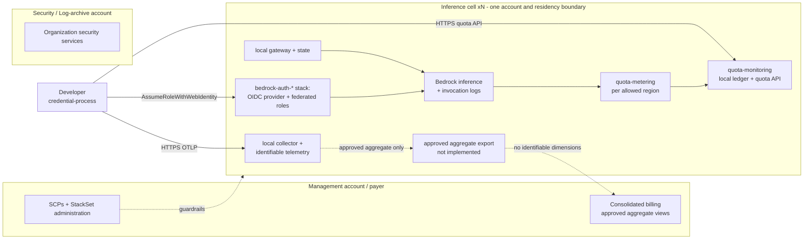

# Multi-Account Deployment

This document describes how to run the platform across multiple AWS accounts under
a central payer with AWS Organizations — the pattern large customers ask for when
they want one inference account per Geo, Country, or Line of Business (LoB). It
covers two deployment topologies, what works cross-account today versus what is
a known limitation, the Geo/LoB residency pattern, an SCP library for org-level
backstops, StackSets guidance, and payer-account cost rollup.

> **Status:** documented option, doc-first. Everything in Topology A works today
> with zero code change. Topology B defines the required inference-cell placement,
> but the Wave 4B multi-account deployment, observability, entitlement, and
> aggregate-reporting building blocks are not implemented or validated. Current
> deployments must operate each cell independently. See
> [ADR-0026](adr/0026-account-local-inference-cell-state.md), which supersedes the
> incompatible hub-centralization decision in ADR-0019.

## The anchor constraint: inference lives where the role lives

Amazon Bedrock core does **not** support resource-based policies ("Supports
resource-based policies: **No**" —
[Bedrock IAM reference](https://docs.aws.amazon.com/bedrock/latest/userguide/security_iam_service-with-iam.html),
read 2026-07-08). Resource-based policies exist only for specific sub-resources
(managed knowledge bases, guardrails, AgentCore runtime/gateway) — **not for
foundation models or inference profiles**. Users in account X therefore cannot
invoke models "in" account Y via a resource policy; the only supported patterns
are assuming a role in Y (exactly what this platform's auth stack does) or placing
an application-owned proxy in Y (the
[Claude apps gateway](APPS_GATEWAY.md) architecture). The AWS Security Reference
Architecture reaches Bedrock from other accounts the same way — "through APIs" via
roles/endpoints
([SRA Bedrock integration](https://docs.aws.amazon.com/prescriptive-guidance/latest/security-reference-architecture-generative-ai/gen-ai-sra.html),
read 2026-07-08).

Consequence: **inference always executes, is logged, and is billed in the account
whose role the user assumed.** The auth stack and Bedrock usage are inseparable by
design. "Multi-account" for this platform is an account-placement and wiring
question, not a re-architecture.

## Foundation prerequisites (built outside this platform)

Both topologies assume an AWS Organizations foundation this platform's stacks
never create: an OU to hold inference accounts, an org CloudTrail into a
log-archive account, an org tag standard with activated cost-allocation tags,
and baseline hardening SCPs. The
[cloud-foundations-templates](https://github.com/cloud-foundations-on-aws/cloud-foundations-templates)
repository offers reference templates for each piece — with its own notice
that they "are not intended to be or supported as solutions": community
reference samples, not supported solutions like this guidance.

- [Centralized logging set](https://github.com/cloud-foundations-on-aws/cloud-foundations-templates/tree/main/logging)
  (org CloudTrail, log-archive buckets, KMS keys) — per-user cost attribution
  depends on CloudTrail recording every Bedrock call with the user's identity
  in the ARN ([COST_ATTRIBUTION.md](COST_ATTRIBUTION.md)); this set builds
  the org trail that story consumes.
- [Foundational tagging policy](https://github.com/cloud-foundations-on-aws/cloud-foundations-templates/tree/main/tagging/foundational-tagging-policy)
  — SCP-4 below and the payer cost rollup assume an org tag standard with
  activated cost-allocation tags; this tag policy is one way to establish it.
- [Foundational OU structure](https://github.com/cloud-foundations-on-aws/cloud-foundations-templates/tree/main/organizations/foundational-organizational-unit-structure)
  — creates the Workloads-style OU skeleton (plus log-archive and
  security-tooling accounts) that both topologies place inference cells into.
- [Org-hardening SCP example](https://github.com/cloud-foundations-on-aws/cloud-foundations-templates/tree/main/organizations/scp-org-hardening-example)
  — baseline hardening (deny leaving the org, deny member-account root) that
  complements the Bedrock-specific SCP library below.

## Topology A — single GenAI member account (today's default)

Deploy everything exactly as documented in [QUICK_START.md](../../QUICK_START.md)
into one dedicated member account (a "GenAI platform account") inside a Workloads
or GenAI OU. Users federate into that account; inference, metering, quota,
collector, and analytics are co-located.

This is the AWS SRA-recommended shape — a dedicated "Generative AI account" in a
Workloads/GenAI OU; the SRA guide itself "assumes a single generative AI account
strategy with IAM roles"
([SRA for generative AI](https://docs.aws.amazon.com/prescriptive-guidance/latest/security-reference-architecture-generative-ai/gen-ai-sra.html),
read 2026-07-08). If you do not have a hard requirement for per-Geo/per-LoB
account separation, use Topology A.

## Topology B — account-local inference cells (multi-BU / multi-Geo enterprises)

Use one independently operated inference cell per Geo, Country, or LoB boundary.
Each cell owns its authorization, gateway, quota, metering, and identifiable
telemetry state. The management account may apply organization guardrails and
coordinate deployment. A reporting account may receive only approved aggregates
that contain no user, principal, session, prompt, response, or unapproved resource
identifier. This placement follows the account-local state decision in
[ADR-0026](adr/0026-account-local-inference-cell-state.md).



Placement rationale per stack:

| Stack | Account class | Why |
|---|---|---|
| `bedrock-auth-*` (OIDC provider + roles) | **Each inference account** | No Bedrock resource-based policies → role account = inference account. Pure-IAM template, StackSet-friendly (see [StackSets](#stacksets-guidance)) |
| Bedrock invocation + model access | Same as auth | Physically bound to the role account. AWS managed entitlements support central subscription and member-account grants ([AWS ML blog, 2026-06-30](https://aws.amazon.com/blogs/machine-learning/simplify-multi-account-access-to-amazon-bedrock-models-with-managed-entitlements/)); this repository does not yet implement that Wave 4B workflow |
| `quota-metering` | Each inference account, per allowed region | Bedrock invocation logging uses a delivery role restricted to the local source account and Region (`deployment/infrastructure/quota-metering.yaml:98-124`) |
| `quota-monitoring` (DDB + quota API) | **Each inference account** | The quota API and `UserQuotaMetrics` table are enforcement state and remain inside the cell. HTTPS reachability does not make a central ledger acceptable |
| `otel-collector`, identifiable analytics, dashboards | **Each inference account/residency boundary** | Identifiable OTEL and derived records stay local. Only a separately approved aggregate export may feed central reporting |
| `claude-apps-gateway` and gateway state | **Each inference account** | The gateway is an inference and authorization path; its policy, budget, and database state are cell-local |
| `distribution`, `bootstrap`, `codebuild`, `websearch` | Evaluate by data and trust boundary | These are not evidence that a Wave 4B shared-services plane exists. Place content-bearing or identity-bearing components only after their own data-boundary review |
| Organization guardrails and aggregate reporting | Management/reporting accounts | SCPs can govern member accounts. Central reporting receives approved aggregates only; the Wave 4B export contract is pending |
| Org CloudTrail, Security Hub | Security/Log-archive per SRA | Outside this platform's stacks; noted for completeness |

> **Identity boundary across cells:** a shared IdP audience means the same JWT
> is acceptable in ANY account that registered that issuer + client ID. Per-account
> trust-policy claim conditions (aud/sub/groups) are the mechanism that decides
> *which* users may enter *which* inference account. Plan your IdP group-to-account
> mapping before rolling out the auth StackSet. See also
> [ADR-0015](adr/0015-session-name-binding.md) for session-name binding.

## Cross-account capability matrix

What crosses account boundaries today versus what does not (all AWS docs read
2026-07-08 unless dated):

| Wiring | Cross-account capable? | Mechanism / blocker |
|---|---|---|
| Bedrock invoke from roles in another account | **NO** | No resource-based policies on foundation models/inference profiles; role account = inference account ([Bedrock IAM reference](https://docs.aws.amazon.com/bedrock/latest/userguide/security_iam_service-with-iam.html)) |
| Bedrock model-access subscriptions | **AWS capability; platform workflow pending** | Managed entitlements support central subscription and member-account grants ([AWS ML blog, 2026-06-30](https://aws.amazon.com/blogs/machine-learning/simplify-multi-account-access-to-amazon-bedrock-models-with-managed-entitlements/)); Wave 4B automation is not implemented |
| Bedrock invocation logs → another account | **NO** | Per-account/per-region singleton with a same-account delivery role (`quota-metering.yaml:98-124`; [model invocation logging docs](https://docs.aws.amazon.com/bedrock/latest/userguide/model-invocation-logging.html)) |
| CloudWatch Logs subscription filter → Lambda in another account | **NO** | Lambda destinations must be same-account; cross-account requires a logical destination fronting Kinesis Data Streams or Firehose only ([PutSubscriptionFilter API](https://docs.aws.amazon.com/AmazonCloudWatchLogs/latest/APIReference/API_PutSubscriptionFilter.html); [cross-account Firehose subscriptions](https://docs.aws.amazon.com/AmazonCloudWatch/latest/logs/CrossAccountSubscriptions-Firehose.html)) |
| Metering stack → quota DynamoDB in another account | **Technically possible; rejected** | DynamoDB supports cross-account access ([DynamoDB cross-account access](https://docs.aws.amazon.com/amazondynamodb/latest/developerguide/rbac-cross-account-access.html)), but moving the quota ledger outside the cell violates [ADR-0026](adr/0026-account-local-inference-cell-state.md) and couples enforcement failures across cells |
| Client quota check (credential-process → quota API) | **Transport supports it; keep cell-local** | The stack exposes an HTTPS API endpoint (`quota-monitoring.yaml:493-563,633-637`), but the client must use the quota API for its selected inference cell |
| Client OTEL → collector | **Transport supports it; identity stays local** | HTTPS OTLP may cross accounts, but identifiable telemetry must terminate inside the cell. Shared or unauthenticated telemetry is aggregate-only |
| Analytics S3 data + Athena to consumer accounts | **AWS supports sharing; policy-limited** | S3 and Glue can be shared cross-account ([cross-account Glue Data Catalog access](https://docs.aws.amazon.com/athena/latest/ug/security-iam-cross-account-glue-catalog-access.html)); [ADR-0026](adr/0026-account-local-inference-cell-state.md) permits only approved aggregate datasets to centralize |
| CloudWatch dashboards over cell metrics | **Possible for approved aggregates; not implemented here** | OAM building blocks and the aggregate schema are pending Wave 4B work; do not link identifiable dimensions centrally |
| Gateway policy, budget, or database state → central account | **Rejected** | Gateway enforcement state remains in the inference account. Gateway and credential-process budgets are separate until a reconciler is proven |
| SCP enforcement over all of the above | **YES** | Org/OU attachment; the org-level backstop for every IAM-scoped control in this repo ([SCP examples](https://docs.aws.amazon.com/organizations/latest/userguide/orgs_manage_policies_scps_examples_general.html)) |

Consequence for Topology B: every synchronous authorization and quota decision,
the complete metering pipeline, gateway state, and identifiable telemetry remain
inside the cell. Cross-account transport capability is not permission to
centralize those records. Central services consume only an explicitly approved
aggregate schema.

## Known limitations

Topology B is an architecture contract, not a one-command deployment path. The
following gaps remain; none authorizes hub-centralized enforcement state:

| # | Current limitation | Evidence / consequence |
|---|---|---|
| L1 | `gip deploy` targets one account at a time | The command creates one CloudFormation manager for the active profile and Region (`source/governed_inference_platform/cli/commands/deploy.py:1165-1166,1520-1556`); run and verify it independently in every cell |
| L2 | `gip package` embeds one federated role ARN or identity pool | The resolver returns exactly one identifier and writes it into one package configuration (`source/governed_inference_platform/cli/commands/package.py:2822-2877,2926-2935`); generate and distribute one package per cell |
| L3 | Only the auth templates are currently documented as StackSet-friendly | Lambda-backed stacks require packaged assets readable in every target account and Region. The artifacts bucket template now offers an opt-in organization-read bucket policy (`deployment/infrastructure/s3bucket.yaml`, `OrganizationId` parameter, empty/off by default), which covers the cross-**account** read; the cross-**Region** half remains — Lambda code must be staged in a bucket in the function's Region, so every target Region still needs its own artifacts bucket — and no Wave 4B StackSet packaging or rollout automation exists |
| L4 | No versioned inference-cell manifest, StackSet deployment plane, managed-entitlement workflow, regional OAM boundary, or aggregate-reporting contract exists | These are pending Wave 4B tracks, not current product capabilities |
| L5 | No proven reconciler combines gateway and credential-process budgets | Operate and report them separately; do not claim one unified hard cap |
| L6 | No approved central aggregate exporter is implemented | Keep source telemetry local. Native consolidated billing remains available subject to the payer-reporting restrictions below |

## The Geo/LoB pattern: per-Geo inference accounts with residency alignment

For customers whose account boundaries follow geography (EU entity, Japan entity,
AU entity) or line of business, pair each inference account with a region and
model scope that matches its residency requirement:

1. **One inference account per Geo/LoB**, each independently deploying the local
   quota, metering, gateway, and telemetry stacks. The auth StackSet may supply a
   per-account `AllowedBedrockRegions` parameter (every
   `bedrock-auth-*` template exposes it and enforces it via
   `aws:RequestedRegion` conditions — e.g.
   `deployment/infrastructure/bedrock-auth-okta.yaml:49,159`).
2. **Geo-scoped inference profiles per account.** The model catalog treats
   `au`, `jp`, `eu`, and `us-gov` as data-residency prefixes that never fall back
   to `global.*`/`us.*` profiles
   (`source/governed_inference_platform/models.py:1697` — `DATA_RESIDENCY_PREFIXES`).
   Configure each Geo account's profile with the matching prefix so packaged
   settings resolve to residency-safe CRIS profile IDs.
3. **SCP-1 below as the org backstop** for each Geo OU, with the region list set
   per OU. Note the caveat: `aws:RequestedRegion` pins where the **API call**
   lands, not where a `global.*` cross-region inference profile routes compute —
   strict-residency Geos must combine the SCP with geo-scoped (`eu.`/`jp.`/`au.`)
   profiles from step 2, never `global.*`.
4. **Entry control per account** via trust-policy claim conditions (see the
   identity-boundary note above): the EU account's role trusts only EU groups,
   and so on.

## SCP library

Org-level backstops for controls the templates already enforce per-role
(`bedrock-auth-generic.yaml:126-128` region condition; the `bedrock-mantle` deny).
Patterns follow the
[AWS SCP examples](https://docs.aws.amazon.com/organizations/latest/userguide/orgs_manage_policies_scps_examples_general.html)
(read 2026-07-08). Limits to keep in mind: 5,120 bytes per SCP; SCPs do not affect
service-linked roles. **Test every SCP on a sandbox OU before org-wide
attachment — an SCP deny cannot be overridden by any IAM policy in member
accounts.**

### SCP-1 — Deny Bedrock outside allowed regions (residency backstop)

```json
{
  "Version": "2012-10-17",
  "Statement": [
    {
      "Sid": "DenyBedrockOutsideAllowedRegions",
      "Effect": "Deny",
      "Action": ["bedrock:*", "bedrock-mantle:*"],
      "Resource": "*",
      "Condition": {
        "StringNotEquals": {
          "aws:RequestedRegion": ["us-east-1", "us-west-2"]
        },
        "ArnNotLike": {
          "aws:PrincipalARN": "arn:aws:iam::*:role/BedrockPlatformBreakGlass"
        }
      }
    }
  ]
}
```

- **Rationale:** org-wide version of the `AllowedBedrockRegions` role condition —
  survives template drift and covers principals the platform did not create.
  Replace the region list with your deployment's `AllowedBedrockRegions`; keep a
  break-glass role exemption.
- **Caveat (global CRIS):** `aws:RequestedRegion` constrains the API endpoint, not
  where a `global.*` cross-region inference profile routes compute. For strict
  residency, pair with geo-scoped (`us.`/`eu.`/`jp.`/`au.`) profiles.
- **Blast radius:** denies ALL Bedrock use outside the listed regions for every
  principal in the attached OU — including consoles, notebooks, and other teams'
  workloads. Attach to the platform/Geo OU, not the root, until validated.

### SCP-2 — Deny `bedrock-mantle:*` org-wide (unmeterable endpoint)

```json
{
  "Version": "2012-10-17",
  "Statement": [
    {
      "Sid": "DenyBedrockMantleEndpoint",
      "Effect": "Deny",
      "Action": "bedrock-mantle:*",
      "Resource": "*"
    }
  ]
}
```

- **Rationale:** `bedrock-mantle` is a separate IAM service namespace whose
  inference calls bypass Bedrock model invocation logs entirely — confirmed by
  live probe (metadata-only invocation logging captured `bedrock-runtime` events
  but zero `bedrock-mantle` events (internal live probe, not published);
  2026-07-08). An unmeterable endpoint must be scoped out until it can be metered.
  The SCP is immune to managed-policy drift: `AmazonBedrockFullAccess` v10
  (edited 2026-02-12) now grants `bedrock-mantle:*`.
- **Historical lesson:** SCP denies were incompletely enforced for mantle
  long-term API keys 2025-12-04 → 2026-01-26 (AWS enforced fully from 2026-01-29;
  [Sonrai Security, 2026-02-24](https://sonraisecurity.com/blog/cracks-in-the-bedrock/)).
  Test org-level controls against every credential type.
- **Blast radius:** blocks the Mantle endpoint (OpenAI-compatible Responses/Chat
  Completions APIs) for every principal in the attached OU. Teams intentionally
  using Mantle need an exemption OU — and their own metering story.

### SCP-3 — Deny long-term Bedrock API keys (creation AND use)

```json
{
  "Version": "2012-10-17",
  "Statement": [
    {
      "Sid": "DenyLongTermBedrockKeyCreation",
      "Effect": "Deny",
      "Action": "iam:CreateServiceSpecificCredential",
      "Resource": "*",
      "Condition": {
        "StringEquals": {
          "iam:ServiceSpecificCredentialServiceName": "bedrock.amazonaws.com"
        }
      }
    },
    {
      "Sid": "DenyLongTermBearerUseBedrock",
      "Effect": "Deny",
      "Action": "bedrock:CallWithBearerToken",
      "Resource": "*",
      "Condition": {
        "StringEquals": { "bedrock:bearerTokenType": "LONG_TERM" }
      }
    },
    {
      "Sid": "DenyLongTermBearerUseMantle",
      "Effect": "Deny",
      "Action": "bedrock-mantle:CallWithBearerToken",
      "Resource": "*",
      "Condition": {
        "StringEquals": { "bedrock-mantle:bearerTokenType": "LONG_TERM" }
      }
    }
  ]
}
```

- **Rationale:** long-term Bedrock API keys (IAM service-specific credentials,
  expiry 1 day to indefinite) bypass STS expiry and the platform's offboarding
  path entirely. `iam:CreateServiceSpecificCredential` gates generation;
  `bedrock:CallWithBearerToken` / `bedrock-mantle:CallWithBearerToken` with the
  `bearerTokenType = LONG_TERM` condition gate use. Short-term key *generation*
  cannot be blocked, only use
  ([Bedrock API-key permissions](https://docs.aws.amazon.com/bedrock/latest/userguide/api-keys-permissions.html),
  read 2026-07-08).
- **Deliberately narrow:** it does NOT deny `bedrock:CallWithBearerToken`
  unconditionally — the platform's Go credential-process issues SHORT_TERM
  presigned tokens (`source/go/cmd/credential-process/bedrock_token.go:16-30`),
  which keep working.
- **Blast radius:** any team using long-term Bedrock API keys anywhere in the
  attached OU breaks immediately. Inventory existing service-specific credentials
  before attaching.

### SCP-4 — Require governance tags on platform stack creation

```json
{
  "Version": "2012-10-17",
  "Statement": [
    {
      "Sid": "RequireGovernanceTagsOnStacks",
      "Effect": "Deny",
      "Action": ["cloudformation:CreateStack", "cloudformation:CreateStackSet"],
      "Resource": "*",
      "Condition": {
        "Null": { "aws:RequestTag/YOUR-TAG-KEY": "true" }
      }
    }
  ]
}
```

- **Rationale:** guarantees every platform stack carries your org's governance
  tag (for example `CostCenter`) at creation, which feeds cost allocation and
  inventory. Substitute `YOUR-TAG-KEY` with your organization's tag standard.
- **Blast radius:** this denies **ALL** untagged stack creation in the attached
  OU, not just this platform's stacks. It only evaluates tags supplied at create
  time (console users must fill the tags step). Attach narrowly — to the
  platform OU only.

## StackSets guidance

Use service-managed CloudFormation StackSets from the management account (or a
delegated administrator): permissions roles are created for you, and auto-deploy
covers accounts that later join the target OU
([StackSets org integration](https://docs.aws.amazon.com/AWSCloudFormation/latest/UserGuide/stacksets-orgs-associate-stackset-with-org.html),
read 2026-07-08). StackSet constraints: no nested stacks, no macros/transforms,
and StackSets never deploy to the management account itself.

| Stack | StackSet-friendly? | Notes |
|---|---|---|
| `bedrock-auth-*` (all IdP variants) | **Template-compatible; not multi-account validated** | These templates have no packaged Lambda assets or nested stacks. Operators may create a service-managed StackSet directly, but this repository provides no Wave 4B rollout or rollback automation. Each instance's `ConfigurationJson` output feeds that account's client config |
| `quota-metering` | **Not provided as a StackSet** | Ships local Lambda code (`Code: ./lambda-functions/...`) and needs packaged assets readable by every target account and Region. The artifacts bucket's opt-in `OrganizationId` org-read policy (limitation L3) covers the cross-account read; per-Region asset staging and StackSet rollout automation remain unimplemented |
| `quota-monitoring`, `otel-collector`, `analytics-pipeline`, dashboards, `claude-apps-gateway`, `networking` | **Not provided as StackSets** | These remain cell-local, but the repository has no Wave 4B manifest or StackSet deployment plane for them. Deploy each cell with the current single-account path |
| Aggregate reporting, OAM, managed entitlements | **Not implemented** | Do not add these names to a rollout plan as existing stacks. They are separately gated Wave 4B work |

Practical sequence with current capabilities:

1. Define each cell's account, residency boundary, allowed Regions, geographic
   CRIS profiles, trust claims, and ownership.
2. Deploy and verify the complete local platform independently in each account
   using the current single-account deployment path. Do not point quota,
   metering, gateway state, or identifiable OTEL at another account.
3. If your organization accepts the unvalidated multi-account path, optionally
   create a service-managed StackSet for only `bedrock-auth-*`, with per-OU
   parameter overrides for `AllowedBedrockRegions` and trust claims.
4. Run `gip package` against each account's outputs and distribute a distinct
   package for that cell.
5. Verify cell-local quota denial, metering visibility, gateway readiness, and
   geographic CRIS selection before onboarding users.
6. Use native consolidated billing for aggregate payer reporting. Wait for the
   separately gated Wave 4B contracts before claiming automated aggregate export,
   OAM, managed entitlements, or multi-account rollback.

## Payer-account cost rollup

AWS Organizations consolidated billing gives the management account a combined
view of member-account charges and per-account cost reports
([AWS consolidated billing](https://docs.aws.amazon.com/awsaccountbilling/latest/aboutv2/consolidated-billing.html),
read 2026-07-15). This is an AWS billing capability, not a Wave 4B platform
reporting implementation.

- Use the usage-account dimension for Geo/LoB reporting because each inference
  account is the cell cost boundary.
- Use activated cost-allocation tags and application inference profile tags for
  approved team or cost-center aggregates. Activation occurs in the payer account
  and is not retroactive; see [COST_ATTRIBUTION.md](COST_ATTRIBUTION.md).
- Do not include or expose `line_item_iam_principal` in central multi-account
  reports by default. It can contain an email, principal ARN, or session name and
  is therefore identifiable data, not an approved aggregate.
- Do not enable caller-identity data in a central payer CUR 2.0 export under this
  architecture. Any exception requires an ADR that supersedes
  [ADR-0026](adr/0026-account-local-inference-cell-state.md), plus access
  controls, retention rules, and residency review. Keep per-user operational
  telemetry and enforcement records inside the cell.
- Do not claim that payer billing reconciles gateway and credential-process
  budgets or provides real-time quota enforcement. It is reporting data only.

## Related documents

- [DEPLOYMENT_PATHS.md](DEPLOYMENT_PATHS.md) — the five single-account deployment paths
- [NETWORK_ISOLATION.md](NETWORK_ISOLATION.md) — private connectivity per account/VPC
- [COST_ATTRIBUTION.md](COST_ATTRIBUTION.md) — CUR 2.0 per-user attribution details
- [ADR-0026](adr/0026-account-local-inference-cell-state.md) — account-local state and approved aggregate boundary
- [ADR-0019](adr/0019-multi-account-network-isolation-doc-first.md) — superseded multi-account decision; network-isolation decision remains accepted
