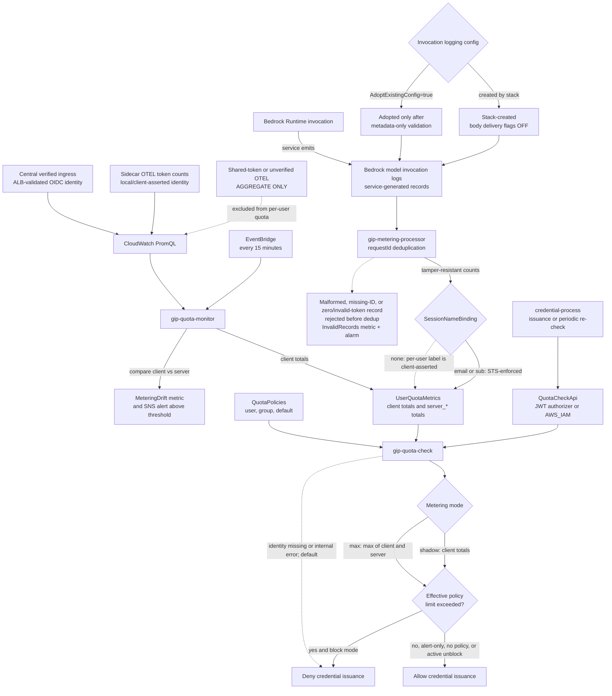

# Claude Code Quota Monitoring

Quota monitoring tracks user token consumption and sends automated alerts when usage thresholds are exceeded, helping administrators manage costs and prevent unexpected overages.

## Overview

The quota monitoring system is an optional CloudFormation stack that integrates with the dashboard stack to track monthly token consumption per user and send SNS alerts at configurable thresholds.

### Key Features

- **Per-user token tracking**: Monthly and daily consumption monitoring for each authenticated user
- **Fine-grained quota policies**: Set limits at user, group, or default levels with precedence rules
- **Multiple limit types**: Monthly tokens and daily tokens
- **Configurable thresholds**: Alerts at 80%, 90%, and 100% of limits
- **JWT group integration**: Automatically extract group membership from identity provider claims
- **Alert deduplication**: One alert per threshold per limit type per user per period
- **DynamoDB storage**: Efficient tracking with automatic TTL cleanup

### Architecture Components

- **UserQuotaMetrics Table**: DynamoDB table storing monthly/daily usage totals with token type breakdown
- **QuotaPolicies Table**: DynamoDB table storing fine-grained quota policies (user/group/default)
- **Quota Monitor Lambda**: Scheduled function checking thresholds every 15 minutes
- **SNS Topic**: Alert delivery to administrators (`gip-quota-alerts`, encrypted at rest with a stack-owned KMS key)
- **EventBridge Rule**: Lambda scheduling
- **Metrics Aggregator Integration**: Updates quota table during metric processing

### Usage reconciliation and credential decision flow



The two usage records are deliberately independent: client telemetry comes through the OTEL path, while server totals come from Bedrock Runtime invocation logs. Service-generated token counts are tamper-resistant, but their **Direct STS per-user attribution is trustworthy only with `SessionNameBinding=email|sub`**. With `SessionNameBinding=none`, the session name and resulting per-user server bucket remain client-asserted.

`shadow` observes drift without changing enforcement; `max` evaluates the higher client or server figure. Neither mode repairs untrusted identity labels or processor records that fail to accrue. There is no `strict` mode. `bedrock-mantle` is denied to governed credentials because it does not produce the invocation logs required by this flow.

This decision applies to the **credential-process/direct IAM path** at credential issuance and periodic re-check, not inline to every Bedrock request. Claude Apps Gateway applies its own inline spend controls; gateway and direct-path budgets are separate and are not a unified hard cap.

## Configuration

> **Prerequisites**: Monitoring must be enabled and the dashboard stack deployed. See the [CLI Reference](CLI_REFERENCE.md#deploy-deploy-infrastructure) for deployment details.

During `gip init`, quota monitoring is **enabled by default** when monitoring is enabled. You'll be prompted to configure:
- Monthly token limit per user (default: 225 million tokens)
- Automatic threshold calculation (80% warning at 180M, 90% critical at 202.5M)
- Daily token limit with burst buffer (auto-calculated from monthly)
- Enforcement modes for daily and monthly limits

Deploy using `poetry run gip deploy` (deploys all enabled stacks) or `poetry run gip deploy quota` for just the quota stack. The OIDC configuration is automatically passed from your profile settings. For complete deployment instructions, see the [CLI Reference](CLI_REFERENCE.md#deploy-deploy-infrastructure).

## Cost-Based Enforcement (Recommended)

Set dollar limits instead of (or alongside) token limits. Cost is calculated server-side using per-model Bedrock pricing rates.

### How it works

1. `quota_monitor` queries PromQL by `(user.email, type, model)` every 15 minutes
2. Each token batch is priced using the actual model: Opus tokens × Opus rate, Sonnet tokens × Sonnet rate
3. `cost_usd` and `daily_cost_usd` are accumulated in DynamoDB alongside raw token counts
4. `quota_check` compares against `monthly_cost_limit` / `daily_cost_limit` from the policy

### Setting cost limits

```bash
# Set $50/month budget for a user (--budget is shorthand for --monthly-cost-limit)
gip quota set-user user@company.com --budget 50

# Set $10/day budget for a team
gip quota set-group engineering --daily-budget 10

# Interactive mode (prompts for budget when no flags provided)
gip quota set-user user@company.com
```

### Pricing rates ($/MTok)

| Model | Input | Output | Cache Read | Cache Write |
|-------|-------|--------|------------|-------------|
| Fable | $10.00 | $50.00 | $1.00 | $12.50 |
| Opus | $5.00 | $25.00 | $0.50 | $6.25 |
| Sonnet | $3.00 | $15.00 | $0.30 | $3.75 |
| Haiku | $1.00 | $5.00 | $0.10 | $1.25 |

Rates are overridable via `BEDROCK_PRICING_RATES_JSON` Lambda env var.

### Legacy / extended-access pricing

Bedrock legacy models can carry a provider-set price uplift during the *public
extended access* phase ([model lifecycle](https://docs.aws.amazon.com/bedrock/latest/userguide/model-lifecycle.html)).
`shared/pricing.py` handles this per model, date-aware:

| Model | Behavior |
|-------|----------|
| Claude Opus 4 / 4.1 | Metered at their own `opus-legacy` rates ($15/$75/MTok) — the generic Opus family ($5/$25) under-meters this generation 3x |
| Claude 3.5 Sonnet v1/v2 | Metered at the published extended-access rate ($6/$30, 2x standard) since 2025-12-01 |
| Claude Sonnet 4, Claude 3.7 Sonnet, Claude 3 Haiku, Claude 3 Sonnet | Extended access active, but the provider premium is **not published** — metered at standard family rates with a structured `WARNING` log (`event: unpriced_extended_access`), never a silently invented number |

When AWS Health announces the premium for an unpriced model, supply it via
`BEDROCK_PRICING_RATES_JSON` under the `override_rate_key` named in the warning
(e.g. `{"sonnet-4-extended": {"input": ..., "output": ...}}`) — the rate then
applies automatically and the warning stops. Until then, cost estimates for
those models **understate** actual spend during extended access.

### Handles opusplan correctly

When using `opusplan` (Opus planning + Sonnet execution), each token batch includes the model dimension from OTEL. Opus tokens are priced at Opus rates, Sonnet tokens at Sonnet rates — no blending assumptions.

### Backward compatible

- Cost limits default to 0 (disabled) — existing token-only deployments unaffected
- Token limits still work independently — both can coexist
- `cost_usd` field appears in DynamoDB on next `quota_monitor` run (ADD operation, non-breaking)

> ⚠️ Cost estimates use published on-demand Bedrock rates. Actual billing may differ with committed throughput or custom agreements. Use AWS Cost Explorer for billing truth.

> **Why not use the client-side `claude_code.cost.usage` metric?** Claude Code emits a cost estimate natively, but it uses generic Anthropic rates (not Bedrock-specific), resets per session (not accumulated monthly), and cannot be trusted for enforcement (client-controlled). Server-side calculation from service-generated token counts is tamper-resistant, uses admin-configurable Bedrock rates, and aggregates across all sessions. Trusted Direct STS per-user attribution still requires `SessionNameBinding`.

> **CoWork support:** Claude Desktop cost enforcement works when the CoWork dashboard stack is deployed with the `model` MetricFilter dimension (included by default). Requires attribution headers configured so `user_email` and `model` dimensions are present in the events.


## Token-Based Limits (Legacy)

| Parameter               | Default     | Description                                    |
| ----------------------- | ----------- | ---------------------------------------------- |
| MonthlyTokenLimit       | 225M tokens | Default maximum per user per month             |
| DailyTokenLimit         | ~8.25M tokens| Daily limit (auto-calculated with burst buffer)|
| BurstBufferPercent      | 10%         | Daily buffer for usage variation (5-25%)       |
| MonthlyEnforcementMode  | block       | Block access when monthly limit exceeded       |
| DailyEnforcementMode    | alert       | Alert only when daily limit exceeded           |
| Warning Threshold       | 80% (180M)  | First alert level                              |
| Critical Threshold      | 90% (202.5M)| Second alert level                             |
| Check Frequency         | 15 minutes  | Lambda execution interval                      |
| Alert Retention         | 60 days     | DynamoDB TTL for deduplication                 |
| EnableFinegrainedQuotas | false       | Enable fine-grained policy support             |

To update limits: Re-run `gip init` and redeploy with `gip deploy quota`.

## Daily Limits and Bill Shock Protection

To prevent unexpected costs from runaway usage, the system auto-calculates a daily limit from your monthly quota with a configurable burst buffer.

### Why Daily Limits?

Without daily limits, a user could consume their entire monthly quota in just 2-3 days of heavy usage, leading to unexpected costs or blocked access mid-month. Daily limits catch runaway usage within 24 hours while still allowing legitimate work patterns.

### Calculation

```
daily_limit = monthly_limit ÷ 30 × (1 + burst_buffer%)
```

Example with 225M monthly limit and 10% burst:
- Base daily: 225,000,000 ÷ 30 = 7,500,000 tokens/day
- With 10% burst: 7,500,000 × 1.10 = **8,250,000 tokens/day**

### Burst Buffer Guidance

The burst buffer allows for legitimate daily variation above the average:

| Buffer | Daily (225M/month) | Use Case |
|--------|-------------------|----------|
| 5% (strict)  | 7,875,000 tokens | Tight cost control, heavy days blocked quickly |
| 10% (default)| 8,250,000 tokens | Balanced protection for typical usage |
| 25% (flexible)| 9,375,000 tokens | Allows 1.25x average days, catches only extreme spikes |

### Enforcement Modes

Each limit type can be configured with different enforcement:

| Mode | Behavior | Use Case |
|------|----------|----------|
| **alert** | Send notifications, allow continued use | Monitoring, soft limits |
| **block** | Deny credential issuance when exceeded | Hard cost control |

**Recommended defaults:**
- **Daily**: `alert` - Warn about unusual patterns, don't interrupt work
- **Monthly**: `block` - Hard stop at budget limit

### Example Configuration

```
Monthly Limit: 225,000,000 tokens (block)
Daily Limit:   8,250,000 tokens (alert)
Burst Buffer:  10%

Behavior:
- Day 1: User consumes 9M tokens → Daily alert sent
- Day 2: User consumes 8.5M tokens → Daily alert sent
- Day 3-5: Normal usage (~7M/day) → No alerts
- Day 15: Monthly usage reaches 180M → 80% warning alert
- Day 20: Monthly usage reaches 225M → Access blocked
```

## Fine-Grained Quota Policies

Fine-grained quotas allow administrators to set different limits for different users and groups, with a clear precedence hierarchy.

### Policy Types

1. **User Policies**: Apply to a specific user by email address
2. **Group Policies**: Apply to all users in a group (from JWT claims)
3. **Default Policy**: Applies to all users without a more specific policy

### Policy Precedence

When determining the effective quota for a user:

1. **User-specific policy** (highest priority): If a policy exists for the user's email, use it
2. **Group policy** (most restrictive): If user belongs to multiple groups with policies, use the **lowest limit** (most restrictive)
3. **Default policy**: If no user or group policy applies, use the default
4. **No policy**: If no policies are defined, usage is **unlimited** (quota monitoring disabled for that user)

### Limit Types

Each policy can configure two types of limits:

| Limit Type           | Description                        | Reset Period     |
| -------------------- | ---------------------------------- | ---------------- |
| Monthly Token Limit  | Maximum tokens per calendar month  | 1st of each month|
| Daily Token Limit    | Maximum tokens per day             | UTC midnight     |

### Managing Policies with CLI

Use the `gip quota` commands to manage policies:

```bash
# Set a user-specific policy
gip quota set-user john.doe@company.com --monthly-limit 500M --daily-limit 20M

# Set a group policy
gip quota set-group engineering --monthly-limit 400M

# Set the default policy for all users
gip quota set-default --monthly-limit 225M --daily-limit 8M

# List all policies
gip quota list
gip quota list --type group

# Show effective policy for a user
gip quota show john.doe@company.com --groups "engineering,ml-team"

# View current usage against limits
gip quota usage john.doe@company.com

# Delete a policy
gip quota delete group engineering

# Temporarily unblock a user who exceeded quota (Phase 2)
gip quota unblock john.doe@company.com --duration 24h
```

### Token Value Shortcuts

The CLI supports human-readable token values:

- `225M` = 225,000,000 (225 million) - default limit
- `500K` = 500,000 (500 thousand)
- `1B` = 1,000,000,000 (1 billion)

### Group Membership from JWT Claims

The system automatically extracts group membership from JWT token claims:

- `groups`: Standard groups claim
- `cognito:groups`: Amazon Cognito groups
- `custom:department`: Custom department claim (treated as a group)

Configure your identity provider to include group claims in the JWT tokens issued to users.

## Alert Management

After deployment, subscribe to the SNS topic for notifications:

```bash
# Get topic ARN from stack outputs
aws cloudformation describe-stacks --stack-name <quota-stack-name> \
  --query 'Stacks[0].Outputs[?OutputKey==`QuotaAlertTopicArn`].OutputValue' \
  --output text

# Subscribe (email, SMS, HTTPS webhook, etc.)
aws sns subscribe --topic-arn <arn> --protocol email --notification-endpoint admin@company.com
```

The topic the stack creates is encrypted at rest with a stack-owned KMS key
(`alias/<quota-stack-name>-quota-alerts`). Its key policy authorizes SNS,
CloudWatch alarms, and EventBridge, while conditional IAM managed policies
grant the two monitor Lambda roles the `kms:GenerateDataKey`/`kms:Decrypt`
access that publishing requires; subscribers need nothing extra. The key ARN
is exported as `QuotaAlertTopicKmsKeyArn` for stacks that reuse the topic (the
model lifecycle template accepts it as `AlertTopicKmsKeyArn`). If you bring
your own encrypted topic, pass both `AlertTopicArn` and
`AlertTopicKmsKeyArn`. The stack then adds exact KMS identity grants to
`QuotaMonitorRole` and, when bypass detection is enabled,
`SidecarMonitorRole`; no post-deploy IAM patch is required.

The stack does not modify customer-owned SNS topic or KMS key resource policies.
Those policies must permit the publishers: CloudWatch alarms and the Lambda
roles as applicable. For a cross-account topic or key, both resource policies
remain your responsibility in the resource-owning account.

### Alert Types

The system sends alerts for two limit types, each with three threshold levels:

#### Monthly Token Alert

Sent when monthly token usage exceeds 80%, 90%, or 100% of the monthly limit.

#### Daily Token Alert

Sent when daily token usage exceeds 80%, 90%, or 100% of the daily limit. Daily alerts can be sent each day (they include the date in the deduplication key).

### Sample Alert Content

```
Subject: Claude Code CRITICAL - Monthly Token Quota - 92%

Claude Code Usage Alert - Monthly Token Quota

User: john.doe@company.com
Alert Level: CRITICAL
Month: November 2025
Policy: group:engineering

Current Usage: 207,000,000 tokens
Monthly Limit: 225,000,000 tokens
Percentage Used: 92.0%

Days Remaining in Month: 8
Daily Average: 9,409,091 tokens
Projected Monthly Total: 282,272,727 tokens

---
This alert is sent once per threshold level per month.
```

Alerts are deduplicated - each threshold triggers only once per user per period, with history stored in DynamoDB (60-day TTL).

## User Notifications

When users approach or exceed their quota limits, they receive visual notifications in both the terminal and browser.

### Browser Notification

The credential provider opens a browser page showing quota status when:

| Condition | Browser Opens? | Access Granted? |
|-----------|----------------|-----------------|
| Within quota (<80%) | No | Yes |
| Warning (80-99%) | Yes (yellow) | Yes |
| Blocked (100%+) | Yes (red) | No |

The browser page displays:
- **Status header**: Warning (⚠️) or Blocked (🚫)
- **Monthly usage**: Progress bar with percentage
- **Daily usage**: Progress bar with percentage (if daily limits configured)
- **Message**: Explanation and guidance

### Terminal Output

In addition to browser notifications, the terminal shows:

**Warning (80%+ usage):**
```
============================================================
QUOTA WARNING
============================================================
  Monthly: 180,000,000 / 225,000,000 tokens (80.0%)
  Daily: 6,600,000 / 8,250,000 tokens (80.0%)
============================================================
```

**Blocked (100%+ usage):**
```
============================================================
ACCESS BLOCKED - QUOTA EXCEEDED
============================================================

Monthly quota exceeded: 225,000,000 / 225,000,000 tokens (100.0%).
Contact your administrator for assistance.

Current Usage:
  Monthly: 225,000,000 / 225,000,000 tokens (100.0%)

Policy: user:john.doe@company.com

To request an unblock, contact your administrator.
============================================================
```

### Periodic Quota Re-Check

By default, quota is re-checked every 30 minutes even when credentials are cached. This closes the enforcement gap where users could continue working for up to 12 hours after being blocked (the credential cache duration).

Configure during `gip init`:

| Interval | Check Frequency | Max Enforcement Delay | UX Impact |
|----------|----------------|----------------------|-----------|
| 0 | Every request | Immediate | ~200ms per request |
| 15 | Every 15 min | 15 minutes | Minimal |
| 30 (default) | Every 30 min | 30 minutes | Imperceptible |
| 60 | Every hour | 1 hour | None |

**How it works:**

1. User requests credentials (cached or fresh)
2. If last quota check was more than `interval` minutes ago:
   - Call quota API (~200ms)
   - Update timestamp
3. If blocked: Show browser notification, deny credentials
4. If warning (80%+): Show browser notification, issue credentials
5. If OK: Issue credentials silently

**Trade-offs:**

- **Interval = 0** (strictest): Every request checks quota. Adds ~200ms latency to each credential request. Use for strict cost control where immediate enforcement is critical.
- **Interval = 30** (recommended): Balance between enforcement tightness and user experience. Users are blocked within 30 minutes of exceeding quota.
- **Interval = 60+** (relaxed): Minimal impact but users may work up to an hour after being blocked.

The check happens in the background when returning cached credentials - users only see a browser notification if their quota status changes.

## Bulk Policy Management

For organizations with many users, the CLI provides import/export commands to manage policies in bulk.

### Export Policies

Export existing policies to JSON or CSV for backup, audit, or migration:

```bash
# Export all policies to JSON
gip quota export policies.json

# Export to CSV for spreadsheet editing
gip quota export policies.csv

# Export only user policies
gip quota export users.json --type user
```

### Import Policies

Import policies from a file:

```bash
# Import from CSV, creating new and updating existing
gip quota import users.csv --update

# Preview changes without applying
gip quota import users.csv --dry-run

# Auto-calculate daily limits (monthly / 30 + burst buffer)
gip quota import users.csv --auto-daily --burst 15
```

### CSV Template

Create a CSV file with these columns:

```csv
type,identifier,monthly_token_limit,daily_token_limit,enforcement_mode,enabled
user,alice@example.com,300M,15M,alert,true
user,bob@example.com,200M,,block,true
group,engineering,500M,25M,alert,true
default,default,225M,8M,alert,true
```

**Required columns:** `type`, `identifier`, `monthly_token_limit`

**Token format:** Supports `K` (thousands), `M` (millions), `B` (billions), e.g., `300M` = 300,000,000 tokens

### Typical Workflow

1. **Initial setup from HR system:**
   ```bash
   # Export user list from HR, create CSV
   gip quota import users.csv --auto-daily --update
   ```

2. **Backup before changes:**
   ```bash
   gip quota export backup-$(date +%Y%m%d).json
   ```

3. **Cross-environment sync:**
   ```bash
   # Export from staging
   gip quota export policies.json --profile staging

   # Import to production
   gip quota import policies.json --profile production --update
   ```

See [CLI Reference](CLI_REFERENCE.md#quota-export-export-policies) for full documentation.

## Troubleshooting

### Quick Checks

```bash
# View Lambda logs
aws logs tail /aws/lambda/gip-quota-monitor --follow

# Query user quotas
aws dynamodb scan --table-name UserQuotaMetrics \
  --projection-expression "email, total_tokens, daily_tokens"

# List quota policies
aws dynamodb scan --table-name QuotaPolicies \
  --filter-expression "sk = :current" \
  --expression-attribute-values '{":current": {"S": "CURRENT"}}'
```

### Common Issues

- **No alerts**: Verify SNS subscriptions are confirmed and EventBridge rule is enabled
- **Missing users**: Check JWT tokens include email claim
- **Wrong policy applied**: Verify group claims are present in JWT tokens
- **Groups not detected**: Check that `ENABLE_FINEGRAINED_QUOTAS` is set to `true`

For detailed monitoring setup, see the [Monitoring Guide](MONITORING.md).

## Cost Considerations

**Estimated monthly costs for <1000 users: $2-10**
- Lambda: ~2,880 invocations x $0.0000002 = $0.58
- DynamoDB: Pay-per-request for user count x 2,880 operations
- SNS: $0.50 per million notifications
- KMS key for the encrypted alert topic: $1.00/month per key plus request charges (see [Cost Estimates](COST_ESTIMATES.md#sns-alert-topic-encryption-keys))
- CloudWatch Logs: Standard retention pricing
- QuotaPolicies table: Minimal cost (policies rarely change)

## Data Schema

### UserQuotaMetrics Table

**User Totals**: `PK: USER#{email}`, `SK: MONTH#{YYYY-MM}`
- Attributes: `total_tokens`, `daily_tokens`, `daily_date`, `input_tokens`, `output_tokens`, `cache_tokens`, `groups`, `last_updated`, `email`
- Server-side metering attributes (additive, only when the metering stack is deployed): `server_total_tokens`, `server_input_tokens`, `server_output_tokens`, `server_cache_read_tokens`, `server_cache_write_tokens`, `server_estimated_cost`, `server_daily_tokens`, `server_daily_cost_usd`, `server_daily_date`, `server_last_updated`, `server_regions`
- TTL: End of following month

**Dedup Markers** (metering stack only): `PK: DEDUP#{requestId}`, `SK: DEDUP`
- Written with a conditional PutItem before accrual so retried log batches never double count
- Invalid records are rejected before marker construction and never commit a marker
- TTL: 24 hours

**Alert History**: `PK: ALERTS`, `SK: {YYYY-MM}#ALERT#{email}#{type}#{level}[#{date}]`
- Attributes: `sent_at`, `alert_type`, `alert_level`, `usage_at_alert`, `policy_info`
- TTL: 60 days

### QuotaPolicies Table

**Policy Records**: `PK: POLICY#{type}#{identifier}`, `SK: CURRENT`
- Attributes: `policy_type`, `identifier`, `monthly_token_limit`, `daily_token_limit`, `warning_threshold_80`, `warning_threshold_90`, `enforcement_mode`, `enabled`, `created_at`, `updated_at`, `created_by`

**GSI: PolicyTypeIndex**
- PK: `policy_type` (user, group, default)
- SK: `identifier`
- Enables efficient queries like "list all group policies"

## Migration from Basic Quotas

If you're upgrading from the basic quota system (single global limit):

1. Deploy the updated CloudFormation stack (adds QuotaPolicies table)
2. Existing UserQuotaMetrics data continues working (new fields are nullable)
3. Set `EnableFinegrainedQuotas: true` in stack parameters
4. Optionally create a default policy to maintain previous behavior:
   ```bash
   gip quota set-default --monthly-limit 225M
   ```
5. Gradually add group/user policies as needed

**No breaking changes** - this is an enhancement that's opt-in through policy creation.

## Access Blocking (Phase 2)

When `enforcement_mode` is set to `"block"` for a policy, the system will deny credential issuance when a user exceeds their quota limits.

### How Blocking Works

1. **Quota Check API**: A real-time API endpoint checks user quota before credential issuance
2. **Enforcement Point**: The credential provider calls the quota check API after OIDC authentication
3. **Block Triggers**: Access is blocked when:
   - Monthly token usage ≥ monthly_token_limit
   - Daily token usage ≥ daily_token_limit (if configured)

### Configuring Blocking

Enable blocking for a policy:

```bash
# Set user policy with blocking enabled
gip quota set-user john.doe@company.com --monthly-limit 10M --enforcement block

# Set group policy with blocking
gip quota set-group engineering --monthly-limit 50M --enforcement block

# Set default with blocking
gip quota set-default --monthly-limit 225M --enforcement block
```

### Admin Override (Unblock)

Administrators can temporarily unblock users who have exceeded their quota:

```bash
# Unblock for 24 hours (default)
gip quota unblock john.doe@company.com

# Unblock for 7 days
gip quota unblock john.doe@company.com --duration 7d

# Unblock until end of month (quota reset)
gip quota unblock john.doe@company.com --duration until-reset

# With reason
gip quota unblock john.doe@company.com --duration 24h --reason "Urgent project deadline"
```

The unblock record expires automatically and is cleaned up by DynamoDB TTL.

### Error Handling: Fail-Open vs Fail-Closed

By default, quota-enabled clients use **fail-closed** behavior: if the quota check API is unavailable, access is denied. This keeps spending controls enforceable during quota API, authorizer, or network failures. Admins can explicitly opt into fail-open for break-glass availability scenarios.

Configure fail mode in your profile config:

```json
{
  "quota_fail_mode": "closed" // Deny on error (default)
  // OR
  "quota_fail_mode": "open"   // Explicit break-glass: allow on error
}
```

The 15-minute Lambda monitoring job continues to run regardless, so alerts will still be sent even if real-time checks fail.

> How this fail mode composes with the rest of the platform (collector outages, metering, apps gateway) is mapped in [FAILURE_POSTURE.md](FAILURE_POSTURE.md); operator procedures are in [RUNBOOKS.md §3](RUNBOOKS.md#3-quota-subsystem-failure).

### Quota Check API

The Quota Check API is a secured HTTP endpoint that validates user quotas before credential issuance.

#### API Security

The API requires JWT authentication using your OIDC provider's tokens:

> **IAM Identity Center users**: Quota enforcement uses IAM SigV4 authentication instead of JWT. The credential-process signs the quota API request with SigV4 (`execute-api` service). API Gateway validates IAM credentials, and the quota Lambda extracts the user email from the caller ARN session name (`arn:aws:sts::ACCOUNT:assumed-role/Role/user@company.com`). Same per-user DynamoDB lookup and enforcement as OIDC. See [IAM Identity Center Setup](providers/iam-identity-center-setup.md) for details.

- **Authentication**: JWT token in `Authorization: Bearer <token>` header (OIDC) or SigV4-signed request (IDC)
- **Validation**: API Gateway JWT Authorizer validates the token against your OIDC provider
- **User Identity**: Email and group membership extracted from validated JWT claims (no query parameters)

This ensures:
- Only authenticated users can check quotas
- User identity cannot be spoofed (claims come from validated JWT)
- No additional credentials needed (uses same OIDC token from auth flow)

#### Deployment Configuration

When using `gip deploy quota`, the OIDC configuration is **automatically passed** from your profile settings (configured during `gip init`). The profile schema does not expose external quota-alert topic fields; use a manual CloudFormation deployment or update when reusing a customer-owned topic.

For manual CloudFormation deployments, provide your OIDC configuration:

```bash
aws cloudformation deploy \
  --stack-name gip-quota \
  --template-file quota-monitoring.yaml \
  --parameter-overrides \
    OidcIssuerUrl="https://company.okta.com" \
    OidcClientId="your-client-id" \
    AlertTopicArn="arn:aws:sns:us-east-1:123456789012:quota-alerts" \
    AlertTopicKmsKeyArn="arn:aws:kms:us-east-1:123456789012:key/00000000-0000-0000-0000-000000000000" \
    # ... other parameters
```

Omit both alert parameters to create the stack-owned encrypted topic. For an
unencrypted external topic, provide `AlertTopicArn` and leave
`AlertTopicKmsKeyArn` empty. For an encrypted external topic, provide the full
KMS key ARN; aliases are not accepted.

The OIDC parameters must match your credential provider configuration:
- `OidcIssuerUrl`: Your identity provider's issuer URL (e.g., `https://company.okta.com` for Okta)
- `OidcClientId`: The client ID configured in your identity provider

After deploying, get the API endpoint from stack outputs:

```bash
# Get quota check API endpoint
aws cloudformation describe-stacks --stack-name <quota-stack-name> \
  --query 'Stacks[0].Outputs[?OutputKey==`QuotaCheckApiEndpoint`].OutputValue' \
  --output text
```

Configure the endpoint in the packaged credential provider `config.json`. The
end-user file uses a nested `profiles` object:

```json
{
  "profiles": {
    "gip": {
      "quota_api_endpoint": "https://xxx.execute-api.us-east-1.amazonaws.com"
    }
  }
}
```

#### API Responses

| Scenario | HTTP Status | Response |
|----------|-------------|----------|
| No/invalid JWT | 401 | Unauthorized (API Gateway rejects) |
| Valid JWT, quota OK | 200 | `{"allowed": true, ...}` |
| Valid JWT, quota exceeded | 200 | `{"allowed": false, "reason": "monthly_exceeded", ...}` |
| Valid JWT, missing email claim | 200 | `{"allowed": true, "reason": "missing_email_claim"}` (fail-open) |

### Enforcement Timing

**Important**: Quota enforcement occurs at credential issuance time — every time the credential-process exchanges tokens for AWS credentials. This includes both browser re-authentication and silent refresh (via stored refresh_token).

With silent refresh enabled (default since June 2026), the credential-process automatically renews credentials without browser interaction. Quota is checked on each renewal, so enforcement gaps are bounded by the STS session duration, not by how often the user sees a browser prompt.

#### Example Timeline (1-hour STS session, silent refresh)

```
09:00 - User authenticates via browser, quota check passes (at 50%)
09:00 - AWS credentials issued, valid for 1 hour
10:00 - Credentials expire, silent refresh triggers
10:00 - Quota check passes (at 80%), new credentials issued
11:00 - Silent refresh triggers again
11:00 - Quota check BLOCKS access (user exceeded limit)
```

The enforcement gap equals the STS session duration (typically 1 hour), regardless of refresh_token lifetime.

#### Recommendation for Tight Enforcement

Reduce `max_session_duration` when blocking is enabled:

| Session Duration | Enforcement Gap | Use Case |
|------------------|-----------------|----------|
| 12h (default) | Up to 12 hours | Alert-only mode |
| 4h | Up to 4 hours | Moderate enforcement |
| 1h (recommended) | Up to 1 hour | Strict cost control |

Configure in your profile:

```json
{
  "profiles": {
    "gip": {
      "max_session_duration": 3600,
      "quota_api_endpoint": "https://xxx.execute-api.us-east-1.amazonaws.com"
    }
  }
}
```

**Trade-off**: Shorter sessions mean more frequent re-authentication prompts for users, but provide tighter quota enforcement.

## Sidecar Bypass Detection

In sidecar mode, per-user token usage is measured from telemetry the local OTEL
sidecar sends to CloudWatch. If a developer stops the sidecar on their machine,
their usage stops being counted — so the quota check never sees them exceed a
limit, even though they can still invoke Bedrock. This is an inherent property
of client-side telemetry.

Sidecar bypass detection is an **opt-in detective control** that surfaces this.
It does not block access; it reports which users are invoking Bedrock without
reporting telemetry, so administrators can follow up.

### How It Works

A scheduled Lambda (`gip-bypass-detection`) runs every 15 minutes and:

1. Queries **CloudTrail** for Bedrock invocation events (`InvokeModel`,
   `InvokeModelWithResponseStream`, `Converse`, `ConverseStream`) in the last
   window. These are logged as CloudTrail **management events** — captured by
   default, with no trail or data-event charges. The caller's email is read from
   the assumed-role session name (`assumed-role/<role>/<email>`), making this a
   tamper-resistant source of Bedrock activity. The assumed-role session name
   identifies who only when it is server-derived or cryptographically bound;
   unbound Direct STS session names are client-asserted.
2. For each of those (typically few) active users, does a single DynamoDB
   `GetItem` point read on their `UserQuotaMetrics` record and checks whether
   `last_updated` falls within the window. This scales with the number of
   *active* users, not the total user count — no full-table scan.
3. A user active in CloudTrail whose record is missing or stale has a
   stopped/bypassed sidecar.
4. Publishes CloudWatch metrics under the `GIP/SidecarHealth` namespace
   (`SidecarStopped` per user, `SidecarStoppedUserCount` aggregate) and sends an
   SNS alert (via the existing quota alert topic) listing affected users.

### Configuration

Disabled by default (opt-in). Enable during `gip init` (sidecar mode only) or
via the `EnableBypassDetection` parameter on the quota stack. In central mode the
collector runs server-side (users cannot stop it), so this control is disabled
automatically.

```bash
# Enable during init
gip init  # Select "Yes" for bypass detection when prompted (sidecar mode)

# Or enable on existing deployment
gip deploy quota --parameters EnableBypassDetection=true
```

| Parameter | Default | Description |
| --- | --- | --- |
| EnableBypassDetection | false | Enable sidecar bypass detection (sidecar mode) |
| BypassDetectionLookbackMinutes | 15 | Detection window; should match the detection schedule |

### Limitations

- **Detective, not preventive.** It reports bypass; it does not block Bedrock.
  For tamper-resistant counts, enable
  [Server-Side Metering](#server-side-metering-tamper-proof-usage) — its drift
  alerts subsume bypass detection with better precision once proven.
- Relies on Bedrock runtime calls being present in CloudTrail management events
  (the default). Detection lag is one schedule interval (15 minutes).
- Alerts fire every schedule interval (15 min) while bypass is active. To reduce
  notification frequency, create a CloudWatch Alarm on `SidecarStoppedUserCount`
  with a longer evaluation period (e.g., 1 hour) instead of relying on raw SNS.

## Current Limitations

- Quotas reset on calendar month/day (UTC timezone)
- Requires email claim in JWT tokens, or email as IAM session name for Identity Center users (see [IAM Identity Center Setup](providers/iam-identity-center-setup.md))
- Group membership requires JWT group claims from identity provider (not available for IDC users — user-level policies only)
- Enforcement only at credential issuance (see [Enforcement Timing](#enforcement-timing) for mitigation)

## CoWork 3P Usage Counting

The GIP credential-process/MDM path treats CoWork service-token telemetry as
aggregate-only. It is not counted toward individual `gip quota` records. The
credential process still checks quota when it refreshes Desktop's AWS
credentials, but GIP does not claim that aggregate Desktop telemetry is mapped
back to the user.

Claude Apps Gateway deployments use the upstream gateway's own per-request
spend controls and telemetry contract. See the exact pinned source under
`vendor/aws-samples/anthropic-on-aws/` (materialize it with
`scripts/fetch-claude-apps-gateway.sh`); GIP does not merge that data into its
credential-process quota tables.

## Data Latency

Different data paths have different latency characteristics:

| Data path | Latency | Use case |
| --- | --- | --- |
| Quota enforcement (DynamoDB) | ~1-5 seconds | Real-time quota checks |
| CloudWatch metrics/dashboards | ~1-5 minutes | Live operational monitoring |
| Analytics (Firehose → S3 → Athena) | Up to 15 minutes | Historical reporting, cost analysis |

The analytics pipeline uses Kinesis Firehose with a configurable buffer interval
(`FirehoseBufferInterval` parameter, default 900 seconds / 15 minutes). Firehose
accumulates records before flushing to S3 to reduce cost and API calls.

To reduce analytics latency, lower the buffer interval (minimum 60 seconds) at
the cost of more frequent S3 writes:

```bash
gip deploy analytics --parameters FirehoseBufferInterval=60
```

## Server-Side Metering (Tamper-Resistant Counts) {#server-side-metering-tamper-proof-usage}

Client telemetry can be suppressed (stop the sidecar, edit the exporter).
Server-side metering adds a second, service-generated count source: **Amazon
Bedrock model invocation logging**, emitted by the Bedrock service itself —
users' IAM policy grants only `bedrock:InvokeModel*`, so they cannot disable
it. The counts are tamper-resistant; Direct STS per-user attribution is trusted
only when the session name is cryptographically bound. Design:
`assets/docs/designs/server-side-metering-design.md` (Phase 1
implemented: shadow + max modes; strict mode deferred to Phase 3).

### How It Works

Per allowed Bedrock region, an optional stack (`quota-metering.yaml`) deploys:

1. A **Bedrock invocation logging configuration**. When this stack creates the
   singleton, all five data-delivery options are OFF, so its records retain
   metering metadata without prompt or completion bodies. If a per-account,
   per-region configuration already exists, the stack fails closed unless
   `AdoptExistingConfig=true`. Before attaching a subscription filter, adoption
   verifies that Bedrock's text, image, embedding, video, and audio data-delivery
   flags are all disabled. A content-bearing configuration is rejected without
   modification; a metadata-only configuration is preserved unchanged.
2. A CloudWatch **log group** (30-day retention) + **subscription filter**.
3. A **processor Lambda** that maps `identity.arn` → email (assumed-role
   session name, same parse as the quota API), prices tokens with the shared
   Bedrock rates, **dedupes on `requestId`** (conditional `DEDUP#` marker,
   24 h TTL — retries and DLQ redrives never double count), and accrues
   additive `server_*` attributes onto the same `UserQuotaMetrics` month item
   via a cross-region `UpdateItem`. Failed batches land in an SQS DLQ; alarms
   cover processor errors, rejected invalid records, DLQ depth, the Bedrock
   `ModelInvocationLogsCloudWatchDeliveryFailure` metric, and any
   `bedrock-mantle` endpoint usage (see
   [Endpoint Scope](#endpoint-scope-bedrock-runtime-only-mantle-tripwire)).
   Malformed records, records missing a request ID, invalid token counts, and
   records whose total token count is zero are rejected before deduplication.
   Each rejection writes a structured content-free error log, and each affected
   batch emits the `GIP/Metering` `InvalidRecords` metric. The
   `MeteringInvalidRecordsAlarm` fires on any rejected record. Invalid records
   never commit `DEDUP#` markers, so corrected records remain replayable.

### Enabling

```yaml
# In an answers file consumed by gip init --from-file
metering:
  enabled: true
  mode: shadow   # or max
```

```bash
gip deploy metering   # deploys one stack per region in allowed_bedrock_regions
```

Requires the quota stack to be deployed first (metering accrues into its
table); the deploy skips with a warning otherwise. With cross-region
inference, invocation logs stay in the **source** region, so instrumenting
`allowed_bedrock_regions` gives full coverage. Profiles without
`allowed_bedrock_regions` set are metered in the primary region only — narrow
the region list for full coverage.

### Shadow vs Max Mode

| Mode | Behavior |
| --- | --- |
| `shadow` (default) | Collect `server_*` figures and reconcile against client telemetry. **Enforcement is unchanged** - run this for at least 2 weeks to validate identity mapping before tightening. Cache-token fidelity was live-verified on 2026-08-14. |
| `max` | `quota_check` enforces on `max(client, server)` for monthly/daily tokens and cost. A stopped sidecar no longer reduces enforced usage; client figures still cover server-side collection gaps. Switch by setting `metering_mode: "max"` and redeploying the quota + metering stacks. |
| `strict` | **Not implemented** (Phase 3). Prerequisites: cache-token fidelity resolved, session-name binding hardened, coverage alarms quiet for a full billing cycle. |

### Drift Alerts (Reconciliation)

Every 15 minutes `quota_monitor` compares month-to-date client vs server
totals per user and publishes a `MeteringDrift` metric (namespace
`GIP/Quota`, dimension `user.email`, in percent):
`drift = (client - server) / max(server, 1)` — a stopped sidecar drives drift
toward −100%. When `|drift| > 25%` **and** the server total exceeds 1M tokens
(noise floor; both tunable via the `DRIFT_ALERT_PERCENT` /
`DRIFT_MIN_SERVER_TOKENS` Lambda env vars), a `metering_drift` SNS alert goes
to the existing quota alert topic (deduped per user per month like other
alerts). This catches both sidecar stoppage and OTEL pipeline bugs.

### Cache-Token Fidelity

Bedrock's documented `input.inputTokenCount` **excludes** cache read/write
tokens, so the processor separately **captures fields matching
`cache.*token` (case-insensitively) only within the service-owned `input`,
`output`, and their nested `usage` blocks, records them raw, and logs the
observed key names** — this excludes caller-controlled metadata while
covering all the spellings AWS documents
(`cacheReadInputTokenCount`, `cacheReadInputTokens`,
`cache_read_input_tokens`, and their write/creation counterparts), counting
alternate spellings of the same quantity once. LV-5 resolved this positively
on 2026-08-14: metadata-only logs exactly matched the client usage blocks for
cache write (7,613 tokens), cache read (7,613 tokens), input, and output.

### Identity Caveats

- IAM Identity Center session names are server-derived and map cleanly.
- Direct STS session names map syntactically, but are client-asserted unless
  `SessionNameBinding=email|sub` is enabled. Server counts remain
  tamper-resistant either way; only binding makes the per-user label
  IdP-signed and STS-enforced.
- **Cognito federation**: Cognito sets its own session name, so per-user
  mapping is impossible; usage aggregates under `USER#UNATTRIBUTED#<role>`
  (visible in the drift metric, never alerted).
- `SessionNameBinding` is not required to operate `shadow` or `max`, but without
  it those modes must not be described as tamper-resistant **per-user**
  enforcement. Binding remains a prerequisite for any future strict mode.

### Endpoint Scope: bedrock-runtime Only (Mantle Tripwire)

Server-side metering covers the `bedrock-runtime` endpoint only. The
`bedrock-mantle` endpoint (OpenAI-compatible Responses/Chat Completions +
Anthropic Messages APIs) produces **no model invocation log events**, its
CloudWatch metrics carry no user identity (only a `Project` dimension), and
its inference calls are CloudTrail *data* events — invisible to the sidecar
bypass detection above. Per-user Mantle metering is therefore **deferred**
(see [ADR-0022](adr/0022-mantle-metering-deferred-tripwire.md)); governed
credentials carry an explicit `DenyBedrockMantleEndpoint` IAM statement
instead (fail-closed until metering parity exists).

As a fail-visible backstop, each metering stack includes a
`MantleEndpointUsageAlarm`: a Metrics Insights alarm on
`SELECT SUM(Inferences) FROM "AWS/BedrockMantle"` that fires on **any** Mantle
inference in that account/region — since governed credentials are denied and
metering cannot see Mantle, any datapoint means ungoverned use. It notifies
the stack's `AlarmTopicArn` when set (otherwise console/dashboard-visible
only). If it fires: CUR mantle usage types (`*-mantle-*-tokens-*`) confirm
ungoverned Mantle spend at account granularity; to identify the caller, enable
a CloudTrail data-event trail for `AWS::BedrockMantle::Project` (principal-level
CUR attribution for Mantle is announced but not yet shipped — R12 row 4), then
revoke or scope the offending credentials. Org-wide, the SCP backstop in
[MULTI_ACCOUNT.md](MULTI_ACCOUNT.md) (SCP-2) denies `bedrock-mantle:*`
preventively.

The alarm path was live-verified in `us-east-1` on 2026-08-14: a controlled
Mantle call produced an `OK` to `ALARM` transition, and the alarm returned to
`OK` after calls stopped.

## Future Enhancements

- **Strict metering mode (Phase 3)**: enforce on server-side figures only —
  see the prerequisites in `assets/docs/designs/server-side-metering-design.md`.
- **Metering coverage check**: compare regions seen in CloudTrail against
  `server_regions` and alarm on gaps (design §7.5).
- **Quota reporting**: Generate usage reports across all users

## Integration Points

- **Dashboard**: Shares DynamoDB metrics table and OTEL pipeline
- **Analytics**: Quota data available in Athena queries (see [Analytics Guide](ANALYTICS.md))
- **External Systems**: SNS topic supports webhooks, Lambda triggers, and third-party integrations
- **Identity Provider**: Group membership extracted from JWT claims

For complete monitoring setup and general telemetry information, see the [Monitoring Guide](MONITORING.md).
