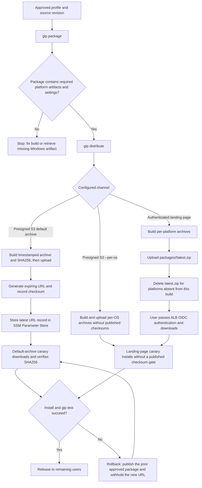
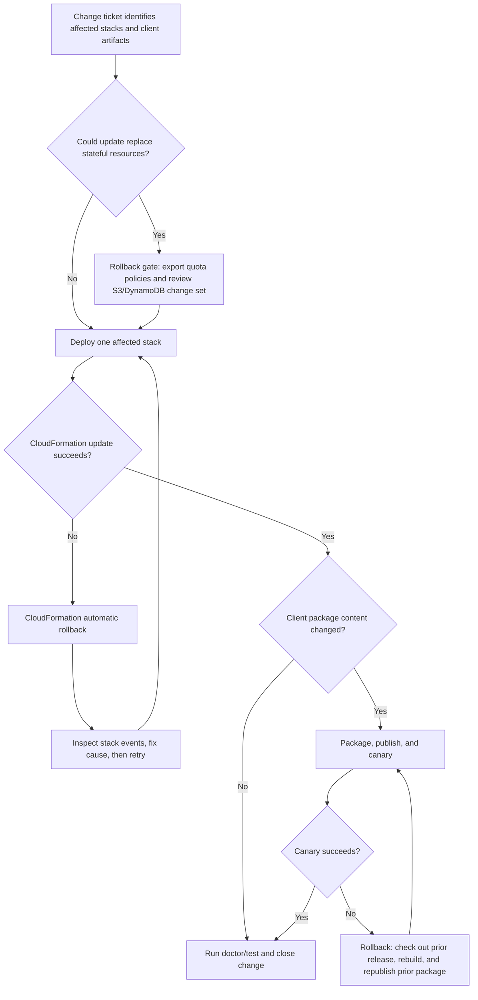
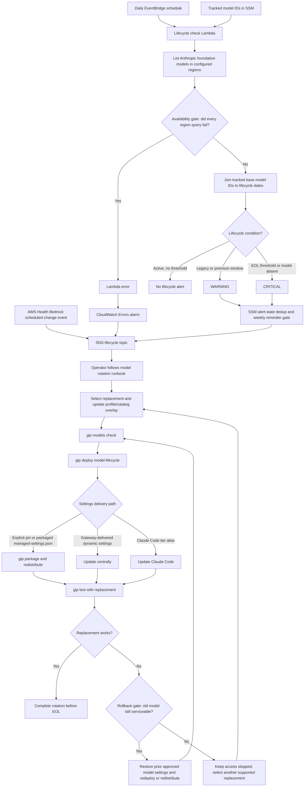

# Operational Runbooks

Concrete procedures for the failure modes and maintenance events an operator of
this solution is most likely to hit. Every resource name and command below is
taken from the templates in `deployment/infrastructure/` and the `gip` CLI in
this repository.

Related: [TROUBLESHOOTING.md](TROUBLESHOOTING.md) (first-response checklist),
[FAILURE_POSTURE.md](FAILURE_POSTURE.md) (per-component fail-closed/fail-open/
fail-visible matrix), [QUOTA_MONITORING.md](QUOTA_MONITORING.md),
[MONITORING.md](MONITORING.md),
[LIVE_VALIDATION.md](LIVE_VALIDATION.md) (executable procedures that convert
the platform's documented-but-unverified assumptions into dated proofs).

---

## 1. IdP client-secret / certificate rotation (Azure AD / Entra ID confidential client)

Applies when `gip init` was configured with Azure authentication mode
`secret` or `certificate` (confidential client). Entra ID client secrets always
carry an expiry date, so this rotation is routine.

This section covers the **confidential-client** path (secret held in the OS
keyring on each machine). The other two places an IdP client secret lives in
this solution have their own runbooks: the Cognito user-pool stack
([section 6](#6-cognito-user-pool-secret-rotation)) and the Claude apps
gateway ([section 7](#7-legacy-gip-apps-gateway-secret-rotation-retired)).

### Where the secret lives

- The secret is **never written to config files**. `gip init` stores it in the
  OS keyring under service `governed-inference-platform`, key
  `<profile>-client-secret`.
- Each end-user machine holds its **own** keyring copy, populated by running:

  ```bash
  credential-process --set-client-secret --profile <profile>
  ```

  (Set the `GIP_CLIENT_SECRET` environment variable first for non-interactive
  rollout via MDM or a script.)
- Certificate mode instead references file paths stored in the profile config
  (`client_certificate_path` / `client_certificate_key_path`).

### What breaks when it expires

The credential-process binary reads the secret from the keyring on every token
exchange. With an expired secret, Entra ID rejects the exchange, so:

- Silent refresh fails, then the interactive browser flow also fails.
- Failures appear **gradually**: cached STS credentials keep working until they
  expire, so users report "authentication stopped working" at different times.
- Typical user-visible error: "Cloud authentication" failures in Claude Code;
  running `COGNITO_AUTH_DEBUG=1 credential-process --profile <name>` shows the error
  returned by the IdP token endpoint (an `AADSTS` code for Entra ID).

### Rotation steps

1. In the Entra ID app registration, create a **new** client secret (do not
   delete the old one yet - both can be valid during rollout).
2. On the admin machine, re-run `gip init` and enter the new secret when
   prompted (Azure AD Authentication Mode section). It replaces the keyring
   entry; nothing is written to config.
3. Roll the new secret to end users. Each machine must run:

   ```bash
   credential-process --set-client-secret --profile <profile>
   ```

   or push it via MDM with `GIP_CLIENT_SECRET` set.
4. After all clients are updated, delete the old secret in Entra ID.

Certificate mode: place the new certificate/key at the paths configured in the
profile (`client_certificate_path` / `client_certificate_key_path`) on each
machine, and update the certificate in the Entra ID app registration.

### Validation

```bash
poetry run gip doctor      # health checks, including auth configuration
poetry run gip test        # end-to-end: authenticate and call Bedrock
```

---

## 2. OTEL collector outage (central mode)

Central mode runs the collector as an ECS Fargate service behind an ALB
(template: `deployment/infrastructure/otel-collector.yaml`, stack name
`<identity-pool-name>-otel-collector` by default —
`cli/commands/deploy.py:1373`).

### Symptoms

- CloudWatch dashboards flat / metrics gap starting at the outage.
- Quota usage **undercounts**: the `gip-quota-monitor` Lambda reads
  CloudWatch metrics every 15 minutes; metrics that never reached the collector
  never reach CloudWatch.
- Client-side: OTLP export failures (Claude Code and Claude Desktop telemetry),
  but **inference is unaffected** - credentials and Bedrock access do not pass
  through the collector.

### What quota enforcement does during the outage (honest impact)

The `gip-quota-check` Lambda **does not fail** during a collector
outage — it reads usage from DynamoDB
(`lambda-functions/quota_check/index.py:get_user_usage`), so it keeps
returning `allowed` based on the last usage the monitor recorded. Neither
fail-mode ever triggers: `ERROR_HANDLING_MODE` fires only on errors *inside*
the Lambda, and the client's `quota_fail_mode` fires only when the quota API
is unreachable. The result is silent under-enforcement, not lockout: usage
during the outage is invisible to the quota system.

**Mitigation:** if the server-side metering stack (`quota-metering.yaml`) is
deployed with `MeteringMode=max`, `quota_check` enforces on
`max(client, server)` (`quota_check/index.py:492-502`), and the server-side
figures accrue from Bedrock invocation logs — independent of the collector.
Collector outages then no longer create an enforcement gap in metered regions.

### Fail-visible alarm

The collector stack creates `<stack-name>-collector-unhealthy`
(`otel-collector.yaml`, resource `CollectorUnhealthyAlarm`): ALB
`HealthyHostCount < 1` for 3 minutes. The ALB emits this metric even while the
ECS tasks are down, so the alarm fires exactly when collector-emitted metrics
stop. Notifications are optional — set the stack's `AlarmTopicArn` parameter
to an SNS topic ARN (`gip deploy` does not currently pass it; set it with a
direct `aws cloudformation deploy --parameter-overrides AlarmTopicArn=<arn>`
update, or subscribe to the alarm in the CloudWatch console). Without a topic
the alarm still turns `ALARM` in the console.

```bash
aws cloudwatch describe-alarms \
  --alarm-names <monitoring-stack-name>-collector-unhealthy
```

### Diagnosis

Fixed resource names from the template:

| Resource | Name |
|---|---|
| ECS cluster | `gip-otel-cluster` |
| Container | `aws-otel-collector` (port 4318) |
| Collector logs | `/ecs/otel-collector` |
| Metrics log group | `/aws/gip/metrics` |
| Claude Desktop events | `/aws/gip/cowork-events` |

```bash
# 1. Service state and recent events (task crashes, health check failures)
aws ecs list-services --cluster gip-otel-cluster
aws ecs describe-services --cluster gip-otel-cluster \
  --services <service-arn> --query 'services[0].events[:10]'

# 2. ALB target health (target group health check: HTTP GET / expecting 200 or 404)
aws elbv2 describe-target-health --target-group-arn <target-group-arn>

# 3. Collector logs
aws logs tail /ecs/otel-collector --since 1h
```

Common causes: task OOM/crash loop (check stopped-task reason), expired/replaced
ACM certificate on the HTTPS listener, security-group or subnet changes, a bad
collector config after a stack update.

### Recovery

```bash
# Restart tasks (picks up latest task definition)
aws ecs update-service --cluster gip-otel-cluster \
  --service <service-name> --force-new-deployment

# If the stack itself is broken, redeploy it
poetry run gip deploy monitoring
```

### Data-loss caveat

Clients export OTLP over HTTP(S) with no durable local buffer. **Metrics
generated during the outage are dropped, not backfilled.** Consequences:

- Dashboards have a permanent gap for the outage window.
- Per-user quota usage for the window is **undercounted** - users get slightly
  more headroom than configured. There is no reconciliation step; accept the
  undercount or adjust policies manually if the outage was long.

---

## 3. Quota subsystem failure

Template: `deployment/infrastructure/quota-monitoring.yaml` (stack
`<identity-pool-name>-quota` by default). Key resources (fixed names):

| Resource | Name | Role |
|---|---|---|
| Lambda | `gip-quota-check` | Real-time check on every credential refresh |
| Lambda | `gip-quota-monitor` | Aggregates usage every 15 min (EventBridge `rate(15 minutes)`) |
| DynamoDB | `UserQuotaMetrics` | Usage records + unblock records |
| DynamoDB | `QuotaPolicies` | Fine-grained policies (user/group/default) |

### Fail-open vs fail-closed - two layers

1. **Server side** (`quota_check` Lambda): an unhandled error inside the Lambda
   returns `allowed` per the `ERROR_HANDLING_MODE` environment variable, which
   defaults to `fail_closed` (deny). The CloudFormation template does **not**
   set this variable, so the default applies. To flip temporarily:

   ```bash
   aws lambda update-function-configuration \
     --function-name gip-quota-check \
     --environment 'Variables={ERROR_HANDLING_MODE=fail_open,...}'
   ```

   Preserve the other variables (`QUOTA_TABLE`, `POLICIES_TABLE`, limits, and
   enforcement modes) when doing this; `update-function-configuration` replaces
   the whole environment. A later stack deploy resets it.

2. **Client side** (profile setting `quota_fail_mode`, default `"closed"`): when
   the quota API is unreachable or returns a non-200, the credential-process
   binary denies (`closed`) or explicitly allows (`open`) per this setting. A
   total API outage with default settings blocks quota-enabled credential
   issuance until the quota service recovers or an admin makes a break-glass
   `quota_fail_mode="open"` change.

### DynamoDB throttling

Both tables are `PAY_PER_REQUEST`, so sustained throttling is unusual. Check:

```bash
aws cloudwatch get-metric-statistics --namespace AWS/DynamoDB \
  --metric-name ThrottledRequests --dimensions Name=TableName,Value=UserQuotaMetrics \
  --start-time <t0> --end-time <t1> --period 300 --statistics Sum
aws logs tail /aws/lambda/gip-quota-check --since 1h
```

### Temporarily unblock a user

```bash
poetry run gip quota unblock user@example.com --duration 24h --reason "ticket-1234"
```

Durations: `24h`, up to `7d`, or `until-reset` (monthly reset). This writes an
`UNBLOCK#CURRENT` record for the user to `UserQuotaMetrics` with a DynamoDB TTL;
delete that record to revoke early.

### Disable enforcement in an emergency

- **Fine-grained policies enabled**: switch policies to alert-only (no
  redeploy needed; takes effect on the next credential refresh). Check the
  current limits first with `gip quota list`, then re-set the default with
  enforcement switched to alert (`--monthly-limit` is required):

  ```bash
  poetry run gip quota set-default --monthly-limit 300M \
    --enforcement alert --daily-enforcement alert
  ```

- **Environment-default deployments** (no fine-grained policies): enforcement
  comes from the stack parameters `MonthlyEnforcementMode` /
  `DailyEnforcementMode`. Set them to `alert` and update the stack (re-run
  `gip init` to change the profile then `poetry run gip deploy quota`, or
  update the parameters directly with the AWS CLI/console).

### Validation

```bash
poetry run gip test --quota-only   # quota API, policies, usage capture
```

---

## 4. Upgrading the solution between versions

### Safe order

1. **Pull the new version**: `git pull` (releases are tagged; `main` is
   release-only).
2. **Redeploy infrastructure stack-by-stack**, in dependency order:

   ```bash
   poetry run gip deploy auth
   poetry run gip deploy networking    # central monitoring mode only
   poetry run gip deploy monitoring
   poetry run gip deploy dashboard
   poetry run gip deploy analytics     # if enabled
   poetry run gip deploy quota         # if enabled
   ```

   (`gip deploy` with no argument deploys all enabled stacks in order.)
3. **Re-package**: `poetry run gip package` - rebuilds the credential-process
   and otel-helper binaries and regenerates `gip-settings/settings.json`,
   `managed-settings.json`, and the Claude Desktop MDM files
   (`cowork-3p-config.json`, `cowork-3p.mobileconfig`).
4. **Redistribute** to end users (`poetry run gip distribute`, or your
   existing MDM/installer channel) **only if needed** - see below.

### What requires client redistribution vs server-only

| Change | Action |
|---|---|
| Lambda code, CloudFormation templates, dashboards, collector config | Server-only: `gip deploy` is enough |
| Quota limits / enforcement modes (fine-grained policies) | Server-only: `gip quota set-*` |
| Model/settings changes (settings.json, managed-settings.json), new binary versions, changed endpoints (collector, quota API), MDM config changes | Re-package + redistribute clients |

Rule of thumb: anything that lands in the package output directory
(`./dist` binaries, `gip-settings/`, Claude Desktop MDM files) reaches users
only through redistribution.

### One-time replacement on the landing-page distribution stack

Upgrading a landing-page deployment past the release that scoped the ALB invoke
permission replaces the Lambda target group, because the target group now
carries a fixed name derived from the stack ID. CloudFormation creates the new
target group, repoints the HTTPS listener, then deletes the old one, so the
landing page is briefly unavailable during `gip deploy distribution`. Downloads
already in flight are unaffected - presigned URLs are served from S3, not
through the load balancer. No action is needed beyond running the deploy during
a quiet window; presigned-s3 deployments are not affected.

### Package publication control flow



The landing-page upload returns non-zero if any platform upload fails. After
successful uploads, it deletes `latest.zip` for platforms absent from that
build. The landing-page path does not publish SHA256 values, so its canary can
verify installation and `gip test`, but not the presigned-S3 checksum gate.
Treat the publish as incomplete until every intended platform and the canary
pass; do not infer an atomic multi-platform release from the S3 key layout.
The presigned-S3 `--per-os` path also lacks published SHA256 values; only the
default timestamped-archive path supports the checksum verification shown.

### Rollback

- `git checkout` the previous tag and re-run `gip deploy` for the affected
  stack; CloudFormation applies the old template as a normal update.
- **Stateful-resource caveats**:
  - The DynamoDB tables (`UserQuotaMetrics`, `QuotaPolicies`) have fixed names
    and **no `DeletionPolicy: Retain`**. A rollback that deletes or replaces
    them destroys quota usage history and policies. Export policies first:
    `poetry run gip quota export policies.json`.
  - S3 buckets (analytics, distribution) cannot be deleted by CloudFormation
    while non-empty; a rollback that tries to replace them will fail rather
    than lose data - resolve manually before retrying.
- If a stack update fails mid-way, CloudFormation auto-rolls-back to the
  previous state; fix the cause before retrying rather than forcing deletes.



---

## 5. Claude Desktop service-token rotation

This rotation applies to central-monitoring deployments that use static MDM
configuration with an **internal** ALB. `gip init` generates a shared **static
UUID** service token,
stores it in the profile as `cowork_service_token`, and passes it to the
monitoring stack as the `CoWorkServiceToken` parameter (`NoEcho`). An ALB rule
(priority 1) accepts `X-Cowork-Token: <token>` without JWT validation and sends
the request to the collector's aggregate receiver. The generated MDM config
embeds the same header in `otlpHeaders`.

CloudFormation rejects `CoWorkServiceToken` when `ALBScheme=internet-facing`.
Internet-facing collector deployments must use verified OIDC for attributed
CoWork telemetry. The shared-token path is aggregate-only and limited to
internal networks.

This is aggregate mode, not user authentication. The collector removes all
caller-supplied resource identity, including `x-user-id` and `x-user-email`,
and marks the telemetry `telemetry.identity.scope=aggregate`. Those headers
never establish identity. A shared token therefore cannot attribute forged
usage to a named user or consume that user's quota.

`NoEcho` does not hide the value from the ALB API: authorized principals with
`elasticloadbalancing:DescribeRules` can read the token from the listener rule.
The template has no automatic rotation mechanism; the procedure below is a
manual replacement and redistribution. Verified OIDC is recommended.

### Rotation = regenerate + redeploy + redistribute

1. Remove the old token from the saved profile: clear the
   `cowork_service_token` value in `~/.gip/profiles/<profile>.json`
   (`gip init` only generates a token when none is present).
2. Re-run `gip init` through the Claude Desktop Support section - a new UUID
   is generated.
3. Redeploy the monitoring stack so the ALB listener rule matches the new
   token: `poetry run gip deploy monitoring`. The old token stops working the
   moment the stack update completes.
4. Regenerate and redistribute the MDM configuration:
   `poetry run gip package`, then push the new `cowork-3p-config.json` /
   `cowork-3p.mobileconfig` through your MDM. Devices still on the old MDM
   config silently lose telemetry (their OTLP posts are rejected at the ALB)
   until they receive the new one - inference is unaffected.

Gateway-based Desktop deployments do not use this GIP shared-token path. Follow
the exact telemetry and identity behavior documented by the pinned AWS
Samples gateway; GIP does not translate its bootstrap response or merge its
telemetry into credential-process quota records.

### Exposure if leaked

The token grants **telemetry ingestion only**. The ALB rule forwards matching
requests to the OTLP collector; it does not issue AWS credentials and cannot
invoke Bedrock. A holder of a leaked token can:

- write forged aggregate telemetry, polluting aggregate dashboards, logs, and
  analytics.

It cannot establish a named identity, consume a named user's quota, read
existing data, or perform inference. Rotate using the steps above; the update
is a fast, low-risk stack change.

---

## 6. Cognito user-pool secret rotation

Applies to deployments that use the Cognito user-pool stack
(`deployment/infrastructure/cognito-user-pool-setup.yaml`, stack name
`gip-user-pool` in the setup guide,
`providers/cognito-user-pool-setup.md`). Two secrets live in this stack. The
CLI app client itself has **no secret** (`UserPoolClient` sets
`GenerateSecret: false` — it is a public PKCE client), so there is nothing to
rotate on the end-user path.

### 6a. External IdP (Federate/OIDC) client secret

The upstream IdP's client secret enters the stack as the
`FederateClientSecret` parameter (`NoEcho`) and lands in the identity
provider's `ProviderDetails.client_secret`
(`cognito-user-pool-setup.yaml`, resource `ExternalIdentityProvider`).

1. Create the new secret in the upstream IdP (Federate service profile);
   keep the old one valid if the IdP supports overlap.
2. Update the stack — `aws cloudformation deploy` reuses previous values for
   any parameter you don't override:

   ```bash
   aws cloudformation deploy \
     --template-file deployment/infrastructure/cognito-user-pool-setup.yaml \
     --stack-name gip-user-pool \
     --capabilities CAPABILITY_IAM \
     --parameter-overrides FederateClientSecret=<new-secret>
   ```

   (Avoid `aws cognito-idp update-identity-provider` for this: it replaces
   the *entire* `--provider-details` map, so a partial update silently drops
   `oidc_issuer`/`authorize_scopes`, and it also drifts the stack.)
3. **Verify**: complete a browser sign-in end to end —
  `poetry run gip test` (or `COGNITO_AUTH_DEBUG=1 credential-process --profile <name>`
   after clearing cached credentials). A wrong secret fails at the Cognito
   `/oauth2/idpresponse` step.
4. **Rollback**: re-run step 2 with the previous secret value.

### 6b. Distribution web client secret (ALB OIDC)

`DistributionWebClient` is the stack's only confidential client
(`GenerateSecret: true`). Its secret is copied into Secrets Manager under the
name `<stack-name>-distribution-web-client-secret` by the stack's
`SecretStoreFunction` Lambda (custom resource `DistributionWebClientSecret` in
`cognito-user-pool-setup.yaml`), and the landing-page distribution stack
consumes it at **deploy time** via a
`{{resolve:secretsmanager:...}}` dynamic reference on the ALB's
authenticate-oidc action (`landing-page-distribution.yaml:1007`).

Two facts drive this runbook:

- Cognito-issued app-client secrets **do not expire** — rotate only on
  suspected compromise. Cognito supports up to **2 active secrets** per app
  client for zero-downtime rotation
  (`AddUserPoolClientSecret`/`ListUserPoolClientSecrets`/`DeleteUserPoolClientSecret`;
  requires a recent AWS CLI).
- Updating the Secrets Manager value alone does nothing until the
  distribution stack is redeployed — the dynamic reference is resolved when
  the ALB listener is created/updated, not per-request.

```bash
POOL_ID=$(aws cloudformation describe-stacks --stack-name gip-user-pool \
  --query "Stacks[0].Outputs[?OutputKey=='UserPoolId'].OutputValue" --output text)
CLIENT_ID=$(aws cloudformation describe-stacks --stack-name gip-user-pool \
  --query "Stacks[0].Outputs[?OutputKey=='DistributionWebClientId'].OutputValue" --output text)

# 1. Note the OLD secret's id (you will delete it in step 5)
aws cognito-idp list-user-pool-client-secrets \
  --user-pool-id "$POOL_ID" --client-id "$CLIENT_ID"

# 2. Add a second secret — Cognito generates it; BOTH secrets stay valid
NEW_SECRET=$(aws cognito-idp add-user-pool-client-secret \
  --user-pool-id "$POOL_ID" --client-id "$CLIENT_ID" \
  --query 'ClientSecretDescriptor.ClientSecretValue' --output text)

# 3. Store the new value under the SAME secret name the distribution stack reads
#    (sent on stdin, so it stays out of shell history and the process list)
[ -n "$NEW_SECRET" ] && printf '%s' "$NEW_SECRET" | aws secretsmanager put-secret-value \
  --secret-id gip-user-pool-distribution-web-client-secret \
  --secret-string file:///dev/stdin
unset NEW_SECRET

# 4. Redeploy the distribution stack so the ALB listener re-resolves the secret
poetry run gip deploy distribution
```

5. **Verify**: sign in through the landing page (a stale ALB secret fails at
   the token exchange after the Cognito redirect), then delete the old
   secret:

   ```bash
   aws cognito-idp delete-user-pool-client-secret \
     --user-pool-id "$POOL_ID" --client-id "$CLIENT_ID" \
     --client-secret-id '<old ClientSecretId from step 1>'
   ```

   (Cognito refuses to delete the last remaining secret, so you cannot lock
   yourself out this way.)

**Rollback**: before step 5 the old secret is still valid — restore it with
`put-secret-value` (previous value is retrievable via
`aws secretsmanager get-secret-value --secret-id <name> --version-stage AWSPREVIOUS`)
and redeploy the distribution stack.

**Caveat**: the stack's `SecretStoreFunction` re-syncs the Secrets Manager
value from `DescribeUserPoolClient` only when the custom resource's
properties change (client replacement), so routine user-pool stack updates
will not clobber your rotated value.

---

## 7. Legacy GIP apps-gateway secret rotation (retired)

!!! warning "Do not use this for new deployments"
    This section applies only to the retired GIP CloudFormation stack
    (formerly `deployment/legacy/`). New deployments use the exact AWS Samples
    CDK pinned in `vendor/aws-samples/anthropic-on-aws/UPSTREAM.json` (run
    `scripts/fetch-claude-apps-gateway.sh`, then `cd
    vendor/aws-samples/anthropic-on-aws/claude-apps-gateway`); follow its
    pinned deployment and operations documentation instead.

Legacy template: `claude-apps-gateway.yaml` — removed from the repository
(not included in this sample); retrieve a deployed stack's copy with
`aws cloudformation get-template --stack-name <name>`, and tear down with
`aws cloudformation delete-stack --stack-name <name>`
([APPS_GATEWAY.md](APPS_GATEWAY.md)). The gateway's config file references
secrets as `${ENV_VAR}` placeholders that the gateway expands at config load
(ADR-0004); the values are injected by ECS **at task start** from Secrets
Manager (task definition `Secrets:` block). Therefore every rotation below is
the same two-step: update the secret value, then force a new deployment so
tasks restart and re-read it.

| Secret | Where | Injected as |
|---|---|---|
| OIDC client secret | `PlaceholderOidcSecret` (created when the `OidcClientSecretArn` parameter is empty) or your own ARN | `OIDC_CLIENT_SECRET` |
| Bearer-token signing secret | `JwtSecret` (48-char generated) | `GATEWAY_JWT_SECRET` |
| Postgres password | `DbSecret` (generated) | `GATEWAY_POSTGRES_PASSWORD` |

The ECS cluster and service have CloudFormation-generated names — resolve
them from the stack:

```bash
CLUSTER=$(aws cloudformation describe-stack-resources --stack-name <gateway-stack> \
  --logical-resource-id ECSCluster --query 'StackResources[0].PhysicalResourceId' --output text)
SERVICE=$(aws cloudformation describe-stack-resources --stack-name <gateway-stack> \
  --logical-resource-id ECSService --query 'StackResources[0].PhysicalResourceId' --output text)
```

### 7a. OIDC client secret (routine — IdP secrets expire)

First check whether the IdP permits two simultaneously valid client secrets.
If it does, use the zero-downtime sequence below:

1. Create a **new** client secret in the IdP app registration; keep the old
   one valid during rollout.
2. Write it to the secret the stack reads — the ARN is the
   `OidcClientSecretToFill` stack output (placeholder path) or the
   `OidcClientSecretArn` you passed at deploy:

   ```bash
   read -rs NEW_SECRET   # paste the new client secret; input is not echoed
   printf '%s' "$NEW_SECRET" | aws secretsmanager put-secret-value \
     --secret-id <secret-arn> --secret-string file:///dev/stdin
   unset NEW_SECRET
   ```

3. Restart tasks so ECS injects the new value:

   ```bash
   aws ecs update-service --cluster "$CLUSTER" --service "$SERVICE" --force-new-deployment
   aws ecs wait services-stable --cluster "$CLUSTER" --services "$SERVICE"
   ```

4. **Verify**: a fresh browser sign-in through the gateway
   (`<PublicUrl>/`) completes. Signed-in users are unaffected (bearer tokens
   validate locally against `JwtSecret`, not the IdP).
5. Delete the old secret in the IdP.

Rolling caveat: the service deploys with `MinimumHealthyPercent: 50`, so old
and new tasks coexist briefly — keep **both** IdP secrets valid until
`services-stable` returns.

**Rollback**: restore the previous value
(`aws secretsmanager get-secret-value --secret-id <arn> --version-stage AWSPREVIOUS`
shows it; `put-secret-value` it back) and force another deployment.

**Single-secret IdPs:** the sequence above is not zero-downtime because
replacing the IdP secret invalidates the old value immediately. Schedule a
sign-in maintenance window, replace the secret at the IdP, immediately write
the new value to Secrets Manager, force the ECS deployment, wait for
`services-stable`, and verify a fresh sign-in. Existing gateway bearer tokens
continue until their configured TTL, but new sign-ins can fail between the IdP
replacement and completion of the ECS rollout. The prior Secrets Manager value
is not a viable rollback after the IdP has invalidated it; rollback requires
issuing another valid secret at the IdP and repeating the deployment.

### 7b. Bearer-token (JWT) signing secret

Rotate on suspected compromise, or to force-invalidate **all** active gateway
sessions (see offboarding, section 8):

```bash
openssl rand -base64 36 | tr -d '\n' | aws secretsmanager put-secret-value \
  --secret-id <JwtSecretArn stack output> \
  --secret-string file:///dev/stdin
aws ecs update-service --cluster "$CLUSTER" --service "$SERVICE" --force-new-deployment
```

Every signed-in user is signed out and re-authenticates via the IdP —
disruptive but safe. During the rollout window, tokens signed by one secret
are rejected by tasks holding the other; treat sign-in errors during the
deployment as transient.

---

## 8. User offboarding

What actually happens when an employee leaves, path by path — and what does
**not** happen on its own. IdP deactivation is the kill switch for new
credentials; already-issued credentials expire on their own schedule, and
several data stores retain the user's email after departure.

### Access shutdown timeline

| # | Action / effect | Latency after IdP deactivation |
|---|---|---|
| 1 | Deactivate the user in the IdP (Okta/Entra/Federate) | you do this — everything below keys off it |
| 2 | OIDC refresh stops: the IdP returns `invalid_grant`, the client discards the stored refresh token and the interactive browser flow also fails (`source/go/internal/oidc/token.go:RefreshTokenExchange`) | immediate (direct-IdP profiles) |
| 3 | **Cognito user-pool caveat**: Cognito issues its *own* refresh token (valid 600 minutes = 10 h, `cognito-user-pool-setup.yaml` `UserPoolClient.RefreshTokenValidity`) and does not re-check the upstream IdP on refresh. Explicitly revoke: | up to 10 h unless revoked |
| 4 | Live STS sessions keep working until expiry — there is no per-user STS revocation | ≤ 12 h direct federation (`MaxSessionDuration: 43200`, `bedrock-auth-*.yaml`); ≤ 8 h Cognito identity-pool default (`cognito-identity-pool.yaml` `MaxSessionDuration` default 28800) |
| 5 | Apps gateway and Desktop sessions expire | Follow `session.ttl_hours` in the pinned upstream gateway configuration |

Step 3 commands (Cognito user-pool deployments):

```bash
aws cognito-idp admin-disable-user --user-pool-id <pool-id> --username <username>
aws cognito-idp admin-user-global-sign-out --user-pool-id <pool-id> --username <username>
```

(`EnableTokenRevocation: true` is set on both app clients, so
`admin-user-global-sign-out` revokes the refresh tokens; already-issued
access/ID tokens still run out their ≤ 60-minute validity.)

**Break-glass** (kills sessions for *every* user on the role, not just one):
attach an inline deny policy with an `aws:TokenIssueTime` condition ("revoke
active sessions") to the Bedrock access role, forcing all users to
re-authenticate — the departed user can't. Use only when a 12-hour tail is
unacceptable. For the apps gateway, follow the pinned upstream emergency
session-invalidation procedure.

### Offboarding checklist

1. Deactivate the user in the IdP.
2. Cognito user-pool deployments: `admin-disable-user` +
   `admin-user-global-sign-out` (above), and later
   `admin-delete-user` to remove the pool's stored profile (email, name).
3. Reclaim/wipe the device via MDM — the OS keyring holds the refresh token
   and (confidential-client mode) the IdP client secret; the credential cache
   holds live STS credentials until expiry.
4. Delete the user's quota policy if one exists:
   `poetry run gip quota delete user <email>`.
5. Memory-enabled deployments ([MEMORY.md](MEMORY.md)): erase the user's
   stored memories — `poetry run gip memory forget-user <email>` (add
   `--dry-run` first to see what exists). Extraction is asynchronous: re-run
   the command once, ~1 hour later, to catch records materialized by an
   in-flight extraction job.
6. Decide on stored-data cleanup using the inventory below (usage rows expire
   on their own; analytics does not).
7. If the user could have captured long-lived artifacts (presigned URLs from
   the distribution stack), note they expire on their own (≤ 48 h default).

### Data inventory (what persists after departure)

Identity in this solution *is* the user's email (metadata-only telemetry —
token counts, model IDs, cost, identity; never conversation content), so
"PII" below means the email address and name. Exception: the opt-in memory
feature stores conversation-derived content ([MEMORY.md](MEMORY.md)) — its
rows below are the only content-bearing ones.

| Store | Contains PII | Retention / TTL | Deletion procedure |
|---|---|---|---|
| Cognito user pool profile | email, names | until deleted | `aws cognito-idp admin-delete-user` |
| `UserQuotaMetrics` (DynamoDB) — usage rows `USER#<email>` / `MONTH#...` | email in key + attribute | DynamoDB TTL set to the 1st of the following month (`quota_monitor/index.py:update_quota_metrics`) | self-expires; or `aws dynamodb delete-item --table-name UserQuotaMetrics --key '{"pk":{"S":"USER#<email>"},"sk":{"S":"MONTH#<YYYY-MM>"}}'` |
| `UserQuotaMetrics` — `ALERTS` rows | email | TTL 60 days (`quota_monitor/index.py:record_sent_alert`) | self-expires |
| `UserQuotaMetrics` — `UNBLOCK#CURRENT` rows | email | TTL = unblock expiry (`cli/commands/quota.py`) | self-expires |
| `QuotaPolicies` (DynamoDB) — user policies | email as identifier | **no TTL** | `gip quota delete user <email>` |
| Analytics S3 (`AnalyticsBucket`) — Parquet | `user_email` column | **indefinite** — lifecycle only *transitions* to Glacier after `DataRetentionDays` (default 90), never expires; bucket is versioned | none per-user: data is date-partitioned (`data/year=/month=/day=/hour=`), not user-partitioned — per-user erasure requires rewriting objects. Documented gap; scope deletion by date range if required |
| Athena results bucket | query outputs may contain emails | auto-expires 7 days | self-expires |
| CloudWatch Logs `/aws/gip/metrics` | `user_email` in EMF events | 30 days | self-expires |
| CloudWatch Logs `/aws/gip/cowork-events` | email attribution | 30 days | self-expires |
| CloudWatch Logs `/aws/bedrock/gip-metering` | caller ARN embeds email session name | `LogRetentionDays` (default 30, `quota-metering.yaml`) | self-expires |
| CloudWatch **metrics** (`GIP` namespace, `user.email` dimension) | email as dimension | 15 months (CloudWatch-fixed) | **cannot be deleted** — ages out |
| CloudTrail | email in STS session-name ARNs | per your org's trail config | immutable by design — retention only |
| AgentCore Memory (opt-in, [MEMORY.md](MEMORY.md)) — raw events | **conversation-derived content** + hashed actorId (`email:<sha256(email)>`) | extracted-only: sweeper T+24h, 3-day service floor; full: `RawEventRetentionDays` | `gip memory forget-user <email>` (checklist step 5) |
| AgentCore Memory — extracted records (`users/email:<sha256(email)>/*`) | **conversation-derived** facts/preferences + hashed actor namespace | **no TTL** | `gip memory forget-user <email>`; re-run ~1 h later (async extraction) |
| Apps gateway Postgres | per-user auth/spend state | until deleted (7-day snapshots) | manual SQL; schema is Anthropic's gateway's — not documented here |
| End-user machine (keyring + credential cache) | tokens, secrets | until wiped | MDM reclaim (checklist step 3) |

---

## 9. Model rotation (Legacy / premium pricing / end of life)

Bedrock models are retired on a published schedule, and the schedule has
teeth: a `LEGACY` model blocks new customers immediately, can lapse for
existing customers after **15 days of inactivity**, picks up a **provider-set
pricing premium** during "public extended access" (`publicExtendedAccessTime`),
and stops serving inference entirely at `endOfLifeTime`. Migration never
happens automatically. This runbook is the response procedure for a lifecycle
alert (or a `gip models check` lifecycle warning).

### Where alerts come from

- **model-lifecycle stack** (optional, ~$0/month — enable in `gip init`, then
  `gip deploy model-lifecycle`): a daily Lambda joins
  `bedrock:ListFoundationModels` lifecycle dates against the models your
  deployment actually references (the `/gip/<profile>/tracked-models` SSM
  parameter, seeded at deploy from your selected model + tier defaults +
  `extra_models` overlay). Alert ladder on the SNS topic: Legacy entry →
  WARNING; premium window within 30 days / active → WARNING; end of life
  within 60/30/7 days → escalating CRITICAL; tracked model absent from the
  listing → CRITICAL. An `aws.health` EventBridge rule forwards AWS's own
  Bedrock scheduled-change notices to the same topic, and a CloudWatch alarm
  fires if the check Lambda itself errors (a broken poller must never look
  like "no news").
- **`gip models check`** prints the same lifecycle warnings interactively.



**The premium magnitude is not in the API or docs** — it is provider-set and
announced in the AWS Health notification you receive when the model enters
Legacy. Read that notification before deciding how urgent the rotation is.

### Step 1 — Evaluate

```bash
# What does the platform reference, and what is its live state?
poetry run gip models check
aws ssm get-parameter --name /gip/<profile>/tracked-models --query Parameter.Value --output text
```

Decide the replacement model (usually the next model in the same tier — check
`MODEL_TIER_PREFERENCES` in `source/governed_inference_platform/models.py`).
Verify it is available in your geography's CRIS profile and allowed regions.

### Step 2 — Update defaults

- If your profile pins the affected model (`selected_model` in
  `~/.gip/profiles/<profile>.json`): re-run `poetry run gip init` and select the
  replacement.
- If the affected model only appears in tier fallback chains: update the repo
  catalog (or pull a release that does), confirm with `gip models check`.
- If the replacement is newer than your release's catalog:
  `gip models check --propose` and use the `extra_models` overlay as the
  bridge (see CLI_REFERENCE.md).

### Step 3 — Re-deploy platform references

```bash
poetry run gip deploy model-lifecycle   # re-seeds tracked-models from the updated profile
poetry run gip deploy auth              # only if AllowedBedrockRegions changed
```

### Step 4 — Get the change to developers (path-dependent)

| How users got their config | What rotation takes |
|---|---|
| **Tier alias** (`ANTHROPIC_MODEL=sonnet` etc. — the default when the selected model has a Claude Code alias) | Nothing platform-side: alias→model resolution lives in the Claude Code release; users migrate by updating Claude Code. |
| **Explicit model ID pin** in packaged `managed-settings.json` | **Re-run `gip package` and redistribute** (distribution stack or your MDM). There is no refresh channel to an installed static package — this is an honest gap, not a knob you forgot. Budget redistribution time *before* the EOL date. |
| **CoWork 3P / apps gateway** | Update managed settings / gateway config centrally; clients pick it up on their refresh cycle — no re-packaging. |

Prefer alias pins when you set up profiles: alias-pinned fleets rotate
themselves with Claude Code updates, and the static-package gap above mostly
disappears.

### Step 5 — Verify

```bash
poetry run gip models check        # no warning for the old model against your defaults
poetry run gip test                # packaged config invokes the replacement model
```

Keep the old model's IAM access in place until the fleet has rotated (the
default wildcard policy does this automatically; a future opt-in pinned
allowlist mode is designed in ADR-0018 but deliberately not shipped). After
`endOfLifeTime`, requests fail at the Bedrock API regardless of IAM.
