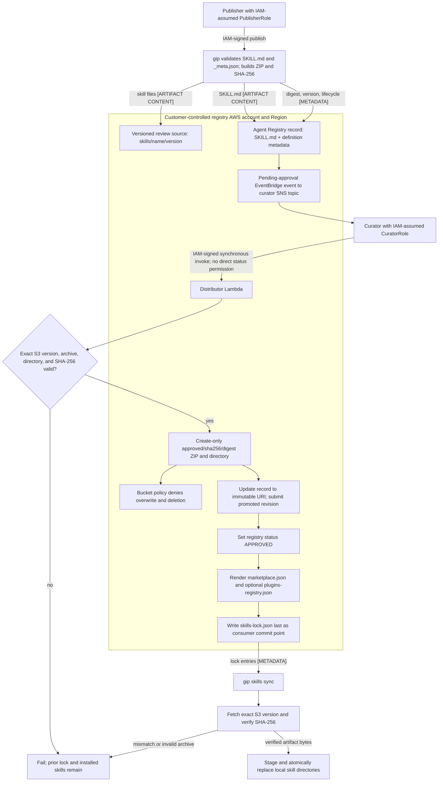

# Skills Registry

Governed, account-common distribution of agent skills to every harness your
organization runs — Claude Code, Claude CoWork (Desktop), OpenCode, Codex CLI,
and server-side AgentCore harnesses — with an explicit publish → approve →
distribute lifecycle.

**Opt-in and disabled by default.** Enable it in `gip init` (Skills Registry
section), then `gip deploy skills`. Decision record: [ADR-0017](adr/0017-skills-registry-on-agent-registry.md).

## Architecture

![Skills registry flow: publish, approve, distribute. On the left, a publisher on a publisher workstation runs gip skills publish. The publisher uploads skill files, create-only, to skills/<name>/<version>/ in the Amazon S3 artifact bucket, and creates and submits a record in AWS Agent Registry. The registry's Pending Approval event triggers an Amazon EventBridge rule that publishes to an Amazon SNS topic, which notifies the curator on a curator workstation. The curator runs gip skills approve, which invokes the AWS Lambda distributor synchronously. The distributor reads and verifies the version under skills/. It promotes the version with If-None-Match to approved/sha256/<digest>, which holds immutable artifacts. It updates the record's URI and approves the record in the registry. It writes skills-lock.json and marketplace.json to distribution/, the lock last. A second EventBridge rule runs the distributor every 15 minutes. On the right, developer machines run Claude Code, OpenCode and Codex CLI. There, gip skills sync reads skills-lock.json and fetches each approved version, verifying its SHA-256. An optional AgentCore harness, in this account or another account in the organization, reads the approved directory over s3://. All AWS resources are drawn inside one AWS account in AWS Cloud, with the three prefixes grouped in the bucket. A caption lists the bucket's protections and notes that installing from marketplace.json is unverified.](../images/skills-registry-flow.png)

## Current publish, approve, and distribute flow



IAM-signed role sessions, not caller-supplied fields, bind publisher and curator
identity. The registry contains `SKILL.md` content as well as metadata; S3 holds
the complete artifact bytes. Approval occurs only after the reviewed bytes are
verified and promoted to a publisher-unwritable, content-addressed key. The
consumer lock is written last, so a failed promotion or output refresh leaves
the previous installable set in place.

Two systems, one direction of data flow:

| Component | Role |
|-----------|------|
| **AWS Agent Registry** (generally available since 2026-08-06) | Governance source of truth: what exists, what is approved, versions, model-compat metadata. Approval workflow (Draft → Pending → Approved/Rejected), CloudTrail-audited. |
| **S3 artifact bucket** | Versioned review sources at `skills/<name>/<version>/`, then content-addressed approved artifacts at `approved/sha256/<digest>/`. Encrypted (SSE-S3), versioned, TLS-only, access-logged. Bucket policy denies overwrites and deletion of approved objects. |
| **Distributor Lambda** | Approval mediator and renderer. On an explicit curator request from `gip skills approve`, it verifies and promotes the submitted artifact, updates the record to `APPROVED`, and renders per-harness outputs. Scheduled runs cannot create approvals; they only verify existing approved records and refresh outputs. |

The registry is a **metadata catalog, not an artifact store** — it holds
SKILL.md content for discovery and a JSON definition; all other skill files
live in S3. No CloudFormation type exists for the registry (verified
2026-07-08), so it is provisioned by a Lambda-backed custom resource that
adopts an existing registry with the same name rather than failing.

> **Namespace migration.** AWS moved the registry to the GA `agent-registry`
> namespace on **2026-08-06**; the preview `bedrock-agentcore` endpoints were
> scheduled to shut down on **2026-09-17**. This stack defaults to the GA
> surface (`AgentRegistryApiSurface=ga-2026-08-06`). Every registry API call in this repo
> is isolated in exactly two mirrored modules —
> `deployment/infrastructure/lambda-functions/skills_registry/registry_client.py`
> (runtime) and `source/governed_inference_platform/cli/utils/agent_registry.py`
> (CLI) — so the rename is a one-file change per runtime. Registry state is
> re-creatable: skill content lives in git + S3; the registry only owns
> approval state (re-publish + re-approve replay after migration).

## Governance model

Three personas, enforced at the IAM boundary (not in application code):

| Persona | Can | Cannot | IAM |
|---------|-----|--------|-----|
| **Publisher** | Create/update records, submit for approval, upload artifacts to `skills/*` | Approve or reject | `PublisherRole` (stack output `PublisherRoleArn`) |
| **Curator** | Request approval/rejection by invoking the distributor | Create records, upload artifacts, or call `UpdateRegistryRecordStatus` directly | `CuratorRole` (stack output `CuratorRoleArn`) |
| **Consumer** | Read approved outputs and artifacts | Everything else | AWS credentials with `s3:GetObject` on the artifact bucket (the federated Bedrock role has none; `OrganizationId` grants org-wide read) |

Both roles trust the account root, so callers must also hold `sts:AssumeRole`
in their own identity policy. When the `PublisherGroups` / `CuratorGroups`
parameters are set (from `gip init`), the trust policy additionally requires
the caller's federated session to carry a matching `aws:PrincipalTag/groups`
session tag — the same IdP-group parameter pattern the gateway stack uses for
`EntitledGroups`. Multi-group claims arrive as one comma-joined tag value, so
exact-match gating works best with a dedicated single-value claim.

When a record is submitted, EventBridge (`Registry Record State changed to
Pending Approval` — the only documented registry event) publishes to the
`CuratorTopicArn` SNS topic. Subscribe curators (email/Slack) to that topic.
The topic the stack creates is encrypted at rest with a stack-owned KMS key
(`alias/<skills-stack-name>-pending-approval`) whose policy grants EventBridge
(`events.amazonaws.com`, the topic's only publisher) the
`kms:GenerateDataKey*`/`kms:Decrypt` access it needs; subscribers need nothing
extra. A topic you bring through the `AlertTopicArn` parameter is left as is:
encrypt it yourself if you need encryption, and grant `events.amazonaws.com` in
its key policy (without `aws:Source*` conditions, which EventBridge-to-encrypted-
topic delivery does not support) or the notification silently fails.
There is no documented Approved event, so distribution is schedule-driven plus
the synchronous invoke in `gip skills approve`.

## Workflow

```bash
# Publisher
gip skills eval ./my-skill/           # deterministic eval matrix (see "Skill evals" below)
gip skills publish ./my-skill/        # validate SKILL.md + _meta.json, upload, register, submit

# Curator (notified via SNS)
gip skills list --status PENDING_APPROVAL
gip skills approve my-skill@1.0.0     # or --reject --reason "..."
                                       # approval triggers distribution immediately

# Consumer (any machine with a gip profile)
gip skills sync                       # materialize approved skills into harness dirs
```

A publishable skill directory contains:

```
my-skill/
├── SKILL.md        # agentskills.io format: YAML frontmatter (name, description) + body
├── _meta.json      # gip metadata (schema below)
├── eval.yaml       # optional deterministic eval suite (schema below)
└── scripts/ references/ assets/ evals/   # optional; shipped verbatim
```

## Account-common consumption (default)

Everything runs in the deployment account; all users share one registry and
one bucket. Approved skills reach each harness through its native channel:

## Per-harness distribution matrix

| Harness | Channel | Output |
|---------|---------|--------|
| **CoWork 3P (Desktop)** | Filesystem/MDM distribution | Follow the exact Apps Gateway/Desktop upstream contract. The retired GIP bootstrap plugin index is not deployed or advertised; see [PLUGINS.md](PLUGINS.md#claude-desktop-delivery). |
| **Claude Code CLI** | Plugin marketplace | Distributor writes `distribution/marketplace.json` (Claude Code marketplace schema) to the artifact bucket; point an internal marketplace at it, or use `gip skills sync`. |
| **OpenCode** | Native skill dirs | `gip skills sync` writes `~/.claude/skills/<name>/` — OpenCode reads `.claude/skills` natively. |
| **Codex CLI** | User skill dir | `gip skills sync` writes `~/.codex/skills/<name>/`. (`/etc/codex/skills` MDM push is out of scope for user-level sync.) |
| **AgentCore harness** (server-side) | S3 skill source | After approval, pass the record's `artifact.s3_uri` directly: `skills=[{"s3": {"uri": "s3://<bucket>/approved/sha256/<digest>/"}}]`. Never execute from the mutable review-source path under `skills/<name>/<version>/`. |

`gip skills sync` reads `distribution/skills-lock.json`. Schema v2 is:

```json
{
  "schema_version": 2,
  "generated_at": "2026-07-08T00:00:00+00:00",
  "skills": [{
    "name": "code-review",
    "version": "1.2.0",
    "s3_uri": "s3://<bucket>/approved/sha256/<digest>.zip",
    "version_id": "<immutable-s3-version-id>",
    "sha256": "<digest>"
  }]
}
```

The sync client accepts only schema v2 and only a ZIP URI whose key is exactly
`approved/sha256/<sha256>.zip` in the configured artifact bucket. It fetches
that exact `version_id`, verifies the downloaded bytes against `sha256`,
validates the archive, and then atomically replaces local installations. A
legacy schema, missing version ID, mutable source URI, digest mismatch, or
invalid archive fails the sync and preserves existing installations.

CoWork's experimental native plugin index does not carry a digest or S3 version ID. Its
integrity therefore relies on HTTPS plus the artifact bucket's explicit deny on
approved-object overwrite and deletion; unlike `gip skills sync`, the CoWork
client does not independently hash the downloaded ZIP. This is a documented
residual limitation of the native CoWork channel. ADR-0033 keeps this path
non-default until an authenticated, immutable artifact-download design exists.

## Cross-account / Organizations option

This stack does not use registry-native cross-account sharing (AWS added AWS
RAM sharing for registries at GA; it is not wired here). What ships now:

- **Artifacts:** set the `OrganizationId` parameter (`o-xxxxxxxxxx`, via
  `gip init`) and the artifact bucket policy grants `s3:GetObject` /
  `s3:ListBucket` on the `approved/` and `distribution/` prefixes to every
  principal in the organization via `aws:PrincipalOrgID`. That is enough for
  AgentCore harness execution roles and `gip skills sync` in any member
  account. **Data exposure note:** with this set, any principal in any org
  account can read all published skill content. Leave empty (default) for
  single-account.
- **Control plane:** publishers/curators in other accounts assume the
  hub-account roles (classic cross-account assume-role).
- **Deferred:** a JWT-mode discovery registry (MCP endpoint, IdP-group-gated,
  account-agnostic) and registry-side org sharing wait for the GA namespace —
  see ADR-0017.

The bucket uses SSE-S3 (AES256), not SSE-KMS: the AWS-managed `aws/s3` KMS key
cannot be used cross-account, which would silently break the org-read option.
If KMS is required, the upgrade path is a customer-managed key with an
org-wide key policy.

## `_meta.json` reference (schema v1 — frozen)

Carried in the registry record under the reverse-DNS extension namespace
**`io.gip.skill/v1`**. The schema is frozen: field renames or semantic
changes require a new namespace (`io.gip.skill/v2`), never an edit. `gip
skills publish` validates strictly (unknown keys rejected) before anything is
uploaded.

```jsonc
{
  "name": "code-review",             // required; ^[a-z0-9][a-z0-9-]{0,63}$; must equal SKILL.md frontmatter name
  "version": "1.2.0",                // required; semver MAJOR.MINOR.PATCH; immutable once published
  "description": "…",                // optional string
  "category": "workflow",            // optional string (marketplace category)
  "harnesses": {                     // optional per-harness emit hints
    "cowork": { "installationPreference": "required" },
    "claude-code": { "pluginName": "org-code-review" }
  },

  // ---- Reserved hooks (R15 contract): eval gating + model-forked skills.
  // Validated now, acted on by the eval lane (E-S3). Safe to omit.
  "model_compat": [                  // one row per model family
    { "model_family": "claude-sonnet-4-5",
      "model_ids": ["us.anthropic.claude-sonnet-4-5-20250929-v1:0"],
      "status": "verified" }         // verified | drift | unverified | incompatible
  ],
  "fork_of": null,                   // or {"skill": "code-review", "version": "1.1.0"}
  "default_for_families": ["claude-sonnet-4-5"],  // resolution index; publish enforces ONE owner
                                     // per family per skill across all versions
  "evals": {                         // pointers only; scores live in S3, never in the record
    "suite_ref": "s3://…/evals/code-review/suite.yaml",
    "latest_score_ref": "s3://…/evals/code-review/1.2.0/scores.json",
    "gate": { "min_score": null }    // curator may require a score before approval (E-S3)
  }
}
```

At publish time the CLI adds two server-populated blocks to the record (not
authored in `_meta.json`): `artifact` identifies the review source and its
immutable canonical ZIP version (`s3_uri`, `source_directory_s3_uri`,
`source_s3_uri`, `source_version_id`, `zip_url`, `sha256`, `size_bytes`, and
`signature: null`); `lifecycle` records `published_by` and `published_at`.
Approval verifies those bytes, promotes them under `approved/sha256/<digest>/`
and `approved/sha256/<digest>.zip`, and updates `artifact.s3_uri` to the
approved directory before the record becomes approved. The signature field is
the reserved KMS code-signing hook.

## Skill evals (deterministic, v1)

Skills must stay verifiably deterministic across model changes. `gip skills
eval <dir>` runs the eval suite declared in an `eval.yaml` next to `SKILL.md`
and detects drift between a baseline model and candidate models. Decision
record: [ADR-0023](adr/0023-deterministic-skill-eval-runner.md).

**Deterministic by default.** A case executes an optional local `command`
inside a fresh isolated workspace seeded from a fixtures directory. To run a
script bundled with the skill, reference it with the `{skill_dir}` placeholder
(the workspace is the command's current directory). Cases that invoke a real
harness or model must declare `live: true` and are **skipped unless
`--live` is passed** — the runner never makes model calls on its own. Only
hard assertions gate in v1; `judge` criteria are validated and recorded but
never gate.

```yaml
# eval.yaml — schema_version 1 (validated strictly; unknown keys rejected)
schema_version: 1
skill: terraform-review            # must equal SKILL.md frontmatter name
harness: claude-code               # claude-code | codex | opencode (record metadata)
timeout_seconds: 300
trials: 1                          # runs per case x model
pass_threshold: 1.0                # fraction of trials that must pass
baseline_model: us.anthropic.claude-sonnet-4-5-20250929-v1:0   # drift reference
models:                            # matrix; ids validated against the models.py catalog
  - us.anthropic.claude-sonnet-4-5-20250929-v1:0
  - global.anthropic.claude-sonnet-5

cases:
  - id: basic-plan-review
    prompt: "Review the terraform plan in plan.json and write findings"
    fixtures: evals/fixtures/basic/     # copied into a fresh workspace per trial
    command: ["python", "{skill_dir}/scripts/review.py", "{model}"]
                                        # {model}/{prompt}/{skill_dir} substituted;
                                        # env: GIP_EVAL_MODEL, GIP_EVAL_PROMPT, GIP_EVAL_SKILL_DIR
    expect:                             # hard assertions (all must hold)
      exit_code: 0
      files:
        - path: review.md
          contains: ["## Findings", "plan.json"]
        - path: findings.json
          json_schema: evals/schemas/findings.schema.json   # needs `pip install jsonschema`
        - path: scratch.tmp
          must_exist: false
      forbidden_paths: [".env", "*.tfstate"]   # hashed before/after; touch/create/delete fails
    judge:                              # optional; recorded, never gates in v1
      - criterion: "Findings reference specific resources"
        min_score: 0.7
```

```bash
gip skills eval ./my-skill/ --validate-only   # schema check only (CI-friendly)
gip skills eval ./my-skill/                   # run the matrix, exit 1 on fail/drift
gip skills eval ./my-skill/ --model global.anthropic.claude-sonnet-5 --live
```

**Scoring.** A case passes on a model when its hard assertions pass in
>= `pass_threshold` of trials. Per model: `pass_rate` = passing cases /
evaluated cases (skipped live cases are excluded). Drift vs
`baseline_model` = `pass_rate(baseline) - pass_rate(candidate)`; a
candidate's verdict is `drift` when any case flips pass->fail against the
baseline or drift exceeds 0.1 — the actionable signal for publishing a
model fork (`fork_of` + `default_for_families` in `_meta.json`). Verdict ->
`model_compat.status` mapping is curator guidance: `pass` -> `verified`,
`drift` -> `drift`, `fail` -> `incompatible` (decide per skill).
If `--model` selects a subset that excludes `baseline_model`, the run still
executes but `drift_vs_baseline` is `null`; run the baseline in the same matrix
when you need drift scoring.

**Result records** are written to `<skill>/evals/results/<run_id>.json`
(override with `--results-dir`), one record per (skill-version x model x
run): `run_id`, `skill`, `version` (from `_meta.json` when present),
`model_id`, `model_family`, `harness`, `verdict`, `pass_rate`,
`case_results` (per-trial assertion detail), `drift_vs_baseline`,
`case_flips`, `artifacts_uri`, `started_at`, plus the run-level
`eval_manifest_sha` of the exact `eval.yaml` evaluated. Records feed the
`model_compat` matrix; scores live outside the registry by design
(`evals.suite_ref` / `evals.latest_score_ref` pointers in `_meta.json`).

**Deferred beyond v1** (recorded in ADR-0023): judge-model scoring as a
gate, automatic fork proposals on drift, harness-transcript assertions
(`tool_calls`, `skill_triggered`), variance normalization, CodeBuild matrix
execution against live harnesses, and MCP-based dynamic skill delivery.

## Configuration reference

| `gip init` answer (`skills.*`) | CFN parameter | Default |
|---|---|---|
| `enabled` | — (deploys the stack) | `false` |
| `registry_name` | `RegistryName` | `gip-skills` |
| `publisher_groups` | `PublisherGroups` | `[]` (IAM-only gating) |
| `curator_groups` | `CuratorGroups` | `[]` (IAM-only gating) |
| `organization_id` | `OrganizationId` | `""` (single-account) |

`gip destroy skills` removes the stack; the registry itself is retained by
default (`RetainRegistryOnDelete=true`) because approval state lives only
there. Delete it manually with the CLI after exporting approvals if you want
it gone.
