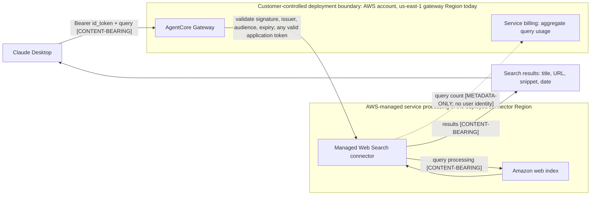

# Web Search for Claude Desktop (Amazon Bedrock AgentCore)

This guide covers the optional web search capability for **Claude Desktop** on Amazon Bedrock. It deploys an **Amazon Bedrock AgentCore Gateway** with the fully managed **Web Search connector** and exposes it as a managed MCP server.

> **Status:** Fully integrated with `gip` since v2.5.1: opt in during `gip init`, deploy with `gip deploy websearch`, and `gip package` / `gip cowork generate` wire the gateway into the Claude Desktop MDM configuration automatically. The manual wiring below remains valid for standalone use of the template.

> **Group entitlement unavailable:** Live Cognito validation on 2026-08-14
> showed that AgentCore exposes `groups` and `cognito:groups` to Cedar as
> `String`, so the `containsAny` policy cannot be created. The product now
> rejects non-empty `EntitledGroups` and `PolicyMode=ENFORCE` until an exact
> string-representation design is implemented. Okta remains untested. An empty
> entitlement list preserves the existing any-valid-application-token behavior.

## What it does

The [Web Search tool on Amazon Bedrock AgentCore](https://aws.amazon.com/blogs/aws/announcing-web-search-on-amazon-bedrock-agentcore-ground-your-ai-agents-in-current-accurate-web-knowledge/) is a managed, MCP‑compliant connector backed by Amazon's own web index. It returns titles, URLs, snippets, and publication dates so the model can ground answers in current information. There is no third‑party search API to provision and no outbound credentials to manage — queries stay within AWS.

The template provisions:

- An **AgentCore Gateway** (MCP protocol) whose inbound authorization (`CUSTOM_JWT`) reuses your existing OIDC identity provider — the same one the rest of this solution already uses.
- A **Gateway target** configured with the managed `web-search` connector (optional domain denylist).
- A least‑privilege **gateway execution IAM role** (`GetGateway`, `GetConfigurationBundleVersion`, `InvokeWebSearch`, `InvokeGateway`).

To attach internal tools or APIs to the same governed MCP entry point, see
[MCP Gateway Extension Guide](MCP_GATEWAY.md).

![Web search over Amazon Bedrock AgentCore Gateway. On the left, a Developer machine box holds credential-process and three clients. Claude Code and Claude Desktop get an auth header from credential-process through a headers helper, Claude Desktop every 900 seconds. They send MCP over HTTPS with a Bearer token straight to the gateway. OpenCode and Codex CLI talk MCP over stdio to credential-process, which forwards each call with a fresh Bearer token. credential-process refreshes the ID token from your OIDC identity provider, drawn in its own box below the developer machine. On the right, an AWS Cloud box holds an AWS account with a us-east-1 Region box. The Region box contains the AgentCore Gateway (MCP endpoint, CUSTOM_JWT inbound) and its web-search gateway target. The gateway reads OIDC discovery and JWKS from your identity provider. It assumes the gateway execution role, which sits in the account outside the Region box. The target invokes the Web Search Tool, drawn in a dashed box inside AWS Cloud labelled AWS-managed, outside your account. The tool returns titles, URLs, snippets and dates to the gateway. A caption notes three things: web search requires an OIDC provider; any valid ID token for the IdP app client can call the usage-billed tool; and query text is processed in us-east-1.](../images/websearch-mcp-flow.png)

## Current search flow and data boundary



The content-bearing query leaves the user's local session and is processed by
the connector in the stack Region, which is `us-east-1` today. This is not a
global-residency claim. No per-user entitlement trace is produced in this
release, and the current quota system does not convert
search charges into per-user budget enforcement.

## Prerequisites

- This solution already deployed with an OIDC identity provider (the Web Search gateway reuses it for inbound auth).
- Deployment into **`us-east-1`**, the only Region the `gip` CLI allows for web search. AWS lists additional Web Search Tool Regions (checked 2026-09-25) that this repository has not validated.

## Deployment

The template defaults to `DeploymentMode=development`. Group-based OIDC
entitlement cannot currently be enabled safely; use an empty entitlement list.

### Development deployment

With `gip`, leave entitled groups empty:

```json
{
  "web_search_enabled": true,
  "websearch_deployment_mode": "development",
  "websearch_entitled_groups": [],
  "websearch_policy_mode": "LOG_ONLY",
  "websearch_policy_validation_complete": false
}
```

Run `gip deploy websearch`. With no entitlement policy, every valid OIDC token
for the application can invoke the billed tool.

The equivalent standalone development deployment is:

```bash
aws cloudformation deploy \
  --region us-east-1 \
  --stack-name <your-stack-name> \
  --template-file deployment/infrastructure/bedrock-agentcore-gateway.yaml \
  --capabilities CAPABILITY_NAMED_IAM \
  --parameter-overrides \
      DeploymentMode=development \
      AuthType=oidc \
      DiscoveryUrl=https://cognito-idp.<idp-region>.amazonaws.com/<user-pool-id>/.well-known/openid-configuration \
      ClientId=<your-app-client-id> \
      EntitledGroups='' \
      PolicyMode=LOG_ONLY \
      PolicyValidationComplete=false
```

### Production entitlement

Production OIDC group entitlement is unavailable in this release. Attempts to
set non-empty `EntitledGroups` or `PolicyMode=ENFORCE` are rejected before
deployment. Keep the gateway in development mode without a group policy, or do
not expose the billed connector until the identity design is replaced.

For `AuthType=idc`, production mode continues to use `AWS_IAM`; the template
does not create or validate caller IAM policies. Review and test those external
identity policies before production. The OIDC Cedar gates above do not apply.

### Parameters

| Parameter | Description |
|-----------|-------------|
| `AuthType` | `oidc` (default — Cognito / Okta / Entra ID / Auth0 / Google; validates the id_token via `CUSTOM_JWT`) or `idc` (IAM Identity Center; authorizes via IAM/SigV4 credentials). |
| `DiscoveryUrl` | Your IdP's full OIDC discovery URL, ending in `/.well-known/openid-configuration` (AgentCore requires the full URL; `gip deploy websearch` builds it for you). Required when `AuthType=oidc`; ignored for `idc`. E.g. `https://cognito-idp.<region>.amazonaws.com/<pool-id>/.well-known/openid-configuration`, `https://login.microsoftonline.com/<tenant>/v2.0/.well-known/openid-configuration`. |
| `ClientId` | OIDC client ID. The gateway validates the id_token's `aud` claim against it (`AllowedAudience`) — every OIDC provider sets `aud = client_id` on id_tokens. Required when `AuthType=oidc`; ignored for `idc`. |
| `DomainExcludeList` | Optional. Comma‑separated domains to exclude from search results (server‑side denylist). Empty = no filtering. |
| `EntitledGroups` | Must remain empty in this release. Non-empty values are rejected because AgentCore exposes tested Cognito group claims as strings, not Cedar sets. Empty = any valid id_token may invoke tools. |
| `PolicyMode` | Must remain `LOG_ONLY`. `ENFORCE` is rejected until group entitlement is redesigned. |
| `DeploymentMode` | Use `development` for OIDC in this release. Production OIDC requires the unavailable entitlement path and is rejected. |
| `PolicyValidationComplete` | Operator acknowledgement that real JWT group decisions matched expectations in `LOG_ONLY`. Required as `true` for production OIDC; not proof generated by the template. |

The stack output **`GatewayMcpEndpoint`** is the MCP endpoint URL to give to Claude Desktop.

## Entitlement

The gateway's `CUSTOM_JWT` authorizer validates the id_token audience, so
**every user in the IdP application** can invoke the usage-billed search tool.
Group-based narrowing is not available in this release. Cognito testing proved
that the proposed Cedar set-intersection policy cannot be created because the
claims are strings. The CLI rejects the unsafe settings rather than allowing a
deployment that would lock out users or imply enforcement. See
[ADR-0014](adr/0014-gateway-cedar-entitlements.md).

**Known gap — per-user search spend.** Web search is billed per query, but the
quota system does not meter search usage per user. The unavailable Cedar policy
cannot provide interim per-user decision traces, so there is currently no
per-user search budget enforcement or attribution in this solution.

## Data residency

> ⚠️ Web search queries (and fragments of user prompts) are processed by the managed connector in the region the stack is deployed into (**`us-east-1`** today), regardless of where the user's IDE session runs or where Bedrock inference happens. On 2026-08-14, a `us-west-2` deployment was rejected by CloudFormation EarlyValidation `PropertyValidation` before any resources were created. Organizations with data residency or sovereignty obligations (e.g. GDPR) should evaluate whether this is acceptable before enabling web search.

## Wire it to Claude Desktop (manual alternative)

`gip package` and `gip cowork generate` add this entry automatically when web search is enabled in your profile. For standalone use, add a `managedMcpServers` entry to your Claude Desktop MDM configuration pointing at the gateway endpoint. Claude Desktop authenticates with an OAuth authorization‑code flow against the **same IdP**, reusing your existing client ID and the `localhost` callback port (default `8400`) — no secret is stored in the config:

```json
{
  "managedMcpServers": "[{\"name\": \"agentcore-websearch\", \"transport\": \"http\", \"url\": \"<GatewayMcpEndpoint>\", \"oauth\": {\"clientId\": \"<your-app-client-id>\", \"authorizationServer\": [\"<oidc-issuer>\"], \"scope\": \"openid email profile\", \"callbackHost\": \"localhost\", \"callbackPort\": 8400}}]"
}
```

- `<GatewayMcpEndpoint>` — the stack output (already includes the `/mcp` path).
- `<oidc-issuer>` — for Cognito `https://cognito-idp.<region>.amazonaws.com/<user-pool-id>`; for Entra ID your Entra issuer.
- The IdP app client must already allow the `http://localhost:8400/...` redirect URI (this solution already requires it for Claude Code).

See [COWORK_3P.md](COWORK_3P.md) for the full MDM configuration reference and the custom‑MDM‑key mechanism.

## Cost

Web Search on Amazon Bedrock AgentCore is usage‑based: **$7 per 1,000 search queries** at time of writing (the gateway itself has no fixed hourly charge). See the [Amazon Bedrock AgentCore pricing](https://aws.amazon.com/bedrock/agentcore/pricing/) page for current pricing. New AWS customers may receive Free Tier credits.

## References

- [Announcing Web Search on Amazon Bedrock AgentCore](https://aws.amazon.com/blogs/aws/announcing-web-search-on-amazon-bedrock-agentcore-ground-your-ai-agents-in-current-accurate-web-knowledge/)
- [AgentCore Gateway documentation](https://docs.aws.amazon.com/bedrock-agentcore/latest/devguide/gateway.html)
- [Claude Desktop 3P Guide](COWORK_3P.md)
