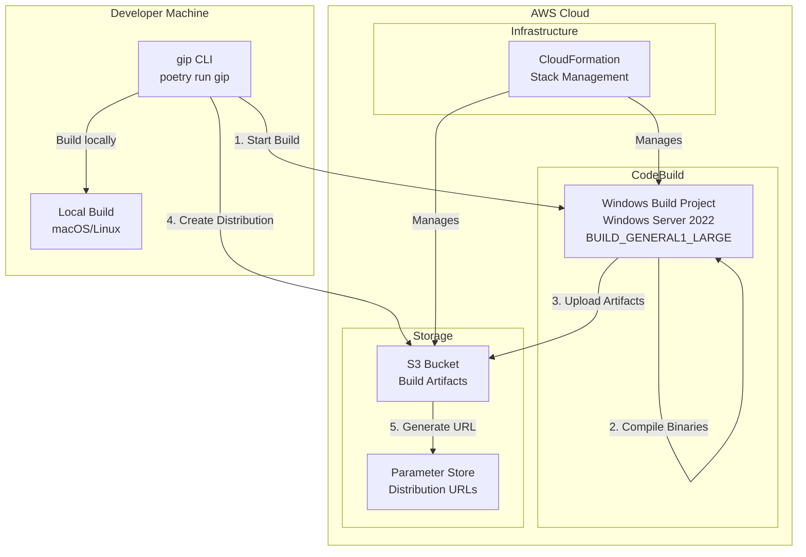
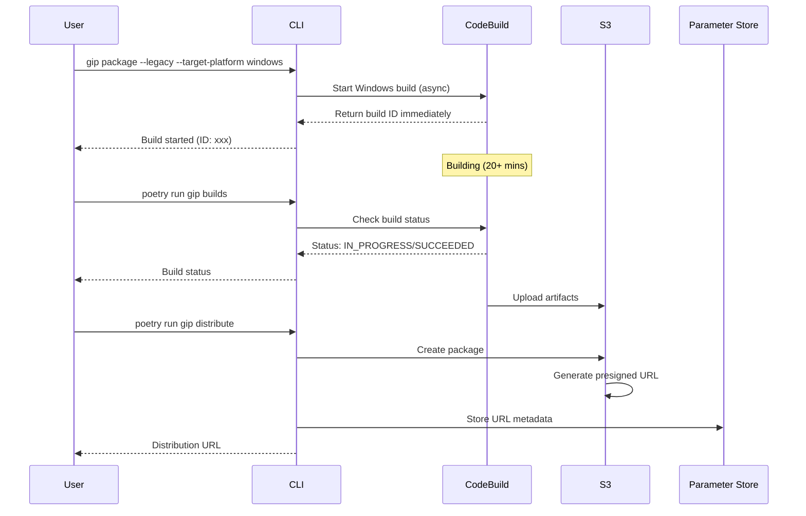
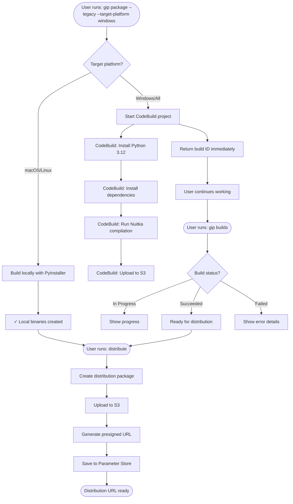

# Windows Build System Documentation

> **NOTE: The Nuitka/CodeBuild build system documented below has been replaced by Go cross-compilation.** Go produces Linux and Windows targets from supported administrator hosts without CodeBuild or Docker. macOS credential binaries require a macOS host because Keychain support uses CGO. See the [Go Build System](#go-build-system-recommended) section below.

## Go Build System (Recommended)

> **Native installer proof (2026-08-14):** a Windows Server 2022 standard user
> completed presigned-package install, OIDC authentication, and Claude Code
> inference. The final installer also passed the administrator refusal,
> read-only source package with a spaced home path, injected rollback,
> idempotent reinstall, tamper refusal, foreign-profile refusal, and duplicate
> AWS-section abort scenarios. Service-session automation used a limited-user
> scheduled task because SSM cannot create a de-elevated interactive process.

Native Go binaries replace the previous PyInstaller/Nuitka build pipeline. Key advantages:

- **No AV false positives**: Go binaries pass Windows Defender (PyInstaller/Nuitka triggered Error 225)
- **Cross-compile Linux and Windows broadly**: macOS targets remain tied to a macOS build host
- **No CodeBuild needed**: Eliminates 3 CodeBuild projects and 30+ minute Windows builds
- **4x smaller**: ~14 MB vs ~60-80 MB for credential-process
- **Fast cross-compilation**: Linux and Windows targets build in seconds; build macOS targets on a macOS host

### Windows-Specific Build Requirements

Windows binaries have special requirements to avoid Defender cloud ML (Wacatac.B!ml) detections:

1. **Do NOT strip**: No `-s -w` ldflags (stripping triggers Defender ML heuristics)
2. **Embed PE version info**: Use `go-winres` to embed RT_VERSION + RT_MANIFEST resources
3. **`.syso` files**: Located at `cmd/credential-process/rsrc_windows_amd64.syso` and `cmd/otel-helper/rsrc_windows_amd64.syso`, auto-linked by the Go compiler for Windows builds

### Three build paths for end-user binaries

| Path | Command | Requires | Runs on Windows admin? |
|---|---|---|---|
| **Go cross-compile via gip** (recommended) | `gip package` | Go 1.24+ installed | ✅ Yes, natively |
| **Go cross-compile via Makefile** | `cd source/go && make windows linux-x64 linux-arm64` | Go 1.24+ and a Unix shell (Git Bash, WSL, or macOS/Linux) | ⚠️ **No** — see below |
| **Legacy** (deprecated) | `gip package --legacy` | PyInstaller + Docker (Linux builds) + CodeBuild (Windows builds) | ⚠️ Partial — native Windows Nuitka works; Linux builds need Docker |

Bare `gip package` cross-compiles with Go. Use the deprecated `--legacy` flag only when temporary Python-binary compatibility is required.

### Building Windows binaries with Make (Git Bash, WSL, or Unix)

```bash
cd source/go

# In Git Bash or WSL, build Windows and Linux targets from a Windows administrator host
make windows linux-x64 linux-arm64

# Or build just Windows:
CGO_ENABLED=0 GOOS=windows GOARCH=amd64 go build \
  -ldflags "-X gip-go/internal/version.Version=2.0.0" \
  -o bin/credential-process-windows.exe ./cmd/credential-process/

CGO_ENABLED=0 GOOS=windows GOARCH=amd64 go build \
  -ldflags "-X gip-go/internal/version.Version=2.0.0" \
  -o bin/otel-helper-windows.exe ./cmd/otel-helper/
```

Verified working from macOS Apple Silicon: all 10 binaries (5 platforms × 2 binaries) produced in ~3 minutes. Each binary matches its target platform (`file <binary>` confirms Mach-O/ELF/PE32+), passes strings-leak checks, and the native macOS binary runs successfully with `--version`.

### Building on a Windows machine

**`gip package` works natively on Windows** — Python subprocess calls `go build` directly and passes env vars as a dict (not shell syntax), with cross-platform `pathlib.Path` handling. It requires Go 1.24+ installed and on `PATH`.

`gip package --legacy` selects the deprecated PyInstaller/Nuitka/Docker/CodeBuild path, which on Windows requires CodeBuild to be enabled during `gip init` and takes 12-15 minutes per build.

**`make all` does NOT work on native Windows cmd.exe or PowerShell.** The Makefile uses Unix-only shell constructs (`mkdir -p`, `rm -rf`). Options if you must use the Makefile on Windows:

1. **Git Bash** (bundled with Git for Windows): `make all` works as-is
2. **WSL (Windows Subsystem for Linux)**: `make all` works after installing `make` and `go`
3. **Native PowerShell alternative** — skip the Makefile and call `go build` directly:

```powershell
cd source\go
$env:CGO_ENABLED="0"
$env:GOOS="windows"
$env:GOARCH="amd64"
go build -trimpath -o bin\credential-process-windows.exe .\cmd\credential-process\
go build -trimpath -o bin\otel-helper-windows.exe .\cmd\otel-helper\

# For other platforms, change $env:GOOS and $env:GOARCH:
$env:GOOS="linux"; $env:GOARCH="amd64"
go build -trimpath -ldflags "-s -w" -o bin\credential-process-linux-x64 .\cmd\credential-process\
# ...etc
```

**Recommended path for Windows admins**: use bare `gip package`. The Makefile is only needed if you want to build outside of the `gip` tooling.

### Verification

Binaries have been verified on Windows EC2 with Defender real-time + cloud protection enabled:
- Defender scan: **No threats found**
- Binary execution: **Works** (credential-process --version)
- Claude Code E2E: **Working** with OIDC auth flow

---

## Legacy Build System (Nuitka/CodeBuild)

> **Deprecated**: The following documentation is preserved for reference. New deployments should use Go binaries.

## Table of Contents

1. [Overview](#overview)
2. [Architecture](#architecture)
3. [Prerequisites](#prerequisites)
4. [Initial Setup](#initial-setup)
5. [Build Process](#build-process)
6. [CLI Commands](#cli-commands)
7. [Distribution](#distribution)
8. [Troubleshooting](#troubleshooting)
9. [Technical Details](#technical-details)

## Overview

The legacy Windows build system used Nuitka via AWS CodeBuild with Windows Server 2022 containers. This approach has been replaced by Go cross-compilation due to Windows Defender false positives (Error 225) with Nuitka-compiled binaries.

### Key Features

- **Cross-platform support**: Builds Windows, macOS, and Linux binaries
- **Asynchronous builds**: Non-blocking build process with status tracking
- **Secure distribution**: Time-limited presigned URLs for package distribution
- **Automated compilation**: Uses Nuitka for Python-to-native compilation
- **No manual intervention**: Fully automated through CLI commands

## Architecture

### System Components



### Legacy CodeBuild Flow Sequence



## Prerequisites

### Local Requirements

- Python 3.10 through 3.13
- Poetry package manager
- AWS CLI v2 configured
- Git

### AWS Requirements

- AWS account with appropriate IAM permissions
- Ability to create CloudFormation stacks
- Permissions for:
  - CodeBuild projects
  - S3 buckets
  - Systems Manager Parameter Store
  - CloudWatch Logs

## Initial Setup

### 1. Clone Repository

```bash
git clone <repository-url>
cd sample-guidance-for-governed-inference-platform-on-amazon-bedrock/source
```

### 2. Install Dependencies

```bash
poetry install
```

### 3. Initialize Configuration

```bash
poetry run gip init
```

During initialization, you'll be prompted for:

- Identity provider domain (e.g., `us-east-1xxxxx.auth.us-east-1.amazoncognito.com`)
- Client ID from your identity provider
- AWS region for deployment
- Cross-region Bedrock access configuration
- **Enable CodeBuild for Windows binary builds? [Y/n]** - Select Yes
- Monitoring preferences

### 4. Deploy Infrastructure

```bash
poetry run gip deploy
```

This creates the following CloudFormation stacks:

- **Authentication stack**: IAM roles, identity pool
- **Networking stack**: VPC and subnets (if monitoring enabled)
- **Monitoring stack**: OpenTelemetry collector (optional)
- **CodeBuild stack**: Windows build project
- **Dashboard stack**: CloudWatch dashboard (optional)
- **Analytics stack**: Athena and Kinesis (optional)

### 5. Verify CodeBuild Deployment

```bash
poetry run gip status
```

Verify CodeBuild is deployed:

```
CodeBuild Stack:
• Status: CREATE_COMPLETE
• Project: gip-auth-windows-build
• S3 Bucket: gip-auth-codebuild-buildbucket-xxxxx
```

## Build Process

### Default Go Build

The default package path builds Windows locally and synchronously with Go:

```bash
poetry run gip package
```

Go 1.24+ is required. Windows binaries are unstripped and include the embedded PE resources described above.

### Legacy CodeBuild Path

Only the deprecated legacy path submits an asynchronous Windows CodeBuild job:

```bash
poetry run gip package --legacy --target-platform windows
```

The command prints the submitted build ID. Do not distribute a Windows package until the build has completed and `credential-process-windows.exe` is present.

### Checking Build Status

Check builds with the dedicated command:

```bash
poetry run gip builds
```

The older package status alias remains available but is deprecated:

```bash
poetry run gip package --status latest
```

### Listing Recent Builds

```bash
poetry run gip builds
```

Output:

```
               Recent Builds for gip-auth-windows-build
┏━━━━━━━━━━┳━━━━━━━━━━━━━━━━┳━━━━━━━━━━━━━━━━━━┳━━━━━━━━━━┳━━━━━━━━━━━┓
┃ Build ID ┃ Status         ┃ Started          ┃ Duration ┃ Phase     ┃
┡━━━━━━━━━━╇━━━━━━━━━━━━━━━━╇━━━━━━━━━━━━━━━━━━╇━━━━━━━━━━╇━━━━━━━━━━━┩
│ abc12345 │ ✓ Succeeded    │ 2024-08-24 10:30 │ 13 min   │ COMPLETED │
│ def67890 │ ✓ Succeeded    │ 2024-08-24 09:15 │ 12 min   │ COMPLETED │
│ ghi11111 │ ✗ Failed       │ 2024-08-24 08:00 │ 2 min    │ BUILD     │
└──────────┴────────────────┴──────────────────┴──────────┴───────────┘
```

## CLI Commands

### Package Command

**Basic usage:**

```bash
poetry run gip package [options]
```

**Options:**
| Option | Description | Default |
|--------|-------------|---------|
| `--target-platform` | Platform to build for (macos/linux/windows/all) | Host-aware: all five on macOS; Linux x64/ARM64 + Windows elsewhere |
| `--profile` | Configuration profile to use | default |
| `--legacy` | Use the deprecated Python build path | false |
| `--status` | Deprecated build-status lookup; use `gip builds` | - |

**Examples:**

Package the targets supported by the administrator host:

```bash
poetry run gip package
```

Distribute the latest completed package with a 48-hour URL:

```bash
poetry run gip distribute --latest --expires-hours 48
```

Check status:

```bash
poetry run gip builds
```

### Builds Command

**Basic usage:**

```bash
poetry run gip builds [options]
```

**Options:**
| Option | Description | Default |
|--------|-------------|---------|
| `--limit` | Number of builds to show | 10 |
| `--project` | CodeBuild project name | auto-detect |

### Distribute Command

**Basic usage:**

```bash
poetry run gip distribute [options]
```

**Options:**
| Option | Description | Default |
|--------|-------------|---------|
| `--get-latest` | Get existing URL without creating new | false |
| `--expires-hours` | URL expiration time (1-168) | 48 |
| `--package-path` | Path to package directory | dist |
| `--allowed-ips` | Unsupported; fails before packaging or upload | - |
| `--show-qr` | Generate QR code | false |

**Examples:**

Create new distribution:

```bash
poetry run gip distribute
```

Get existing URL:

```bash
poetry run gip distribute --get-latest
```

## Distribution

### Package Contents

The distribution package (`dist/`) contains:

```
dist/
├── credential-process-windows.exe      # Windows auth binary (~28 MB)
├── credential-process-macos-arm64      # macOS ARM64 binary (~26 MB)
├── otel-helper-windows.exe            # Windows telemetry helper (~28 MB)
├── otel-helper-macos-arm64            # macOS telemetry helper (~26 MB)
├── config.json                        # Configuration with Cognito settings
├── install.sh                         # macOS/Linux installer script
├── install.bat                        # Windows installer launcher
├── gip-install.ps1                   # Windows PowerShell installer logic
├── README.md                          # Installation instructions
└── .claude/
    └── settings.json                  # Claude Code telemetry settings
```

### End User Installation

**Windows:**

```batch
REM Download the package
curl -L -o gip-package.zip "<presigned-url>"

REM Extract
tar -xf gip-package.zip

REM Install
cd dist
install.bat
```

**macOS/Linux:**

```bash
# Download the package
curl -L -o gip-package.zip "<presigned-url>"

# Extract
unzip gip-package.zip

# Install
cd dist
chmod +x install.sh
./install.sh
```

The installer will:

1. Create `~/gip/` directory
2. Copy binaries to the directory
3. Configure AWS CLI profile named `gip`
4. Test authentication

## Troubleshooting

### Common Build Issues

#### 1. Build Fails Immediately

**Error:** "The Python version '3.12' is not supported by Nuitka '2.0'"
**Solution:** This has been fixed - we now use Nuitka 2.7.12 which supports Python 3.12

#### 2. Build Times Out

**Error:** "Build timed out after 20 minutes"
**Solution:** Normal build time is 12-15 minutes. Check CodeBuild logs for compilation errors.

#### 3. No Artifacts Found

**Error:** "no matching artifact paths found"
**Solution:** Check that the build phase completed successfully:

```bash
aws logs tail /aws/codebuild/gip-auth-windows-build --region us-east-1 --since 30m
```

#### 4. PowerShell Syntax Errors

**Error:** "The term 'SET' is not recognized"
**Solution:** CodeBuild uses PowerShell, not CMD. The buildspec has been updated to use PowerShell syntax.

### Checking Build Logs

**Via AWS CLI:**

```bash
# Get recent logs
aws logs tail /aws/codebuild/gip-auth-windows-build \
  --region us-east-1 \
  --since 30m

# Search for errors
aws logs filter-log-events \
  --log-group-name /aws/codebuild/gip-auth-windows-build \
  --region us-east-1 \
  --filter-pattern "ERROR"
```

**Via Console:**
The package command provides a direct link to the AWS Console for each build.

## Technical Details

### Windows Build Environment

**CodeBuild Configuration:**

- **Environment Type:** `WINDOWS_SERVER_2022_CONTAINER`
- **Compute Type:** `BUILD_GENERAL1_LARGE` (4 vCPUs, 8 GB memory)
- **Base Image:** `aws/codebuild/windows-base:2022-1.0`
- **Timeout:** 30 minutes
- **Region:** us-east-1 (hardcoded for consistency)

### Software Versions

**Build Environment:**

- Windows Server 2022
- Python 3.12.10 (installed via Chocolatey)
- Nuitka 2.7.12
- pip 24.x

**Dependencies installed during build:**

- nuitka==2.7.12
- ordered-set
- zstandard
- boto3
- requests
- PyJWT
- keyring
- cryptography
- questionary
- rich
- cleo
- pydantic
- pyyaml

### Nuitka Compilation Settings

```bash
C:\Python312\python.exe -m nuitka \
  --standalone \                    # Include all dependencies
  --onefile \                      # Single executable file
  --assume-yes-for-downloads \      # Auto-download requirements
  --windows-disable-console \       # No console window popup
  --company-name="Claude Code" \
  --product-name="Claude Code Credential Process" \
  --file-version="1.0.0.0" \
  --product-version="1.0.0.0" \
  --windows-file-description="AWS Credential Process for Claude Code" \
  --output-filename=credential-process-windows.exe \
  --output-dir=. \
  --remove-output \                # Clean up build artifacts
  source/credential_provider/__main__.py
```

### Build Performance

**Typical build times:**

- macOS ARM64 (local): ~30 seconds
- Windows (CodeBuild): 12-15 minutes
  - Install phase: ~1 minute
  - Pre-build (dependencies): ~2 minutes
  - Build (Nuitka compilation): ~10-12 minutes
  - Post-build: ~30 seconds

**Optimization history:**

1. Initial: PyInstaller, MEDIUM instance → 16+ minutes
2. Nuitka 2.0.0, MEDIUM instance → Failed (Python 3.12 incompatible)
3. Nuitka 2.7.12, LARGE instance → 12-13 minutes (current)
4. Attempted 2XLARGE → Not supported for Windows containers

### Security

**S3 Bucket:**

- Private bucket with versioning enabled
- Server-side encryption (SSE-S3)
- Lifecycle rules for old packages (90 days)

**Presigned URLs:**

- Default expiration: 48 hours
- Maximum expiration: 168 hours (7 days)
- `--allowed-ips` is rejected because these presigned URLs do not enforce source-IP restrictions

**IAM Permissions Required:**

```json
{
  "Version": "2012-10-17",
  "Statement": [
    {
      "Effect": "Allow",
      "Action": [
        "codebuild:StartBuild",
        "codebuild:BatchGetBuilds",
        "codebuild:ListBuildsForProject"
      ],
      "Resource": "arn:aws:codebuild:us-east-1:*:project/gip-auth-windows-build"
    },
    {
      "Effect": "Allow",
      "Action": ["s3:PutObject", "s3:GetObject", "s3:ListBucket"],
      "Resource": [
        "arn:aws:s3:::gip-auth-codebuild-buildbucket-*",
        "arn:aws:s3:::gip-auth-codebuild-buildbucket-*/*"
      ]
    },
    {
      "Effect": "Allow",
      "Action": ["ssm:PutParameter", "ssm:GetParameter"],
      "Resource": "arn:aws:ssm:*:*:parameter/gip/*"
    }
  ]
}
```

### Cost Analysis

**Per build:**

- CodeBuild: ~$0.10 (13 minutes × $0.005/minute for LARGE instance)
- S3 storage: ~$0.01 (100 MB stored)
- Data transfer: Varies by downloads

**Monthly estimate (daily builds):**

- 30 builds × $0.10 = $3.00 CodeBuild
- Storage: ~$0.50
- **Total: ~$3.50/month**

### File System Locations

**Source files:**

```
/source/
├── credential_provider/
│   └── __main__.py           # Main authentication module
├── otel_helper/
│   └── __main__.py           # Telemetry helper module
├── governed_inference_platform/
│   └── cli/
│       └── commands/
│           ├── package.py    # Package build logic
│           ├── builds.py     # Build listing logic
│           └── distribute.py # Distribution logic
└── deployment/
    └── infrastructure/
        └── codebuild-windows.yaml  # CodeBuild CloudFormation
```

**Build artifacts:**

```
~/.gip/
└── latest-build.json         # Latest build metadata

dist/                         # Local package output
└── [platform binaries]

S3: gip-auth-codebuild-buildbucket-xxxxx/
├── windows-binaries.zip      # Windows build artifacts
└── packages/
    └── YYYYMMDD-HHMMSS/
        └── gip-package-*.zip
```

## Appendix

### Legacy CodeBuild Process Flow



### Quick Reference Card

```bash
# Daily workflow
poetry run gip package                    # Build synchronously with Go
poetry run gip distribute                 # Create distribution

# Deprecated legacy Windows CodeBuild workflow
poetry run gip package --legacy --target-platform windows
poetry run gip builds                     # Check remote build status

# Get existing URL (no rebuild)
poetry run gip distribute --get-latest

# Debug failed build
poetry run gip builds
aws logs tail /aws/codebuild/gip-auth-windows-build --region us-east-1

# Extended distribution (7 days)
poetry run gip distribute --expires-hours 168
```

---

_Last updated: August 2024_
_Version: 1.0.0_
