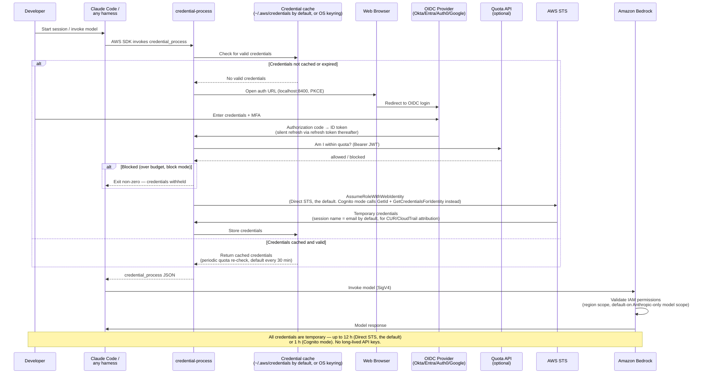
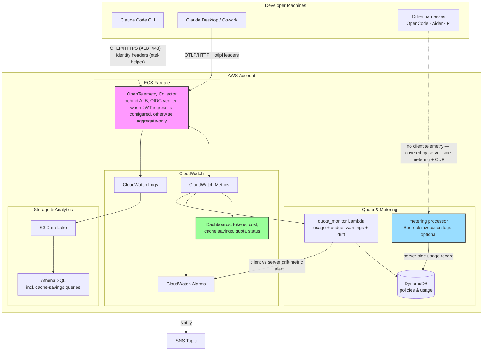

# Architecture Diagrams

## 1. Authentication and Credential Flow

This diagram shows the complete process for obtaining temporary AWS
credentials and using them to access Amazon Bedrock. The default federation
path is **Direct STS** (`AssumeRoleWithWebIdentity` against an IAM OIDC
provider); an Amazon Cognito Identity Pool broker is the configurable
alternative (`federation_type: cognito`), which additionally applies
server-derived session tags for tamper-proof attribution.

## 2. OpenTelemetry Monitoring Architecture

This diagram illustrates the optional monitoring setup using an
OpenTelemetry collector on ECS Fargate (central mode). In sidecar mode the
same collector runs locally on each machine instead.

## Published diagrams and their sources

| Published PNG | SVG source | Generator module |
|---|---|---|
| `platform-overview-v2.png` | `diagrams/platform-overview-v2.svg` | `diagrams/d1_platform_overview.py` |
| `credential-flow-direct-diagram.png` | `diagrams/credential-flow-direct-diagram.svg` | `diagrams/d2_credential_flow.py` |
| `websearch-mcp-flow.png` | `diagrams/websearch-mcp-flow.svg` | `diagrams/d3_websearch.py` |
| `memory-architecture.png` | `diagrams/memory-architecture.svg` | `diagrams/d4_memory.py` |
| `skills-registry-flow.png` | `diagrams/skills-registry-flow.svg` | `diagrams/d5_skills_registry.py` |

All five diagrams are hand-laid-out SVG built from the official AWS Architecture Icons (Q3 2026 release,
07.31.2026), vendored unmodified in `diagrams/icons/`. To change one, edit its module and run
`python3 build.py` in `assets/images/diagrams/`: it writes the SVG beside the scripts and the 2x PNG into
`assets/images/`, and fails on any layout-check error (non-orthogonal connectors, connectors crossing text,
icons or each other, overlapping text, arrow ends off their icon, or text too small at README width).
It needs Python 3 and `rsvg-convert` (`brew install librsvg`). Design rules: `diagrams/DESIGN_NOTES.md`.

## AWS Architecture Icon Requirements

For official AWS architecture diagrams (PNG format):
- Use latest AWS Architecture Icons Toolkit (light background, released 04.28.2023)
- Service icons ≥0.4"×0.4", grouping icons ≥0.3"×0.3"
- All icons must have labels at bottom, Arial 9-12pt in black
- "AWS" or "Amazon" appears in same line as first word of service
- Solid black arrows (1.25pt width), no diagonal lines
- No cropping, flipping, or shape modifications allowed

## Key Architecture Components

1. **Developer Workstation**: Runs Claude Code (or any AWS-SDK harness) with the credential-process binary and local credential caching
2. **OIDC Provider**: Enterprise identity provider (Okta, Entra ID, Auth0, Google, Cognito User Pool)
3. **AWS STS**: Issues temporary credentials via `AssumeRoleWithWebIdentity` — directly against the IAM OIDC provider (default) or brokered by an Amazon Cognito Identity Pool (alternative, adds server-derived session tags)
4. **Quota API**: Optional Lambda + DynamoDB gate at credential issuance — USD budgets or token limits per user/group
5. **Amazon Bedrock**: Target AI service accessed with temporary credentials; IAM optionally scoped to Anthropic models only
6. **Server-side metering** (optional): Bedrock model invocation logs (metadata only) provide a second, tamper-proof usage record, reconciled against client telemetry
7. **AWS CloudTrail / CUR 2.0**: Per-user audit and cost attribution via the STS session name
8. **Amazon CloudWatch + S3/Athena**: Dashboards (including prompt-cache savings), alarms, and historical analytics
9. **Amazon ECS Fargate**: Hosts the central OpenTelemetry collector — and, if chosen, the Claude apps gateway control plane
